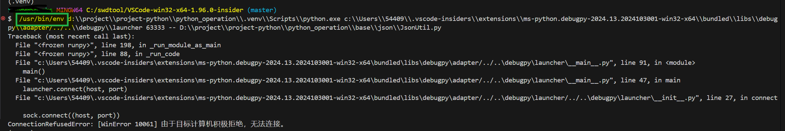
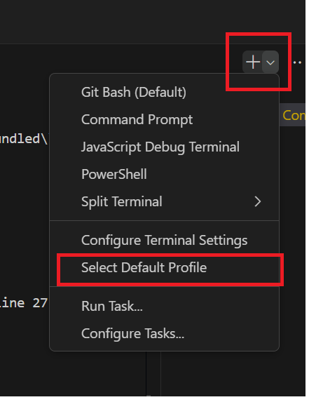
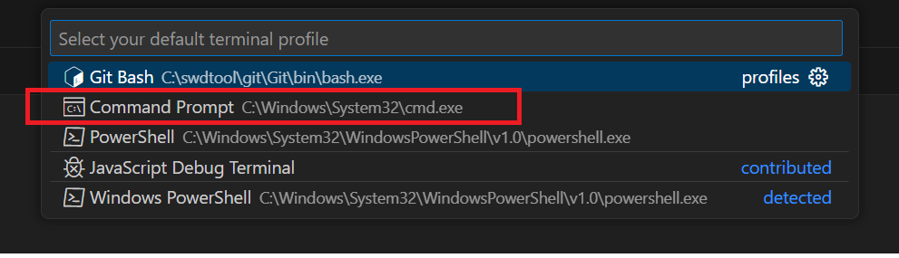

---
tags:
  - VSCode
  - debug
  - error
---
当使用vscode进行python or go的debug时,  经常出现下面的异常:


配置如下:
1. 默认的terminal 为 git bash
2. debug python file

从上面的异常日志可以看到, 当开始debug, 并启动git bash时,  第一行:
```shell
 /usr/bin/env d:\\project\\project-python\\python_opera
```

此时会先执行 `env`,  并且git bash 启动时间比较长.
此`env` 在此处执行应该是有些问题.  (原因暂未找到)

解决:
选择默认的 debug terminal 为windows 默认的 cmd






