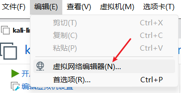
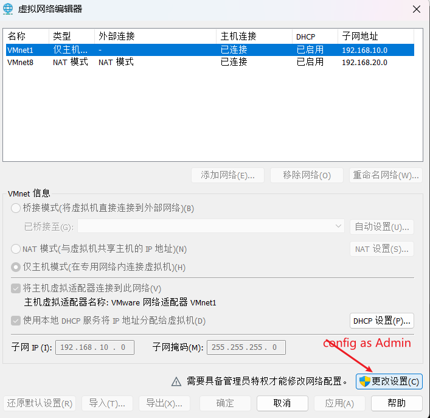
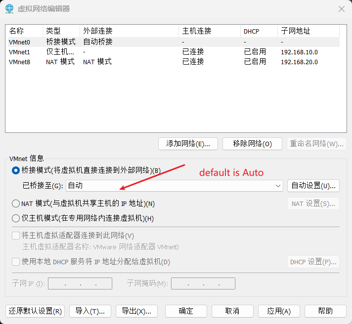
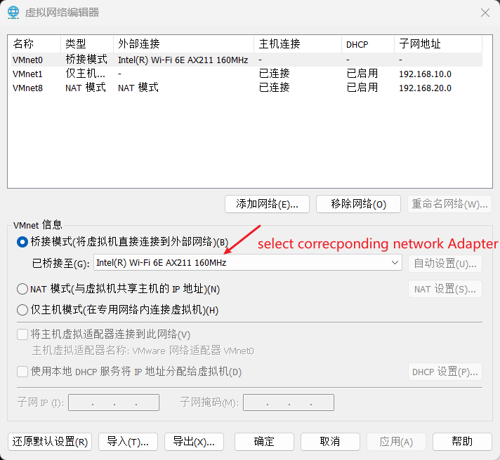

---
tags:
  - vmware
  - bridge-network
---
When the host in Vmware config as `bridge` network, the VM can't connect to internet, how to resolve this ?

we need open the bridge config and select the right adapter for bridge network.

> open config

> click config as admin

> the default value is Auto

> select the corresponding adapter

If you are connecting with network cable, the select the real physical network. 
Here, i am connect to router with wireless, so i select the WIFI adapter.

After the update the adapter,  the bridge network is good to use.
