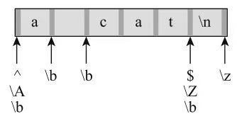
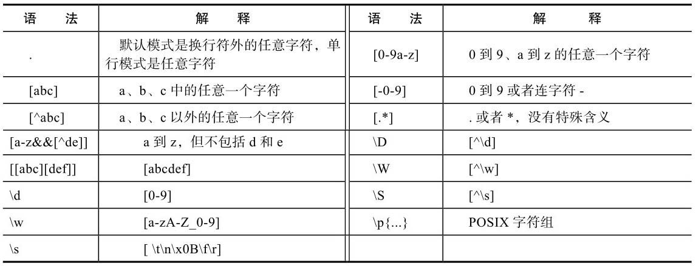

# 正则表达式

正则表达式是一串字符，它描述了一个文本模式，利用它可以方便的处理文本，包括文本的查找，替换，验证，切分等。正则表达式中的字符有两类:一类是普通字符，就是匹配普通字符本身，另一类是元字符，这些字符有特殊含义，这些字符及其特殊含义构成了正则表达式的语法。

## 1.单个字符

大部分的单个字符就是用字符本身表示的，比如字符：'0'，'3'，'a'等，但有一些单个字符使用多个字符表示，这些字符都以斜杠 '\\'  开头。 

### 1.1 特殊字符

比如tab字符：'\t' , 换行符号'\n'   回车符 '\r'

### 1.2  八进制表示的字符

以 \0 开头，后面跟 1~3 个数字，比如 \041, 对应的ASCLL 编码为 97的字符，及字符 'a'。

### 1.3 十六进制表示的字符

以 \x 开头，后面跟两位字符，比如 \x6A，对应的ascll编码为106的字符，即字符 'j'。

### 1.4 Unicode编码表示的字符

以 \u 开头，后面跟4位字符，比如 \u9A6C，表示的是中文字符 '马'，这只能表示编码在 0xffff 以下的字符，如果超出 0XFFFF，使用 \x{...} 形式，比如 \x{1f48e}

### 1.5 斜杠 \ 本身

斜杠本身是一个元字符，如果要匹配它自身，使用两个斜杠表示，即 '\\'，俗称转义。

### 1.6 元字符本身

除了 '\'，正则表达式中还有很多元字符，比如:  .  *  ？ +,(分别是  点  星号  问号  加号)等，要匹配这些元字符自身，需要在前面加转义字符 '\\'， 比如: '\\.';

## 2.字符组

字符组有多种，包括任意字符，多个指定字符之一，字符区间，排除型字符组，预定义的字符组等，下面一一介绍。

### 2.1 点号

点号字符 '.' 是一个元字符默认下，**它匹配除了换行符以外的任意字符**。如: a.f，即匹配字符串'abf'，也匹配'acf'。一般称为**<u>单行匹配模式或者点号匹配模式</u>**，在此模式下，'.' 匹配任意字符，包括换行符。可以有两种方式指定匹配模式: 

1)  在正则表达式中，以(? s)开头，s表示single line，即**单行匹配模式**. (? m) 表示**多行匹配模式.**

2) 在程序中指定，在java中对应的模式常量是 Pattern.DOTALL。


### 2.2 字符组

**在单个字符和任意字符之间，有一个字符组的概念，匹配组中的任意一个字符，用中括号表示 []**。比如:[abcd] 匹配 a , b, c , d中的任意一个字符。

#### 2.2.1 原字符组

为了方便表示连续的多个字符，字符组中可以使用连续字符 '-' , 如：[0-9]，[a-z] ，[A-Z]。

#### 2.2.2 字符组连续号

可以有多个连续空间，可以有其他普通字符 如: [0-9a-zA-Z_]。

在字符组中 ‘-’ 是一个元字符，如果要匹配它自身，**可以使用转义**，即 '\\-'，或者**把它放在字符组最前面**。

如：[-0-9]  , [0-9\\-]

#### 2.2.3 字符组中排除概念

字符组支持排除概念,在 [ 后紧跟一个字符  ^ ,比如 : 

```shell
# 表示匹配除了 a b c d之外的任意一个字符.
[^abcd]
```

**注意** 在字符组中除了 ^ . -  []   \ 外，其他在字符组内的元字符不再具有特殊含义，变成了普通字符，比如: 

```shell
[.*]  # 表示就是匹配  .  * 本身
```

预定义的字符组:

```shell
\d : d表示digit，匹一个数字字符，等同于 [0-9]
\w : w表示word，匹配一个单词字符，等同于 [a-zA-Z0-9_]
\s : s表示space，匹配一个空白字符 等同于 [\t\n\x0B\f\r]
# 与上面对应的排除字符组
\D : 匹配非数字字符 即 [^\d]
\W : 匹配一个非单词字符，即 [^\w]
\S : 匹配一个非空白字符，即 [^\s]
```

## 3.量词

### 3.1  +(加号)

**加号**:表示前面字符的**一次或多次**出现，如

```shell
ab+c  # 即能匹配 abc  也能匹配 abbc   abbbc 
```

### 3.2 *(星号)

**星号**:表示前面字符的**零次或多次**出现，如：

```shell
ab*c    # 既能匹配 abc  ac  abbbc
```

### 3.3  ?(问号)

**问号**:表示前面字符可能出现，也可能不出现。如:

```shell
ab?c   #  既能匹配  ac  也能匹配abc，但不能匹配 abbc
```

### 3.4 {m,n} 通用的出现次数

出现次数从m到n，包括m和n。如果n没有限制可以省略，如果m和n一样，可以写为: {m} 如:

```shell
ab{1,10} : b可以出现1到10次
ab{3}c   : b必须出现3次
ab{1,}c  : b至少出现1次，与ab+c一样
ab{0,}c  : b可以出现0次，也可以出现无数次，与ab*c一样
ab{0,1}c : b至多初出现一次，与ab?c 一样。
```

**注意**：这些量词出现在字符组中，不再是元字符。

```shell
[?*+{}]   : 表示的就是匹配它们自身
```

### 3.4 贪婪匹配

关于量词匹配，它们默认是匹配的是贪婪模式的。举个栗子:

```shell
# 正则表达式如下:
<a>.*</a>

# 如果要处理的字符串是:
<a>first</a><a>second</a>

# 目的是想得到两个匹配，一个匹配是<a>first></a>,一个匹配是<a>second</a>
但默认情况下，只有一个匹配，匹配所有内容。
```

为什么出现上面的情况呢？  

```shell
因为 .* 可以匹配第一个 <a> 和最后一个  </a> 之间的所有字符，只要能匹配， .* 就尽量匹配，它是贪婪的。
```

那如果想在碰到第一个匹配时就停止呢？ 应该使用**懒惰量词**。**<u>在量词后面加一个符号 '?'</u>** ，针对上例修改为:

```shell
<a>.*?</a>   # 此处在量词后面添加了 ？，表示懒惰模式。
```

所有量词都有懒惰模式:

```shell
x??   	# 第二个问号，表示懒惰模式
x*?		# 问号表示懒惰模式
x+?		# 问号表示懒惰模式
x{m,n}?	# 问号表示懒惰模式
```


## 4.分组

表达式可以用括号() 括起来，表示一个分组，比如 a(bc)d，bc就是一个分组。 分组可以嵌套，比如 a(de(fg))。*<u>分组默认都有一个编号，按照括号的出现顺序，从1开始，从左到右依次低增</u>*。

如:

```shell
a(bc)((de)(fg))
分组0 是一个特殊分组，内容是整个匹配的字符串，这里是  abcdefg
第一个分组是 bc
第二个分组是  defg
第三个分组是  de
第四个分组是  fg
```

### 4.1 捕获分组

分组匹配的子字符串可以在后续进行访问，好像被捕获了一样，所以默认分组称为**捕获分组**。

**可以对分组使用量词，表示分组的出现次数。**

```shell
a(bc)+d   # 表示bc出现一次或多次
a(bc)*d	  # 表示 bc 出现0ci或多次
```

中括号 [] 表示匹配其中的一个字符，括号 ()  和 元字符 | 一起，可以表示匹配其中的一个表达式:

```shell
(httpd | ftp | file)  # 表示匹配 httpd  或  ftp  或 file
```

**注意** | 元字符在 [] 中不再是元字符

```shell
[a|b]  # 表示匹配  a 或 | 或 b
```

在正则表达式中，可以使用斜杠 \ 加分组编号引用之前匹配的分组，这称为 **回溯引用**。

```shell
<(\w+)>(.*)</\1>  # \1 表示匹配之前第一个分组 (\w+)

#此表达式可以匹配类似如下字符串:
<title>bc</title>
```

使用数字引用分组，可能容易出现混乱，可以对分组进行命名，通过名字引用之前的分组，对分组命名的语法是

```shell
# 分组命名
(?<name>X)

# 命名分组的引用
\k<name>
```

```shell
# 举个栗子
<(?<tag>\w+)>(.*)</\k<tag>>   # 把上面<(\w+)>(.*)</\1> 改写了
```

默认组都成为捕获分组，即分组匹配的内容都被捕获了，可以在后续被引用。实现捕获分组有一定的成本，为了提高性能，如果分组后续不需要被引用，可以修改  **非捕获分组**。

```shell
# 非捕获分组的语法
(?:...)

如:
(?:abc|efg)
```

## 5.特殊边界匹配

在正则表达式中，除了可以指定字符需要满足什么条件，还可以指定边界需要满足什么条件，或者说匹配特定的边界，常用的表示边界的元字符有:

```shell
^	匹配开始
$	默认情况下,匹配整个字符串的结束,不过整个字符串以换行符结束,$ 匹配换行符之前的边界
\A  与^类似,但不管什么模式,它匹配的总是整个字符串的开始边界
\Z  与$类似,但不管什么模式,总是匹配整个字符串的结束边界.如果字符串以行换符结束,匹配的是换行符之前的边界
\z  与$类似,但不管什么模式,总是匹配字符串结束边界.总结匹配的是结束边界.
\b  匹配的是单词边界,如: \bcat\b,匹配的是完整的单词cat.
```

**\b匹配的不是一个具体的字符，而是一种单词边界，另一边不是单词边界。**

边界匹配不同于字符匹配，可以认为，在一个字符串中，每个字符的两边都是边界，而上面介绍的这些特殊字符，匹配的都不是字符，而是特定的边界。



如:

```shell
^abc  # 表示字符串以 abc开始
^[^abc]  # 表示一个以不是a b c字符开始

abc$    # 表示整个表达式以 abc结束
```

### 5.1 多行匹配

以上 ^和$ 都是默认模式下的，可以指定另外一种匹配模式，**多行匹配模式**，在此模式下，会以行为单位进行匹配，^匹配的是行开始，$匹配的是行结束，比如:

```shell
# 表达式
^abc$

# 字符串
abc\nabc\r\n   # 此就会有两个匹配
```

```shell
# 指定多行匹配模式的方式:
## 方式一：
在正则表达式中，使用 (? m)开头，m表示multi-line，即多行模式

## 方式二
在java中对应的模式常量是 Pattern.MULTILINE

注意: 单行模式和多行模式，其实没有什么关系。 单行模式影响的是 .(点号) 的匹配规则，使得其可以匹配换行符； 多行模式影响的是 ^ 和 $ 的匹配规则，使得它们可以匹配行的开始和结束。两个模式可以一起使用.
```


##  6. 环视边界匹配

对于边界匹配，除了上面介绍的边界元字符，还有一种更为通用的方式，那就是**环视**。**环视的意思就是左右看看，需要左右符号一些条件，本质上，它也是匹配边界，对边界有一些要求，这个要求是针对左边或右边的字符的**。

### 6.1 肯定顺序环视

```shell
syntax: # 注意符号之间是没有空格的
(?=...)
```

要求右边的字符串匹配指定的表达式。如:

```shell
abc(? =def) # （？ =def) 在字符c右面，即匹配c右面的边界。对这个边界的要求是: 它的右边有def，

# 比如 abcdef，如果没有 如abcd，则不匹配

(? =.*[A-Z])\w+  # \w+ 表示匹配至少一个单词字符,(? =.*[A-Z])在左边,表示 左边界至少有一个 大写字母
```


### 6.2 否定顺序环视

```shell
syntax: # 注意符号之间是没有空格的
(?!...)
```

要求右边的字符串不能匹配指定的表达式。 比如

```shell
s(? ! ing) # 表示匹配一般的s,但不匹配后面又ing的s.
```


### 6.3  肯定逆序环视

```shell
syntax: # 注意符号之间是没有空格的
(?<=...)
```

要求左边的字符串匹配指定的表达式。如:

```shell
(? <=\s)abc # (? <=\s)在字符a左边，即匹配a左边的边界,对这个边界的要求是: 它的左边必须是空白字符
```

### 6.4 否定逆序环视

```shell
syntax: # 注意符号之间是没有空格的
(?<!...)
```

要求左边的字符串不能匹配指定的表达式.如:

```shell
(? <! \w)cat # 即匹配c左边的边界,对这个边界的要求是 它的左边边界不能是单词字符

[\w.]+(? <! \.) # [\w.]表示匹配单词字符和.构成的字符串,(? <! \.)表示左边界不能是. 。
# 如字符 hello.ma  就匹配， 如果是 hello.ma.  则匹配的字符是  hello.ma
```

这些环视结构也被称为**断言**，断言的对**象是边界，边界不占用字符，没有宽度，所以也被称为零宽度断言。**

**环视匹配的是一个边界，里面的表示式是对这个边界左边或右边的字符串的要求。对同一个边界，可以指定多个要求，也就是写多个环视表达式。**

```shell
(? =.*[A-Z])(? =.*[0-9])\w+   # 此处对左边界提出了两个边界要求
```


## 7 转义

### 7.1 把普通字符转义，使其具备特殊含义

如：

```shell
\t  \n  \d  \w  \b  \A 等，也就是说转义把普通字符变为了元字符
```

### 7.2 把元字符转义，使其变为普通字符

```shell
\.   \*  \\  \(  \?   # 把元字符变为了普通字符
```

### 7.3 \Q \Ed的使用

把所有元字符看作普通字符的方法:

```shell
\Q(.*+?)\E  # \Q \E 之间的所有字符都会被视为普通字符
```

在java中，字符'\\' 也是字符串语法中的一个元字符，这使得正则表达式中的 '\\' 在java字符串表示中，要用两个 '\\\\' 。在java中需要匹配 '\\' 时，则要使用四个 '\\'.

### 7.4 忽略大小写

另一种模式: 不区分大小写模式。

```shell
(? i)the   # (? i) 表示忽略大小写
```

对应java中的模式常量时: Pattern.CASE_INSENSITIVE.


小结：

单个字符：


字符组语法：



量词语法：


分组语法：


边界和环视语法：


匹配模式和转义语法:

