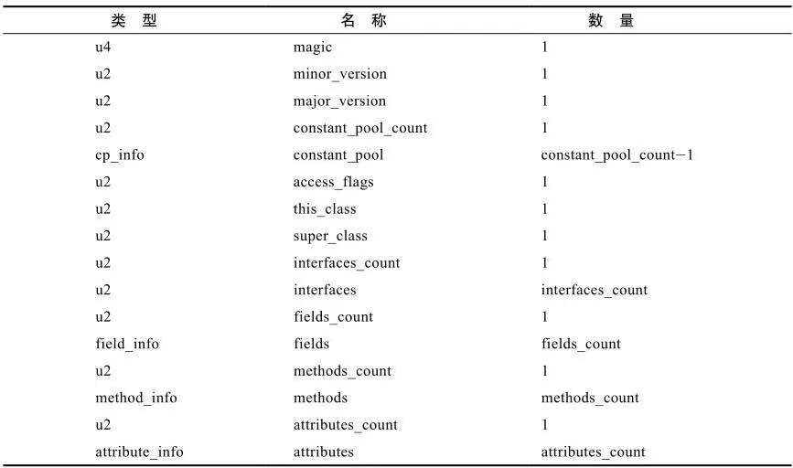
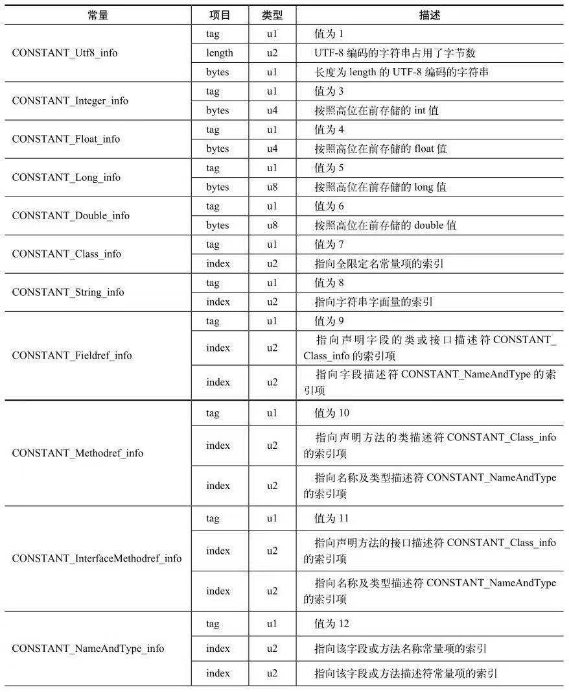

[TOC]

# class文件结构

此篇分析一下关于java编译后的class文件的结构，此是了解jvm内部结构必需的一个步骤。当然了纯纯分析数据结构比较枯燥，不过没关系，前面介绍理论知识，后面给出一个具体分析文件的示例，争取以简单直接的白话叙述清楚。

## 1. 总体结构

class文件是一组8字节为基础单位的二进制流，各个数据项目严格按照顺序紧凑的排列在class文件之中，中间没有添加任何分隔符，使得整个class文件中存储的内容几乎全部都是程序运行的必要数据，没有空隙存在。当遇到8位字节以上空间的数据项时，则会按照高位在前的方式分隔成若干个8位字节进行存储。

按照虚拟机规定，class文件采用一种类似c语言结构体的伪结构来存储，这种伪结构只有两种数据类型：**无符号数和表**。**无符号数：**是属于基本的数据类型，以u1，u2，u4，u8来分别代表1个字节，2个字节，4个字节，8个字节；无符号数可以用来描述数字，索引引用，数量值或者按照UTF-8编码构成字符串值。

**表：**是由多个无符号数或其他表作为数据项构成的复合数据类型，所有表都习惯性的以"_info"结尾。class文件本质上就是一张有层次关系的表。

class文件格式:



由图可知，一个class文件有上面16个item组成，其中要描述的同一类型的多个数据时，都设置了一个前置计数器。像上图中constant_pool_count 和 constant_pool，以及接口，fields，method，attribute都是这样。这涉及到程序的设计，因此java从没有约定编写一个类只可以有固定数量的field，或方法等硬性要求，大家平时也都是需要什么，就定义什么，所以数量都是不确定的。

接下来咱们一个一个分析class文件中的这些item。

### 1.1 魔数

class文件中的魔数是固定的，作用是用于确定这个文件是否为一个能被虚拟机接收的class文件。固定为:0xCAFEBABE。

### 1.2 版本号

minor_version表示次版本号，major_version 表示主版本号。Java的版本号是从45开始的，高版本的JDK能向下兼容以前版本的class文件。下面是各个jdk支持的version号:


### 1.3 常量池

关于常量池有关的item，constant_pool_count 和 constant_pool。因此常量池中的数量也是不确定的，所以定义了一个前置计数器；常量池计数器从1开始，0作为保留，作为表达"不引用任何一个常量池项目"。

常量池中主要存放两大类常量：字面常量(Litera)和符号引用(reference)。**字面常量**接近java语言层面的常量概念，如文本字符串，被声明为final的常量值。

符号引用属于编译原理方面的概念，包括三类常量：

1. 类和接口的全限定名(full qualified)
2. 字段的名称和描述符(descriptor)
3. 方法的名称和描述符

Java代码在进行javac编译的时候，不进行连接，而是在虚拟机加载class文件的时候进行动态连接。在虚拟机运行时，需要从常量池获得对应的符号引用，再在类创建时或运行时解析并翻译到具体的内存地址之中。

常量池中的每一项常量都是一个表，共有11种结构，这11种表都有一个共同的特点，就是表开始的第一位是一个u1类型的标志位(tag,取值为1至12，缺少标志2的数据类型)，代表当前这个常量属于哪种常量类型。

11种常量类型如下:


11种常量类型的结构总表：



### 1.4 access_flags

此标志用于识别一些类或接口层次的访问信息，包括这个class是类还是接口；是否定义为public类型；是否定义为abstract类型；是否被声明为final。

具体标志为如下：


### 1.5 this_class, super_class, interface

类索引(this_class)和父类索引(super_class)都是一个u2类型数据，而interfaces是一组u2类型的数据集合，class文件中由这个三项数据来确定这个类的继承关系。

**类索引:**用于确定这个类的全限定名。

**父类索引:**用于确定这个类的父类的全限定名。由于java不允许多继承，所以了除了Object之外，其他类都有一个父类。

**接口索引：**用于描述这个类实现了哪些接口，这些被实现的接口按照implements语句后的接口顺序从左到右排列在接口索引中（如果这个类本身是一个接口，则应当是extends）。

类索引和父类索引都是指向一个类型为constant_class_info的类描述符常量，通过constant_class_info类型的常量中的索引值找到定义在constant_utf8_info类型的常量中的全限定名字符串。

### 1.6 fields

字段表(field_info)用于描述接口或类中声明的变量。字段包括了类级变量或实例级变量。

字段表结构如下:


字段访问标志


跟随access_flag标志的是两个索引值:name_index和descriptor_index。它们都是对常量池的引用，分别代表着字段的**简单名称**和字段和**方法的描述符**。解释一下简单名称，描述符，全限定名概念：

全限定名：如 "org/apache/clazz/testClass" 是类的全限定名，就是把类全名中的 "." 替换为了 "/"。为了使连续的多个全限定名之间不产生混淆，在使用时最后一般会加入一个 ";" 表示全限定名结束。

简单名称：简单名称就是没有类型的参数修饰的方法或字段名称。如方法名为 void inc()方法的简单名称就是  inc

描述符：描述符的作用是用来描述字段的数据类型、方法的参数列表(包括数量，类型以及顺序)和返回值。

基本数据类型(byte short int long double float char boolean) 以及代表无返回值的void类型都用一个大写字母表示，对象类型使用字符L加对象的全限定名类表示。

描述符：


示例:

```shell
# 对于数组类型，每一维度使用一个前置的 "[" 字符来描述
java.lang.String [][] 二维数组，表示为: [[Ljava/lang/String
int[]  表示为: [I
# 描述符描述方法时，按照先参数列表后返回值的顺序描述，参数列表按照参数的严格顺序放在一组小括号"()"之内。
void int()   表示为:   ()V
java.lang.String toString()   表示为   ()Ljava/lang/String
int indexOf(char[] source,int sourceOffset,int sourceCount,char[] target,int targetOffset,int targetCount,int formIndex)  表示为：
						([CII[CIII)I
```


### 1.7 methods


### 1.8 attributes

