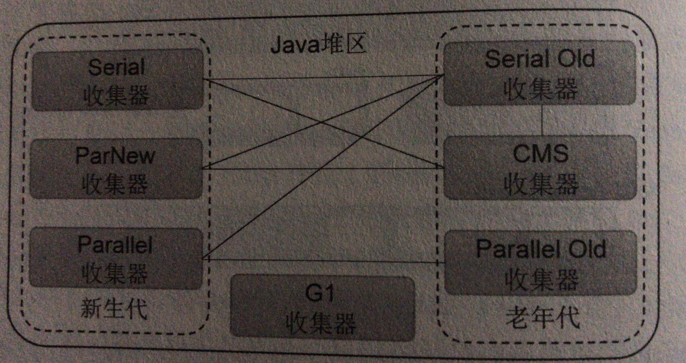

# 垃圾收集器

先来个图看看有那些收集器：

基于分代的概念，不同的代空间之间均活动着不同的GC。比如searial收集器是一个典型的新生代垃圾收集器，它采用复制算法回收新生代无用对象的内存空间。JVM实际运行中，新生代和老年代中各自的GC需要组合在一起共同执行垃圾收集。如图，新生代的GC和老年代的GC相连，则意味着可以组合在一起使用。

## 并行回收：Serial收集器

Serial收集器作用域新生代中，它采用复制算法，串行收集和stop-the-world机制的方式执行内存回收。并且serial是HotSpot中Client模式下的新生代默认收集器。

除了新生代外，Serial还提供作用与老年代垃圾收集的Serial Old收集器。Serial Old也采用了串行回收和stop-the-world机制，内存回收算法使用了标记-压缩算法。使用 -XX:+UseSerialGC 手动指定Serial收集器。

## 并行回收：ParNew收集器

如果说Serial是新生代单线程收集器，那么ParNew就是多线程版本的Serial。ParNew除了采用并行回收的方式执行内存回收外，两款收集器几乎没有什么任何区别，ParNew在新生代也是采用了复制算法和stop-the-world机制。

那么是否就可以断定ParNew就是比serial性能高呢？

如果说ParNew收集器运行在多CPU环境下，由于可以充分利用多CPU，多核心等物理硬件资源优先，确实要比serial性能更好，可以迅速的完成垃圾收集，提升程序吞吐量。但如果是CPU个数受限情况下，ParNew就不一定比serial性能更快了。虽然Serial是单线程，不需要CPU频繁的做任务切换，因此可以有效避免多线程交互过程中产生的一些额外开销。从理论上说serial又是时JVM受限于CPU宿主环境，而ParNew优势则是多CPU，多核心的宿主环境中，并且在注重低延迟的应用环境下，ParNew+CMS组合执行Server模式下的回收是比较好的选择。

-XX:+UseParNewGC手动指定。

## 程序吞吐量优先：Parallel收集器

Parallel同样采用复制算法，并行回收和stop-the-world机制。ParNew也是同样，那么Parllel是否是多此一举？和ParNew收集器不同，Paralle收集器可以控制程序的吞吐量大小，因此被称为吞吐量优先的垃圾收集器。可以通过选项 -XX:GCTimeRatio 设置执行内存回收的时间所占的JVM运行总时间的比例，也就是控制GC的执行频率，公式 1/(1+N) ，默认值是99，也就是1%的时间用于执行内存回收。初次之外，Parllel收集器还提供选项 -XX:MaxGCPauseMillis 设置执行内存回收时 Stop-the-World 机制的暂停时间阈值。如果指定了该项，那么parallel收集器会尽可能的在设定时间范围内完成内存回收。

**注意：** 在垃圾收集器中吞吐量和低延迟这两个目标其实是存在相互竞争的矛盾，因为如果选择了吞吐量优先，那么降低内存回收的执行频率是必然的，但这将会导致GC需要更长的暂停时间来执行内存回收。相反如果选择了低延迟优先，那么为了降低每次执行回收时的暂停时间，只能够频繁的执行内存回收，但这又引起了新生代内存的缩减和导致程序吞吐量的下降。

Parllel还提供了 -XX:UseAdaptiveSizePolicy 选项用于设置GC的自动分代大小的设置，此选项设置后，就意味着开发人员不再需要显示的设置新生代中的一些细节参数，JVM会根据自身的当前运行情况动态调整这些相关的参数。

在吞吐量优先的程序中，Parllel+Parllel Old组合执行Server模式下的内存回收时不错的选择。

-XX:+UseParllelGC 指定使用Parllel收集器。

收集器的其他参数：

## GC组合设置

| GC组合                                      | MinorGC              | FullGC                            | 描述                                                         |
| ------------------------------------------- | -------------------- | --------------------------------- | ------------------------------------------------------------ |
| -XX:+UseSerialGC                            | Serial收集器串行回收 | SerialOld串行回收                 | -XX:+UserSerialOld就可以手动指定使用Serial+SerialOld组合收集 |
| -XX:+UseParNewGC                            | ParNew并行回收       | SerialOld串行回收                 | -XX:+UseParNewGC可以手动指定使用ParNew+SerialOld组合         |
| -XX:+UserParallelGC                         | Parallel并行回收     | SerialOld串行回收                 | -XX:+UserParallelGC手动使用Parallel+SerialOld收集            |
| -XX:+UseParallelOldGC                       | Parallel并行回收     | ParllelOld并行回收                | -XX:+UseParallelOldGC 手动指定Parallel+ParallelOld回收       |
| -XX:+UseConcMarkSweepGC                     | ParNew并行回收       | 缺省使用CMS回收,备用使用SerialOld | -XX:+UseConcMarkSweepGC手动指定ParNew+CMS+SerialOld备用      |
| -XX:+UseConcMarkSweepGC   -XX:+UserParNewGC | ParNew并行回收       | 缺省使用CMS回收,备用使用SerialOld | -XX:+UseConcMarkSweepGC手动指定ParNew+CMS+SerialOld备用      |
| -XX:+UseG1GC                                | G1并发,并行收集      | G1并发,并行收集                   |                                                              |

## GC选项设置

## 内存选项

| 选项            | 缺省值               | 描述                                                   | 备注                                                         |
| --------------- | -------------------- | ------------------------------------------------------ | ------------------------------------------------------------ |
| -Xms            | 物理内存的1/64(<1GB) | 设置java堆区的初始内存                                 | 当可用java堆区内存小于40%时,JVM就会将内存调整到-Xmx所允许的最大值 |
| -Xmx            | 物理内存的1/4        | 设置java堆区的最大内存                                 | 当可用java堆区内存大于70%时,JVM就会将内存调整到-Xms指定的值  |
| -Xmn            | 暂无                 | 设置新生代的内存                                       | -Xmn内存大于为eden+2个survivor空间的值,建议配置整个堆的3/8   |
| -XX:NewSize     | 暂无                 | 设置新生代的初始内存                                   | 和选项-Xmn等价,但推荐生产环境使用-Xmn                        |
| -XX:MaxNewSize  | 暂无                 | 设置新生代最大内存                                     |                                                              |
| -XX:NewRatio    | 暂无                 | 新生代(eden+2个Survior空间)与老年代的比值,不包括永久代 | 当选项-XX:NewRatio=4时,表示新生代与老年代所占的比值为1:4.如果已经设置了Xmn,则无须设置该选项. |
| -XX:PermSize    | 物理内存的1/64       | 方法区的初始内存                                       | 暂无                                                         |
| -XX:MaxPermSize | 物理内存的1/4        | 方法区的最大内存                                       | 暂无                                                         |

## 其他设置

| 选型                               | 描述                                     |
| ---------------------------------- | ---------------------------------------- |
| -XX:+PrintGC                       | 打印垃圾收集器的基础信息                 |
| -XX:+PrintGCDetail                 | 打印垃圾收集器的详细信息                 |
| -XX:+PrintGCTimesStamps            | 打印垃圾收集器开始执行的时间戳(基准时间) |
| -XX:+PrintGCDateStamps             | 打印垃圾收集器开始执行的时间戳(日期格式) |
| -XX:+PrintGCApplicationStoppedTime | 打印垃圾收集器造成的程序暂停的时间       |
| -XX:+PrintTLAB                     | 打印TLAB的使用情况                       |
| -XX:+PrintTenuringDistribution     | 打印每次MinorGC后新的存活周期的阈值      |
| -XX:+PrintHeapAtGC                 | 打印GC前后详细的堆栈信息                 |
| -Xloggc                            | 指定GC日志的输出路径                     |

