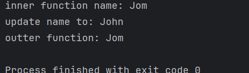

---
tags:
  - java
  - value-pass
---
在一个java 函数中, 参数可以是 基本数据类型(int, long, bool, char etc), 我们称之为 `值传递`, 即***函数得到的实参其实是 参数的一个拷贝***. 
```java
public class example {

	// parameter is primitive type
	public void add (int a, int b) {
		return a+ b;
	}
}
```

那么针对参数参数为对象类型呢？  如何理解其同样也是`值传递` ？
在平时的使用中，传递一个对象到函数， 其实函数是可以修改对象的属性值的，感觉更像是`引用传递`.

> 针对参数为对象的, 同样也是值传递, 只不过传递的为`对象的一个地址副本`. 也就是说函数接收的参数和实参其实是指向同一个对象的, 故通过 接收的参数是可以修改对象. 但是修改函数参数为一个新对象, 其实并不影响函数外的对象.
> 

```java
import lombok.AllArgsConstructor;  
import lombok.Data;  
import lombok.NoArgsConstructor;  
  
@Data  
@NoArgsConstructor  
@AllArgsConstructor  
public class Person {  
  
    private String name;  
  
    private int age;  
  
}


public class Main {  
  
    public void SayHello(Person p){  
        System.out.println("inner function name: " + p.getName());  
         p =new Person("John", 30);  
        System.out.println("update name to: " + p.getName());  
    }  
  
  
    public static void main(String[] args) {  
        Main main = new Main();  
        Person jom = new Person("Jom", 20);  
        main.SayHello(jom);  
  
        System.out.println("outter function: " + jom.getName());  
    }  
}
```

输出：



可以看出外部的对象并没有改变.  原理如下: 
[[value-pass.excalidraw]]


> `Go`的值传递于此类似

