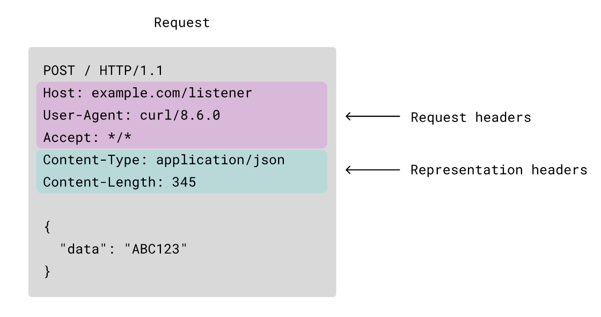
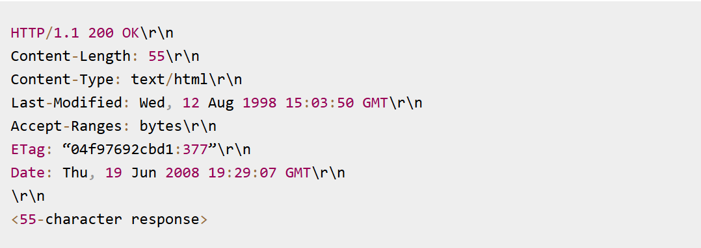
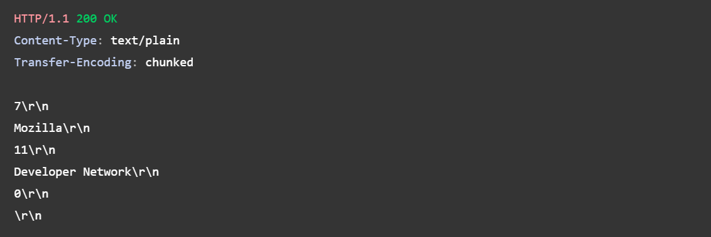

---
tags:
  - http
  - chunk-body
  - SSE
---
## normal fomat

针对http的request， reponse 的请求格式如下所示：






针对此种类型的数据类，都有一个`Content-length`表明了body中的数据长度，故 http-server/client 解析此类信息时，只需读取对应 长度的数据即可。

## chunk
那么对于那种数据量很大，或者动态生成的内容无法确定长度，要如何处理呢？
难道把所有数据缓存到内存，直到能确定其长度？这是一个可用的方法，不过容易出现OOM。

此时就可以使用`chunk` 传输类型，其格式如下：


其response header中包含：`Transfer-Encoding: chunked`，response body格式:

```shell
## 解析上图中的内容:
7\r\n    # 内容长度为7
Mozilla\r\n
11\r\n    # 内容长度为 17
Developer Network\r\n
0\r\n
\r\n

```

```shell
length\r\n   # 长度格式为 16进制
body\r\n
...
0\r\n   # 结束行长度为0
\r\n
```

由此可以看出来`chunk`传输类型比较灵活，`其可以有一些数据就直接发送，不需要获取所有数据才进行发送`。

> Note

chunk 没有Content-Length header.


## SSE & event-stream

SSE stream留不同于webSocket，其是单向数据，即server->client，并且是一个长存的http connection。

其格式如下：
```shell
=> Request
GET /stream HTTP/1.1
Host: example.com
Accept: text/event-stream

<= Response
HTTP/1.1 200 OK
Connection: keep-alive
Content-Type: text/event-stream
Transfer-Encoding: chunked

: this is a test stream   ## comment

id: 42                   ## message body
event: bar               ## event name
data: Multi-line message of
data: type "bar" and id "42"

id: 43
event: bar
data: {"message": "JSON payload"}

id: 44
event: bar
data: {"message": "JSON payload1"}

```

```shell
## other message format
retry: 15000    # set client reconnect interval

data: First message is a simple string.

data: {"message": "JSON payload"}

event: foo
data: Message of type "foo"

id: 42
event: bar
data: Multi-line message of
data: type "bar" and id "42"

id: 43
data: Last message, id "43"
```

通过SSE stream，server 可以实时推送一些信息到client。


> reference

[sse-stream](https://developer.mozilla.org/en-US/docs/Web/API/Server-sent_events/Using_server-sent_events)
[SSE](https://hpbn.co/server-sent-events-sse/)
[chunk wiki] (https://en.wikipedia.org/wiki/Chunked_transfer_encoding)
[http spec](https://datatracker.ietf.org/doc/html/rfc9112)


