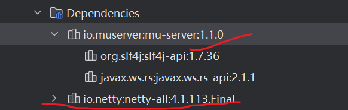
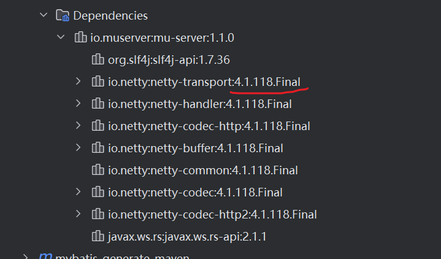

---
tags:
  - maven
  - best-practise
---
在maven管理依赖时, 通常第三方引入的间接依赖会有 vulnerability.  那么针对这种情况要如何优雅的进行处理呢 ?

通常大家都会把三方的依赖exclude, 之后手动加上高版本的依赖, 如下:
```shell
<dependencies>  
    <dependency>  
        <groupId>io.muserver</groupId>  
        <artifactId>mu-server</artifactId>  
        <version>1.1.0</version>  
        <exclusions>  
            <exclusion>  
                <groupId>io.netty</groupId>  
                <artifactId>netty-transport</artifactId>  
            </exclusion>  
            <exclusion>  
                <groupId>io.netty</groupId>  
                <artifactId>netty-handler</artifactId>  
            </exclusion>  
            <exclusion>  
                <groupId>io.netty</groupId>  
                <artifactId>netty-codec-http</artifactId>  
            </exclusion>  
            <exclusion>  
                <groupId>io.netty</groupId>  
                <artifactId>netty-buffer</artifactId>  
            </exclusion>  
            <exclusion>  
                <groupId>io.netty</groupId>  
                <artifactId>netty-common</artifactId>  
            </exclusion>  
            <exclusion>  
                <groupId>io.netty</groupId>  
                <artifactId>netty-codec</artifactId>  
            </exclusion>  
            <exclusion>  
                <groupId>io.netty</groupId>  
                <artifactId>netty-codec-http2</artifactId>  
            </exclusion>  
        </exclusions>  
    </dependency>  
    <dependency>  
        <groupId>io.netty</groupId>  
        <artifactId>netty-all</artifactId>  
        <version>4.1.113.Final</version>  
    </dependency>  
</dependencies>

```
可以看到mu-server的netty依赖没有了, 只剩下 netty-all的依赖.



但是比较优雅的是通过 dependencyManagement 来设定好所有依赖的版本, 这样就算第三方引入了间接的低版本依赖,  其也会被 dependencyManagement 进行管理:
```shell
 <dependencyManagement>  
   <dependencies>  
       <dependency>  
           <groupId>io.netty</groupId>  
           <artifactId>netty-transport</artifactId>  
            <version>4.1.118.Final</version>  
       </dependency>  
       <dependency>  
           <groupId>io.netty</groupId>  
           <artifactId>netty-handler</artifactId>  
            <version>4.1.118.Final</version>  
       </dependency>  
       <dependency>  
           <groupId>io.netty</groupId>  
           <artifactId>netty-codec-http</artifactId>  
            <version>4.1.118.Final</version>  
       </dependency>  
       <dependency>  
           <groupId>io.netty</groupId>  
           <artifactId>netty-buffer</artifactId>  
            <version>4.1.118.Final</version>  
       </dependency>  
       <dependency>  
           <groupId>io.netty</groupId>  
           <artifactId>netty-common</artifactId>  
            <version>4.1.118.Final</version>  
       </dependency>  
       <dependency>  
           <groupId>io.netty</groupId>  
           <artifactId>netty-codec</artifactId>  
            <version>4.1.118.Final</version>  
       </dependency>  
       <dependency>  
           <groupId>io.netty</groupId>  
           <artifactId>netty-codec-http2</artifactId>  
            <version>4.1.118.Final</version>  
       </dependency>  
       <dependency>  
           <groupId>io.netty</groupId>  
           <artifactId>netty-bom</artifactId>  
           <version>4.1.118.Final</version>  
           <type>pom</type>  
       </dependency>  
   </dependencies>  
 </dependencyManagement>
 
<dependencies>  
    <dependency>  
        <groupId>io.muserver</groupId>  
        <artifactId>mu-server</artifactId>  
        <version>1.1.0</version>  
        <exclusions>  
        </exclusions>  
    </dependency>  
</dependencies>

```

可以看到 `mu-server`的netty 依赖版本变成了设定的version 号.




