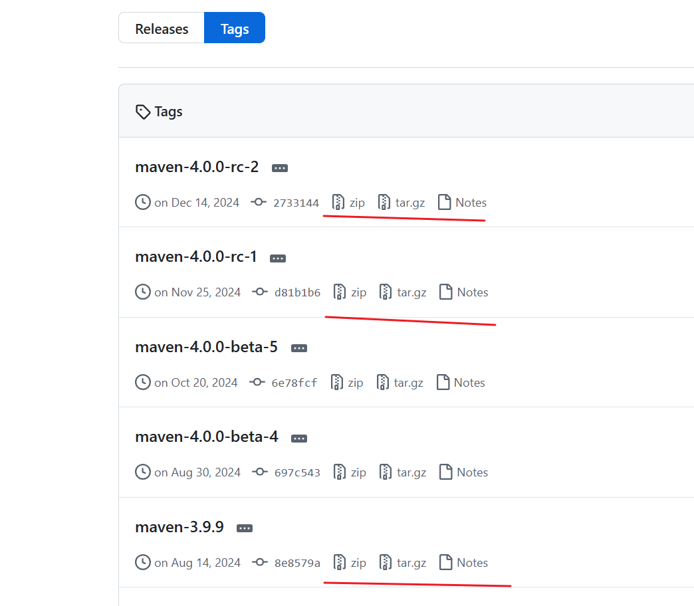
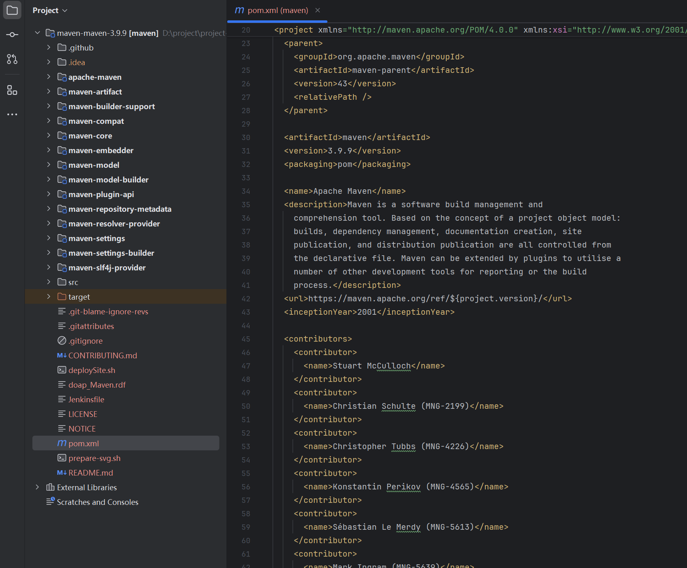
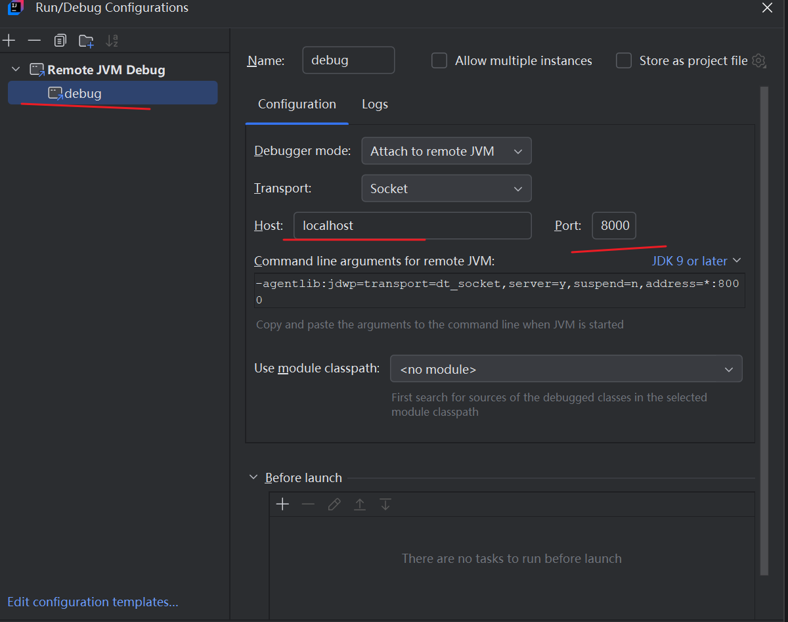
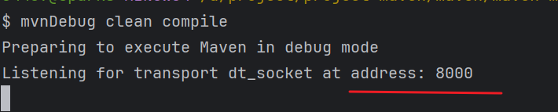
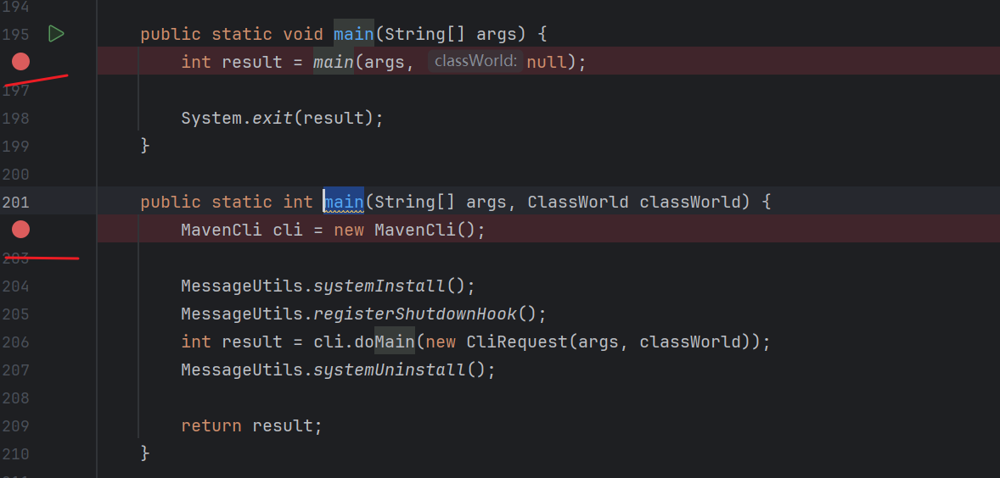
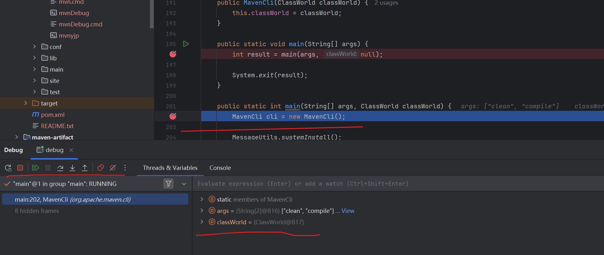

---
tags:
  - maven
  - debug
  - idea
  - maven_debug
---
工作中使用到了很多maven的功能，如： 打包，单元测试，单元测试报告，以及setting中设置server的credentials.  但是说到maven， 仍然会对其实现不是特别理解。
那么我们来搭建一个可以进行debug的maven环境， 用于对于内部实现的连接。

>step 1: 本地安装好一个maven环境

下载一个maven package， 解压， 配置环境变量就可以直接使用了。


> step 2: 下载上面maven package 对应的源码

[download](https://github.com/apache/maven/tags)



> step 3:  idea 打开源码包

使用Idea打开源码，并且成功执行`mvn clean compile`



> step4: 配置idea debug

配置到debug的配置，因为mvnDebug使用的8000端口， 故这里配置的同样为8000.



> step5: mvnDebug 运行 指令

通过 `mvnDebug clean compile` 来打开debug端口
```shell
mvnDebug clean compile
```



> step6:  打上 breakpoint 进行调试

在入口函数 `org.apache.maven.cli.MavenCli#main(java.lang.String[], ClassWorld)` 打上breakpoint.  




> step7: 使用idea配置好的debug 配置连接




