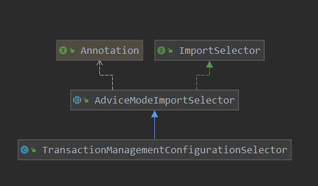
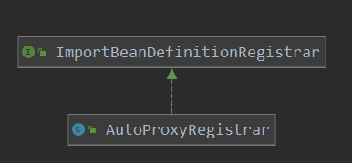
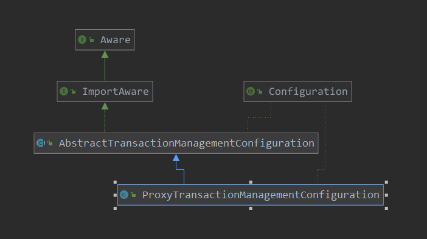

[TOC]

# 事务的环境准备

前篇分析了Aop的实现，本篇来看一下事务的处理。其实了解的小伙伴都知道，事务其实也是通过Aop来实现的，只不过是一种特殊的Aop。

其实分析过Aop后，相比大家都了解了分析的思路，看看有什么新添加的配置，新添加的注解，以此作为入口点来进行分析；那就比较清晰了，事务多了一个特殊的注解：@EnableTransactionManagement。

看一下此注解做了什么工作把：

```java
@Target(ElementType.TYPE)
@Retention(RetentionPolicy.RUNTIME)
@Documented
@Import(TransactionManagementConfigurationSelector.class)
public @interface EnableTransactionManagement {
	boolean proxyTargetClass() default false;

	AdviceMode mode() default AdviceMode.PROXY;

	int order() default Ordered.LOWEST_PRECEDENCE;
}
```

可以看到这次同样是注入到容器中一个类，直接看此类干了什么呢？


看一下此TransactionManagementConfigurationSelector的类图：



可以看到此是ImportSelector的子类，也就是说此类同样是向容器注入bean的操作。

先看一下父类: 

> org.springframework.context.annotation.AdviceModeImportSelector#selectImports

```java
@Override
public final String[] selectImports(AnnotationMetadata importingClassMetadata) {
    Class<?> annType = GenericTypeResolver.resolveTypeArgument(getClass(), AdviceModeImportSelector.class);
    Assert.state(annType != null, "Unresolvable type argument for AdviceModeImportSelector");
    AnnotationAttributes attributes = AnnotationConfigUtils.attributesFor(importingClassMetadata, annType);
    if (attributes == null) {
        throw new IllegalArgumentException(String.format(
            "@%s is not present on importing class '%s' as expected",
            annType.getSimpleName(), importingClassMetadata.getClassName()));
    }
    // 事务代理的模式
    AdviceMode adviceMode = attributes.getEnum(getAdviceModeAttributeName());
    // 根据模式的不同 来注入不同的bean到容器中
    String[] imports = selectImports(adviceMode);
    if (imports == null) {
        throw new IllegalArgumentException("Unknown AdviceMode: " + adviceMode);
    }
    return imports;
}
```

> org.springframework.transaction.annotation.TransactionManagementConfigurationSelector#selectImports

```java
@Override
protected String[] selectImports(AdviceMode adviceMode) {
    switch (adviceMode) {
        case PROXY:
            // 向容器中注入下面两个类
            return new String[] {AutoProxyRegistrar.class.getName(),
                                 ProxyTransactionManagementConfiguration.class.getName()};
        case ASPECTJ:
            // 继续向容器中注入 AspectJ 创建代理的bean
            return new String[] {determineTransactionAspectClass()};
        default:
            return null;
    }
}


private String determineTransactionAspectClass() {
    return (ClassUtils.isPresent("javax.transaction.Transactional", getClass().getClassLoader()) ?
            TransactionManagementConfigUtils.JTA_TRANSACTION_ASPECT_CONFIGURATION_CLASS_NAME :
            TransactionManagementConfigUtils.TRANSACTION_ASPECT_CONFIGURATION_CLASS_NAME);
}

```

分别在看看注入的两个类做了什么操作：

AutoProxyRegistrar的类图如下：



从类图可以看出，此类的操作，仍然是向容器中注入bean。

> org.springframework.context.annotation.AutoProxyRegistrar#registerBeanDefinitions

```java
	@Override
	public void registerBeanDefinitions(AnnotationMetadata importingClassMetadata, BeanDefinitionRegistry registry) {
		boolean candidateFound = false;
		Set<String> annoTypes = importingClassMetadata.getAnnotationTypes();
		for (String annoType : annoTypes) {
			AnnotationAttributes candidate = AnnotationConfigUtils.attributesFor(importingClassMetadata, annoType);
			if (candidate == null) {
				continue;
			}
			Object mode = candidate.get("mode");
			Object proxyTargetClass = candidate.get("proxyTargetClass");
			if (mode != null && proxyTargetClass != null && AdviceMode.class == mode.getClass() &&
					Boolean.class == proxyTargetClass.getClass()) {
				candidateFound = true;
				// 此处注入的是 创建 事务代理的类
				if (mode == AdviceMode.PROXY) {
					AopConfigUtils.registerAutoProxyCreatorIfNecessary(registry);
					if ((Boolean) proxyTargetClass) {
						AopConfigUtils.forceAutoProxyCreatorToUseClassProxying(registry);
						return;
					}
				}
			}
		}
		if (!candidateFound && logger.isInfoEnabled()) {
			String name = getClass().getSimpleName();
			logger.info(String.format("%s was imported but no annotations were found " +
					"having both 'mode' and 'proxyTargetClass' attributes of type " +
					"AdviceMode and boolean respectively. This means that auto proxy " +
					"creator registration and configuration may not have occurred as " +
					"intended, and components may not be proxied as expected. Check to " +
					"ensure that %s has been @Import'ed on the same class where these " +
					"annotations are declared; otherwise remove the import of %s " +
					"altogether.", name, name, name));
		}
	}
```

> org.springframework.aop.config.AopConfigUtils#registerAutoProxyCreatorIfNecessary

```java
@Nullable
public static BeanDefinition registerAutoProxyCreatorIfNecessary(BeanDefinitionRegistry registry) {
    return registerAutoProxyCreatorIfNecessary(registry, null);
}
// 注册创建事务的bean
@Nullable
public static BeanDefinition registerAutoProxyCreatorIfNecessary(
    BeanDefinitionRegistry registry, @Nullable Object source) {
    return registerOrEscalateApcAsRequired(InfrastructureAdvisorAutoProxyCreator.class, registry, source);
}

```

> org.springframework.aop.config.AopConfigUtils#registerOrEscalateApcAsRequired

```java
// 注册或者 包装
@Nullable
private static BeanDefinition registerOrEscalateApcAsRequired(
    Class<?> cls, BeanDefinitionRegistry registry, @Nullable Object source) {

    Assert.notNull(registry, "BeanDefinitionRegistry must not be null");
    // 如果容器中存在 这个AUTO_PROXY_CREATOR_BEAN_NAME bean,则进行一定的包装操作
    if (registry.containsBeanDefinition(AUTO_PROXY_CREATOR_BEAN_NAME)) {
        BeanDefinition apcDefinition = registry.getBeanDefinition(AUTO_PROXY_CREATOR_BEAN_NAME);
        if (!cls.getName().equals(apcDefinition.getBeanClassName())) {
            int currentPriority = findPriorityForClass(apcDefinition.getBeanClassName());
            int requiredPriority = findPriorityForClass(cls);
            if (currentPriority < requiredPriority) {
                apcDefinition.setBeanClassName(cls.getName());
            }
        }
        return null;
    }
    // 如果容器中不存在 AUTO_PROXY_CREATOR_BEAN_NAME 这个bean,那么就创建一个  并注册到容器中
    RootBeanDefinition beanDefinition = new RootBeanDefinition(cls);
    beanDefinition.setSource(source);
    beanDefinition.getPropertyValues().add("order", Ordered.HIGHEST_PRECEDENCE);
    beanDefinition.setRole(BeanDefinition.ROLE_INFRASTRUCTURE);
    registry.registerBeanDefinition(AUTO_PROXY_CREATOR_BEAN_NAME, beanDefinition);
    return beanDefinition;
}
```

嗯，有没有似曾相识，Aop的创建类也同样是这样注入到容器的。

在看一下ProxyTransactionManagementConfiguration的类图：



从类图可以看到，此类是一个配置类：

```java
@Configuration
public class ProxyTransactionManagementConfiguration extends AbstractTransactionManagementConfiguration {
    // 此才是主要的, 主要用于判断 method 是否需要创建事务代理
    @Bean(name = TransactionManagementConfigUtils.TRANSACTION_ADVISOR_BEAN_NAME)
    @Role(BeanDefinition.ROLE_INFRASTRUCTURE)
    public BeanFactoryTransactionAttributeSourceAdvisor transactionAdvisor() {
        BeanFactoryTransactionAttributeSourceAdvisor advisor = new BeanFactoryTransactionAttributeSourceAdvisor();
        // 记录事务属性 AnnotationTransactionAttributeSource
        // 也就是记录pointcut
        advisor.setTransactionAttributeSource(transactionAttributeSource());
        // 记录拦截器
        advisor.setAdvice(transactionInterceptor());
        if (this.enableTx != null) {
            advisor.setOrder(this.enableTx.<Integer>getNumber("order"));
        }
        return advisor;
    }
    
    // 此就是相当于 pointcut
    @Bean
    @Role(BeanDefinition.ROLE_INFRASTRUCTURE)
    public TransactionAttributeSource transactionAttributeSource() {
        return new AnnotationTransactionAttributeSource();
    }
    
    // 事务的拦截器
    @Bean
    @Role(BeanDefinition.ROLE_INFRASTRUCTURE)
    public TransactionInterceptor transactionInterceptor() {
        TransactionInterceptor interceptor = new TransactionInterceptor();
        interceptor.setTransactionAttributeSource(transactionAttributeSource());
        if (this.txManager != null) {
            interceptor.setTransactionManager(this.txManager);
        }
        return interceptor;
    }
}
```

此配置类向容器中注入了事务的advisor， 事务的拦截器，事务的pointcut，对于一个Aop的创建来说就全活了。

通过一个注解，可以看到其做了哪些工作呢？总结一下：

1. 注入了创建事务Aop的类到容器中
2. 创建了事务的advisor
3. 创建了事务的pointcut
4. 创建事务额拦截器

一个注解，就把整个常见事务Aop的所需要的bean准备齐活了。准备齐了，下面就可以看看事务Aop的创建了。


