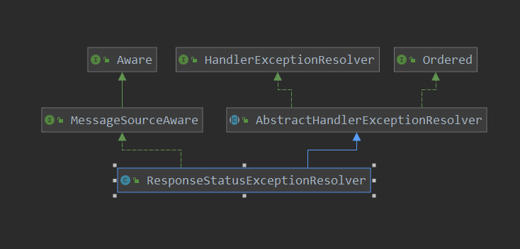

[TOC]

# ResponseStatusExceptionResolver 初始化

本篇看一下ResponseStatusExceptionResolver的初始化，先看一下类图把：



```java
public class ResponseStatusExceptionResolver extends AbstractHandlerExceptionResolver implements MessageSourceAware {

    @Nullable
    private MessageSource messageSource;


    @Override
    public void setMessageSource(MessageSource messageSource) {
        this.messageSource = messageSource;
    }


    @Override
    @Nullable
    protected ModelAndView doResolveException(
        HttpServletRequest request, HttpServletResponse response, @Nullable Object handler, Exception ex) {

        try {
            // 如果是 ResponseStatusException 异常
            // 则强转异常获取异常信息, 进行返回
            if (ex instanceof ResponseStatusException) {
                return resolveResponseStatusException((ResponseStatusException) ex, request, response, handler);
            }
            // 没有异常,则 获取 ResponseStatus注解的信息
            ResponseStatus status = AnnotatedElementUtils.findMergedAnnotation(ex.getClass(), ResponseStatus.class);
            // 如果有指定 返回的status,则 返回
            if (status != null) {
                return resolveResponseStatus(status, request, response, handler, ex);
            }
            // 如果 ex.getCause() 仍然是 异常,则再次 递归解析 异常
            if (ex.getCause() instanceof Exception) {
                return doResolveException(request, response, handler, (Exception) ex.getCause());
            }
        }
        catch (Exception resolveEx) {
            if (logger.isWarnEnabled()) {
                logger.warn("Failure while trying to resolve exception [" + ex.getClass().getName() + "]", resolveEx);
            }
        }
        return null;
    }

    /**
	 * Template method that handles the {@link ResponseStatus @ResponseStatus} annotation.
	 * <p>The default implementation delegates to {@link #applyStatusAndReason}
	 * with the status code and reason from the annotation.
	 * @param responseStatus the {@code @ResponseStatus} annotation
	 * @param request current HTTP request
	 * @param response current HTTP response
	 * @param handler the executed handler, or {@code null} if none chosen at the
	 * time of the exception, e.g. if multipart resolution failed
	 * @param ex the exception
	 * @return an empty ModelAndView, i.e. exception resolved
	 */
    protected ModelAndView resolveResponseStatus(ResponseStatus responseStatus, HttpServletRequest request,
                                                 HttpServletResponse response, @Nullable Object handler, Exception ex) throws Exception {

        int statusCode = responseStatus.code().value();
        String reason = responseStatus.reason();
        return applyStatusAndReason(statusCode, reason, response);
    }

    /**
	 * Template method that handles an {@link ResponseStatusException}.
	 * <p>The default implementation delegates to {@link #applyStatusAndReason}
	 * with the status code and reason from the exception.
	 * @param ex the exception
	 * @param request current HTTP request
	 * @param response current HTTP response
	 * @param handler the executed handler, or {@code null} if none chosen at the
	 * time of the exception, e.g. if multipart resolution failed
	 * @return an empty ModelAndView, i.e. exception resolved
	 * @since 5.0
	 */
    protected ModelAndView resolveResponseStatusException(ResponseStatusException ex,
                                                          HttpServletRequest request, HttpServletResponse response, @Nullable Object handler) throws Exception {

        int statusCode = ex.getStatus().value();
        String reason = ex.getReason();
        return applyStatusAndReason(statusCode, reason, response);
    }

    /**
	 * Apply the resolved status code and reason to the response.
	 * <p>The default implementation sends a response error using
	 * {@link HttpServletResponse#sendError(int)} or
	 * {@link HttpServletResponse#sendError(int, String)} if there is a reason
	 * and then returns an empty ModelAndView.
	 * @param statusCode the HTTP status code
	 * @param reason the associated reason (may be {@code null} or empty)
	 * @param response current HTTP response
	 * @since 5.0
	 */
    protected ModelAndView applyStatusAndReason(int statusCode, @Nullable String reason, HttpServletResponse response)
        throws IOException {

        if (!StringUtils.hasLength(reason)) {
            response.sendError(statusCode);
        }
        else {
            String resolvedReason = (this.messageSource != null ?
                                     this.messageSource.getMessage(reason, null, reason, LocaleContextHolder.getLocale()) :
                                     reason);
            response.sendError(statusCode, resolvedReason);
        }
        return new ModelAndView();
    }
}
```

可以看到，这里的初始化也是比较清晰的，也没有做其他什么特殊操作。


