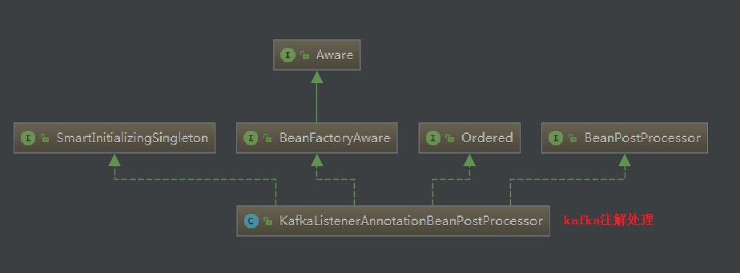
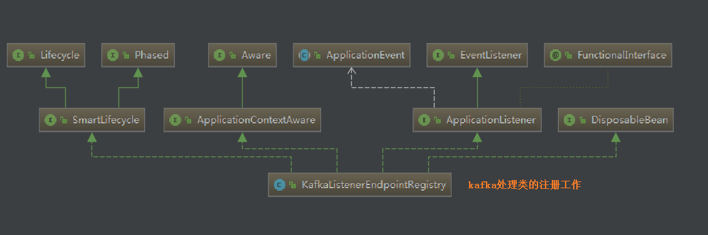
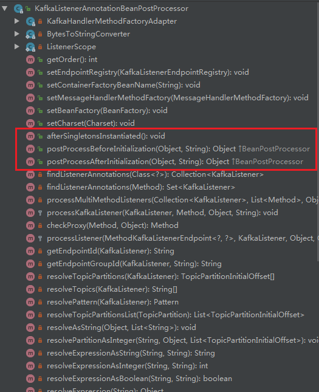

[TOC]

# springboot - kakfa 整合源码解析

开篇先问一个问题：springboot是如何做到开箱即用的？自己对此问题的目前理解是，对于许多需要的组件，springboot做了许多的配置类，换句话说就是springboot把之前需要程序员自己做的配置都提前做好了，以此来达到一个开箱即用的效果。

好了，那看相关kafka的整合，肯定也是以springboot对kafka的自动配置类为入口，以一个bean的生命周期为线索来进行分析。

那自动配置的类在autoconfig包中，并且在spring.factories文件中写好了。看一下吧：


那先进入此类看一下吧：

```java
@Configuration
@ConditionalOnClass(KafkaTemplate.class)
@EnableConfigurationProperties(KafkaProperties.class)
@Import({ KafkaAnnotationDrivenConfiguration.class, KafkaStreamsAnnotationDrivenConfiguration.class })
public class KafkaAutoConfiguration {
  .....
}
// 注意看此处引入的其他类，具体的代码先省略。
// KafkaProperties 就是从application.yml|applicaiton.properties中读取的kafka的信息，不是特别重要，此处暂且不说
```

```java
@Configuration
@ConditionalOnClass(EnableKafka.class)
class KafkaAnnotationDrivenConfiguration {
...
}

// 此处也是主要看引入的具体的代码
```

```java
@Target(ElementType.TYPE)
@Retention(RetentionPolicy.RUNTIME)
@Documented
@Import(KafkaBootstrapConfiguration.class)
public @interface EnableKafka {
}
// 此处也看具体引入的包
```

```java
@Configuration
public class KafkaBootstrapConfiguration {
    
    /**
    * 此处引入了两个重要额bean,此处分析的主要点
    */
    // 注解的具体处理
	@SuppressWarnings("rawtypes")
	@Bean(name = KafkaListenerConfigUtils.KAFKA_LISTENER_ANNOTATION_PROCESSOR_BEAN_NAME)
	@Role(BeanDefinition.ROLE_INFRASTRUCTURE)
	public KafkaListenerAnnotationBeanPostProcessor kafkaListenerAnnotationProcessor() {
		return new KafkaListenerAnnotationBeanPostProcessor();
	}
   	// 此会保存kafka的 containter 以及 kafkaListenerContainer 信息
	@Bean(name = KafkaListenerConfigUtils.KAFKA_LISTENER_ENDPOINT_REGISTRY_BEAN_NAME)
	public KafkaListenerEndpointRegistry defaultKafkaListenerEndpointRegistry() {
		return new KafkaListenerEndpointRegistry();
	}
}
```

上面主要是一个自动配置的引入流程，只需要知道上面的代码步骤即可，具体的代码下面慢慢分析。下面就是整个的自动配置以及处理的流程分析。不过主要还是KafkaListenerAnnotationBeanPostProcessor和KafkaListenerEndpointRegistry两个bean的功能分析。

对于具体整合的分析，咱们以一个bean的生命周期为脉络入手分析；那么先看一下上面的两个类框架图：





从生命周期看，KafkaListenerAnnotationBeanPostProcessor此bean先进行处理，看一下此类的具体方法：



方法很多，不过在bean的初始化过程中，主要是上面圈出的三个方法是初始化阶段的主要方法。执行顺序是：

```java
postProcessBeforeInitialization -> postProcessAfterInitialization -> afterSingletonsinstantiated
```

那接下来就是最有价值，当然也是比较枯燥的源码分析了：

```java
// 这里没有什么说的, 
@Override
public Object postProcessBeforeInitialization(Object bean, String beanName) throws BeansException {
		return bean;
	}
```

```java
// 这里就涉及到了具体的处理逻辑
@Override
public Object postProcessAfterInitialization(final Object bean, final String beanName) throws BeansException {
    if (!this.nonAnnotatedClasses.contains(bean.getClass())) {
        Class<?> targetClass = AopUtils.getTargetClass(bean);
        // 查找有KafkaListener注解的类
        Collection<KafkaListener> classLevelListeners = findListenerAnnotations(targetClass);
        final boolean hasClassLevelListeners = classLevelListeners.size() > 0;
        final List<Method> multiMethods = new ArrayList<Method>();
        // 查找有KafkaListener的注解的方法
        Map<Method, Set<KafkaListener>> annotatedMethods = MethodIntrospector.selectMethods(targetClass,
       new MethodIntrospector.MetadataLookup<Set<KafkaListener>>() {
		 @Override
         public Set<KafkaListener> inspect(Method method) {
            Set<KafkaListener> listenerMethods = findListenerAnnotations(method);
            return (!listenerMethods.isEmpty() ? listenerMethods : null);
         }
});
        if (hasClassLevelListeners) { // 如果注解放在类上,那会按照此逻辑处理
            Set<Method> methodsWithHandler = MethodIntrospector.selectMethods(targetClass,(ReflectionUtils.MethodFilter)    method ->AnnotationUtils.findAnnotation(method, KafkaHandler.class) != null);
            multiMethods.addAll(methodsWithHandler);
        }
        if (annotatedMethods.isEmpty()) {// 没有添加此主机的方法,那么就会报错
            this.nonAnnotatedClasses.add(bean.getClass());
            if (this.logger.isTraceEnabled()) {
                this.logger.trace("No @KafkaListener annotations found on bean type: " + bean.getClass());
            }
        }
        else { // 有带有KafkaListener注解的方法,按照此逻辑处理
            // Non-empty set of methods
            for (Map.Entry<Method, Set<KafkaListener>> entry : annotatedMethods.entrySet()) {
                Method method = entry.getKey();
                for (KafkaListener listener : entry.getValue()) {
                    // 方法上带注解的进行处理  -- 咱们从这里看下去
                    processKafkaListener(listener, method, bean, beanName);
                }
            }

        }
        if (hasClassLevelListeners) { // 如果类带有此注解的
            processMultiMethodListeners(classLevelListeners, multiMethods, bean, beanName);
        }
    }
    return bean;
}
```

```java
protected void processKafkaListener(KafkaListener kafkaListener, Method method, Object bean, String beanName) {
    // 检查是否是代理
    Method methodToUse = checkProxy(method, bean);
    // 具体的注册节点
MethodKafkaListenerEndpoint<K, V> endpoint = new MethodKafkaListenerEndpoint<>();
    endpoint.setMethod(methodToUse);
    endpoint.setBeanFactory(this.beanFactory);
    // 异常处理方法
    String errorHandlerBeanName = resolveExpressionAsString(kafkaListener.errorHandler(), "errorHandler");
    if (StringUtils.hasText(errorHandlerBeanName)) {
        endpoint.setErrorHandler(this.beanFactory.getBean(errorHandlerBeanName, KafkaListenerErrorHandler.class));
    }
    // 继续处理
    processListener(endpoint, kafkaListener, bean, methodToUse, beanName);
}
```

```java
protected void processListener(MethodKafkaListenerEndpoint<?, ?> endpoint, KafkaListener kafkaListener, Object bean,Object adminTarget, String beanName) {
    String beanRef = kafkaListener.beanRef();
    if (StringUtils.hasText(beanRef)) {
        this.listenerScope.addListener(beanRef, bean);
    }
    // endpoint看到此bean保存了此listener的大部分信息
    endpoint.setBean(bean);
    endpoint.setMessageHandlerMethodFactory(this.messageHandlerMethodFactory);
    endpoint.setId(getEndpointId(kafkaListener));
    endpoint.setGroupId(getEndpointGroupId(kafkaListener, endpoint.getId()));
    endpoint.setTopicPartitions(resolveTopicPartitions(kafkaListener));
    endpoint.setTopics(resolveTopics(kafkaListener));
    endpoint.setTopicPattern(resolvePattern(kafkaListener));
    endpoint.setClientIdPrefix(resolveExpressionAsString(kafkaListener.clientIdPrefix(),"clientIdPrefix"));
    // 获取注解的信息,并进行相应的处理
    String group = kafkaListener.containerGroup();
    if (StringUtils.hasText(group)) {
        Object resolvedGroup = resolveExpression(group);
        if (resolvedGroup instanceof String) {
            endpoint.setGroup((String) resolvedGroup);
        }
    }
    // concurrency并发数
    String concurrency = kafkaListener.concurrency();
    if (StringUtils.hasText(concurrency)) {
        endpoint.setConcurrency(resolveExpressionAsInteger(concurrency, "concurrency"));
    }
    // 是否自动启动
    String autoStartup = kafkaListener.autoStartup();
    if (StringUtils.hasText(autoStartup)) {
        endpoint.setAutoStartup(resolveExpressionAsBoolean(autoStartup, "autoStartup"));
    }
	// containerFactory的工厂类
    KafkaListenerContainerFactory<?> factory = null;
    String containerFactoryBeanName = resolve(kafkaListener.containerFactory());
    if (StringUtils.hasText(containerFactoryBeanName)) {
        Assert.state(this.beanFactory != null, "BeanFactory must be set to obtain container factory by bean name");
        try {
            factory = this.beanFactory.getBean(containerFactoryBeanName, KafkaListenerContainerFactory.class);
        }
        catch (NoSuchBeanDefinitionException ex) {
         throw new BeanInitializationException("Could not register Kafka listener endpoint on [" + adminTarget+ "] for bean " + beanName + ", no " + KafkaListenerContainerFactory.class.getSimpleName() + " with id '" + containerFactoryBeanName + "' was found in the application context", ex);
        }
    }
	// 进行注册
    this.registrar.registerEndpoint(endpoint, factory);
    if (StringUtils.hasText(beanRef)) {
        this.listenerScope.removeListener(beanRef);
    }
}
```

```java
// KafkaListenerEndpointRegistrar class
private final List<KafkaListenerEndpointDescriptor> endpointDescriptors = new ArrayList<>();
public void registerEndpoint(KafkaListenerEndpoint endpoint, KafkaListenerContainerFactory<?> factory) {
    Assert.notNull(endpoint, "Endpoint must be set");
    Assert.hasText(endpoint.getId(), "Endpoint id must be set");
    // Factory may be null, we defer the resolution right before actually creating the container
    KafkaListenerEndpointDescriptor descriptor = new KafkaListenerEndpointDescriptor(endpoint, factory);
    synchronized (this.endpointDescriptors) {
        // 注意此时的startImmediately是false,故不会走这里
        if (this.startImmediately) { // Register and start immediately
            this.endpointRegistry.registerListenerContainer(descriptor.endpoint,
 resolveContainerFactory(descriptor), true);
        }
        else {
            // 就是添加到一个list
            this.endpointDescriptors.add(descriptor);
        }
    }
}
```

那上面那个bean初始化前后函数就到这里了，可以看到初始化前没有什么动作，初始化后进行了许多的操作，主要操作如下：

1. 找到带有KafkaListener注解的类或方法
2. 对具体的类或方法进行处理
   1. 首先是创建MethodKafkaListenerEndpoint
   2. MethodKafkaListenerEndpoint记录了大部分的kafkaListener的信息，包括了topic，groupId，此方法对应的bean，以及kafkaListener的一些属性：并发数，是否自动等
   3. 把此endpoint注册到了KafkaListenerEndpointRegistrar类中

那现在bean初始化前后的操作做完了，接下来就会走afterSingletonsInstantiated此方法：

```java
@Override
public void afterSingletonsInstantiated() {
    // 设置bean容器
    this.registrar.setBeanFactory(this.beanFactory);
    if (this.beanFactory instanceof ListableBeanFactory) {
        // 从bean工厂中获取KafkaListenerConfigurer类
        Map<String, KafkaListenerConfigurer> instances =
            ((ListableBeanFactory) this.beanFactory).getBeansOfType(KafkaListenerConfigurer.class);
        // 根据获取到的配置类进行配置
        for (KafkaListenerConfigurer configurer : instances.values()) {
            configurer.configureKafkaListeners(this.registrar);
        }
    }
	/// 这里注入的 KafkaListenerEndpointRegistry,所以上面postProcessAfterInitialization才能进行注册操作
    if (this.registrar.getEndpointRegistry() == null) {
        if (this.endpointRegistry == null) {
            Assert.state(this.beanFactory != null,
                         "BeanFactory must be set to find endpoint registry by bean name");
            // 从容器中获取
            this.endpointRegistry = this.beanFactory.getBean(
                KafkaListenerConfigUtils.KAFKA_LISTENER_ENDPOINT_REGISTRY_BEAN_NAME,
                KafkaListenerEndpointRegistry.class);
        }
        // 注入
        this.registrar.setEndpointRegistry(this.endpointRegistry);
    }
	// 并发容器工厂名
    if (this.containerFactoryBeanName != null) {
        this.registrar.setContainerFactoryBeanName(this.containerFactoryBeanName);
    }

    // Set the custom handler method factory once resolved by the configurer
    MessageHandlerMethodFactory handlerMethodFactory = this.registrar.getMessageHandlerMethodFactory();
    if (handlerMethodFactory != null) {
        this.messageHandlerMethodFactory.setMessageHandlerMethodFactory(handlerMethodFactory);
    }
    else {
        addFormatters(this.messageHandlerMethodFactory.defaultFormattingConversionService);
    }
	// 前面都是一个铺垫,此处是真正注册的地方
    // Actually register all listeners
    this.registrar.afterPropertiesSet();
}
```

```java
@Override
public void afterPropertiesSet() {
    registerAllEndpoints();
}

protected void registerAllEndpoints() {
    synchronized (this.endpointDescriptors) {
        for (KafkaListenerEndpointDescriptor descriptor : this.endpointDescriptors) {
            // 进行具体的注册操作
            this.endpointRegistry.registerListenerContainer(
                descriptor.endpoint, resolveContainerFactory(descriptor));
        }
        // 设置现在可以启动的标志
        this.startImmediately = true;  // trigger immediate startup
    }
}
```

那看一下具体是如何进行的注册:

```java
public void registerListenerContainer(KafkaListenerEndpoint endpoint, KafkaListenerContainerFactory<?> factory) {
    registerListenerContainer(endpoint, factory, false);
}

// 注册函数
public void registerListenerContainer(KafkaListenerEndpoint endpoint, KafkaListenerContainerFactory<?> factory, boolean startImmediately) {
    Assert.notNull(endpoint, "Endpoint must not be null");
    Assert.notNull(factory, "Factory must not be null");

    String id = endpoint.getId();
    Assert.hasText(id, "Endpoint id must not be empty");
    synchronized (this.listenerContainers) {
        Assert.state(!this.listenerContainers.containsKey(id),
                     "Another endpoint is already registered with id '" + id + "'");
        // createListenerContainer创建container,其作用什么呢? 其实就是一个为每一个监听的方法创建了一个线程池,然后在线程池中启动多个消费线程;消费线程的上限就是topic的分区数
        MessageListenerContainer container = createListenerContainer(endpoint, factory);
        // listenerContainers 记录所有的container的一个容器
        // 也就是在listenerContainers不存在的才会进行创建操作
      // 如果没有设置id那么id就是:org.springframework.kafka.KafkaListenerEndpointContainer# + 一个序列号
        this.listenerContainers.put(id, container);
        if (StringUtils.hasText(endpoint.getGroup()) && this.applicationContext != null) {
            // 这是containerGroup
            // 如果不存在那么就创建一个新的
            List<MessageListenerContainer> containerGroup;
            if (this.applicationContext.containsBean(endpoint.getGroup())) {
                containerGroup = this.applicationContext.getBean(endpoint.getGroup(), List.class);
            }
            else {
                containerGroup = new ArrayList<MessageListenerContainer>();
                this.applicationContext.getBeanFactory().registerSingleton(endpoint.getGroup(), containerGroup);
            }
            containerGroup.add(container);
        }
        if (startImmediately) {
            startIfNecessary(container);
        }
    }
}
```

那分析到这里，就发现一个问题，啊，已经分析完了，怎么没有看到我想看到的内容？这里只是记录了有kafkaListener注解方法，然后进行了相关的注册(其实就是放到了一个list中)，根据endpoint的id创建了对应的topic的container(具体存放kafka消费线程的地方)。心中杂乱，接下来怎么弄？如何走？ 都看到了容器，具体的消费线程是什么启动的呢？.......在杂乱之中，冷静就显得越发重要，再细看一下之前的框架图，突然发现了SmartLifecycle，生命周期管理，突然发现了曙光有没有。好，接着看这个。

那接下来看看KafkaListenerEndpointRegistry此类吧，具体看一下此类中的start方法：(不过你细看一下还有其他的一下关于生命周期管理的方法)

```java
public interface Lifecycle {
	void start();

	void stop();

	boolean isRunning();
}
```


```java
	@Override
	public void start() {
        // 可以看到此处的启动就是遍历之前注册好的endpoint，进行启动操作
		for (MessageListenerContainer listenerContainer : getListenerContainers()) {
			startIfNecessary(listenerContainer);
		}
	}
	
	public Collection<MessageListenerContainer> getListenerContainers() {
		return Collections.unmodifiableCollection(this.listenerContainers.values());
	}
```

```java
	private void startIfNecessary(MessageListenerContainer listenerContainer) {
		if (this.contextRefreshed || listenerContainer.isAutoStartup()) {
			listenerContainer.start();	// 调用启动方法
		}
	}
```

具体启动到了父类 AbstaractMessageListenerContainer 类:

```java
@Override
	public final void start() {
		checkGroupId();
		synchronized (this.lifecycleMonitor) {
			if (!isRunning()) {
				Assert.isTrue(
						this.containerProperties.getMessageListener() instanceof GenericMessageListener,"A " + GenericMessageListener.class.getName() + " implementation must be provided");
                // 具体启动方法有子类来进行实现(类似于模板模式是不是)
				doStart();
			}
		}
	}
```

先看ConcurrentmessageListenerContainer的启动把，见名识义，就是并发的信息监听容器：

```java
@Override
protected void doStart() {
    if (!isRunning()) { // 没有在running状态的才进行下面操作
        checkTopics();
        ContainerProperties containerProperties = getContainerProperties();
        TopicPartitionInitialOffset[] topicPartitions = containerProperties.getTopicPartitions();
        // 对并发数和topic的分区数进行了对比,也就是并发数不能大于分区数
        if (topicPartitions != null
            && this.concurrency > topicPartitions.length) {
            this.logger.warn("When specific partitions are provided, the concurrency must be less than or " + "equal to the number of partitions; reduced from " + this.concurrency + " to " + topicPartitions.length);
            this.concurrency = topicPartitions.length;
        }
        setRunning(true);
		// 前方高能: 这里就是创建 多个监听线程,具体数量等于concurrency,也就是不大于分区数
        for (int i = 0; i < this.concurrency; i++) {
            KafkaMessageListenerContainer<K, V> container;
            if (topicPartitions == null) {
                // 如果没有设置分区数,就走这里的
                container = new KafkaMessageListenerContainer<>(this, this.consumerFactory, containerProperties);
            }
            else {
                // 如果设置了分区数,就监听分配的分区数
                container = new KafkaMessageListenerContainer<>(this, this.consumerFactory,containerProperties, partitionSubset(containerProperties, i));
            }
        
        String beanName = getBeanName();
        container.setBeanName((beanName != null ? beanName : "consumer") + "-" + i);
            if (getApplicationEventPublisher() != null) {
        container.setApplicationEventPublisher(getApplicationEventPublisher());
            }
            // 设置cliendId
            container.setClientIdSuffix("-" + i);
            container.setGenericErrorHandler(getGenericErrorHandler());
            container.setAfterRollbackProcessor(getAfterRollbackProcessor());
            // 容器启动
            container.start();
            this.containers.add(container);
        }
    }
}
```

接着看一下这个start方法，回忆一下，有关什么设计模式来着？ 对了，你说的不错，模板模式。

```java
	// 父类方法的启动函数
	@Override
	public final void start() {
		checkGroupId();
		synchronized (this.lifecycleMonitor) {
			if (!isRunning()) {
				Assert.isTrue(
						this.containerProperties.getMessageListener() instanceof GenericMessageListener,"A " + GenericMessageListener.class.getName() + " implementation must be provided");
                // 这里调用子类的具体的启动方法 
				doStart();
			}
		}
	}
```

```java
// KafkaMessageListenerContainer 具体监听子类:
@Override
protected void doStart() {
    if (isRunning()) {
        return;
    }
    if (this.clientIdSuffix == null) { // stand-alone container
        checkTopics();
    }
    ContainerProperties containerProperties = getContainerProperties();
    // 如果不是自动提交，就设置ack的对应的值
    if (!this.consumerFactory.isAutoCommit()) {
        AckMode ackMode = containerProperties.getAckMode();
        if (ackMode.equals(AckMode.COUNT) || ackMode.equals(AckMode.COUNT_TIME)) {
    Assert.state(containerProperties.getAckCount() > 0, "'ackCount' must be > 0");
        }
        if ((ackMode.equals(AckMode.TIME) || ackMode.equals(AckMode.COUNT_TIME))
            && containerProperties.getAckTime() == 0) {
            containerProperties.setAckTime(5000);
        }
    }

    Object messageListener = containerProperties.getMessageListener();
    Assert.state(messageListener != null, "A MessageListener is required");
    // 线程池
    if (containerProperties.getConsumerTaskExecutor() == null) {
        SimpleAsyncTaskExecutor consumerExecutor = new SimpleAsyncTaskExecutor(
            (getBeanName() == null ? "" : getBeanName()) + "-C-");
        containerProperties.setConsumerTaskExecutor(consumerExecutor);
    }
    Assert.state(messageListener instanceof GenericMessageListener, "Listener must be a GenericListener");
    this.listener = (GenericMessageListener<?>) messageListener;
    ListenerType listenerType = ListenerUtils.determineListenerType(this.listener);
    if (this.listener instanceof DelegatingMessageListener) {
        Object delegating = this.listener;
        while (delegating instanceof DelegatingMessageListener) {
            delegating = ((DelegatingMessageListener<?>) delegating).getDelegate();
        }
        listenerType = ListenerUtils.determineListenerType(delegating);
    }
    // 创建具体的监听线程, 并提交到线程池执行
    this.listenerConsumer = new ListenerConsumer(this.listener, listenerType);
    setRunning(true);
    this.listenerConsumerFuture = containerProperties
        .getConsumerTaskExecutor()
        .submitListenable(this.listenerConsumer);
}
```

那看看这个具体的消费线程把：

```java
// ListenerConsumer 是KafkaMessageListenerContainer的内部类
// 先看一下构造方法把:
// 可以看到此构造方法很长,可见做了不少事情啊
ListenerConsumer(GenericMessageListener<?> listener, ListenerType listenerType) {
    Assert.state(!this.isAnyManualAck || !this.autoCommit,
                 "Consumer cannot be configured for auto commit for ackMode " + this.containerProperties.getAckMode());
    // 创建consumer
    final Consumer<K, V> consumer =
        KafkaMessageListenerContainer.this.consumerFactory.createConsumer(
        this.consumerGroupId,
        this.containerProperties.getClientId(),
        KafkaMessageListenerContainer.this.clientIdSuffix);
    this.consumer = consumer;
    ConsumerRebalanceListener rebalanceListener = createRebalanceListener(consumer);
    if (KafkaMessageListenerContainer.this.topicPartitions == null) {
        if (this.containerProperties.getTopicPattern() != null) {
            // 订阅tpoic
            consumer.subscribe(this.containerProperties.getTopicPattern(), rebalanceListener);
        }
        else {
            consumer.subscribe(Arrays.asList(this.containerProperties.getTopics()), rebalanceListener);
        }
    }
    else {
        // 如果指定了分区,那就订阅指定的分区
        List<TopicPartitionInitialOffset> topicPartitions =
            Arrays.asList(KafkaMessageListenerContainer.this.topicPartitions);
        this.definedPartitions = new HashMap<>(topicPartitions.size());
        for (TopicPartitionInitialOffset topicPartition : topicPartitions) {
            this.definedPartitions.put(topicPartition.topicPartition(),
new OffsetMetadata(topicPartition.initialOffset(), topicPartition.isRelativeToCurrent(),  topicPartition.getPosition()));
        }
        // 订阅分区
        consumer.assign(new ArrayList<>(this.definedPartitions.keySet()));
    }
    GenericErrorHandler<?> errHandler = KafkaMessageListenerContainer.this.getGenericErrorHandler();
    this.genericListener = listener;
    if (listener instanceof BatchMessageListener) {
        this.listener = null;
        this.batchListener = (BatchMessageListener<K, V>) listener;
        this.isBatchListener = true;
        this.wantsFullRecords = this.batchListener.wantsPollResult();
    }
    else if (listener instanceof MessageListener) {
        this.listener = (MessageListener<K, V>) listener;
        this.batchListener = null;
        this.isBatchListener = false;
        this.wantsFullRecords = false;
    }
    else {
        throw new IllegalArgumentException("Listener must be one of 'MessageListener', "
                                           + "'BatchMessageListener', or the variants that are consumer aware and/or "
                                           + "Acknowledging"
                                           + " not " + listener.getClass().getName());
    }
    this.listenerType = listenerType;
    this.isConsumerAwareListener = listenerType.equals(ListenerType.ACKNOWLEDGING_CONSUMER_AWARE)
        || listenerType.equals(ListenerType.CONSUMER_AWARE);
    if (this.isBatchListener) {
        validateErrorHandler(true);
        this.errorHandler = new LoggingErrorHandler();
        this.batchErrorHandler = determineBatchErrorHandler(errHandler);
    }
    else {
        validateErrorHandler(false);
        this.errorHandler = determineErrorHandler(errHandler);
        this.batchErrorHandler = new BatchLoggingErrorHandler();
    }
    Assert.state(!this.isBatchListener || !this.isRecordAck, "Cannot use AckMode.RECORD with a batch listener");
    if (this.transactionManager != null) {
        this.transactionTemplate = new TransactionTemplate(this.transactionManager);
    }
    else {
        this.transactionTemplate = null;
    }
    // 获取线程池
    if (this.containerProperties.getScheduler() != null) {
        this.taskScheduler = this.containerProperties.getScheduler();
        this.taskSchedulerExplicitlySet = true;
    }
    else {
        // 没有线程池则创建
        ThreadPoolTaskScheduler threadPoolTaskScheduler = new ThreadPoolTaskScheduler();
        threadPoolTaskScheduler.initialize();
        this.taskScheduler = threadPoolTaskScheduler;
    }
    // 监控
    this.monitorTask = this.taskScheduler.scheduleAtFixedRate(() -> checkConsumer(),
    this.containerProperties.getMonitorInterval() * 1000);
    if (this.containerProperties.isLogContainerConfig()) {
        this.logger.info(this);
    }
}
```

那看一下具体的执行方法:

```java
// 主要看两个点：1.消费  2.调用处理的逻辑
// 其他很多代码都是关于异常的处理,如果看不懂,那么也不影响下面的分析
@Override
public void run() {
    this.consumerThread = Thread.currentThread();
    if (this.genericListener instanceof ConsumerSeekAware) {
        ((ConsumerSeekAware) this.genericListener).registerSeekCallback(this);
    }
    if (this.transactionManager != null) {
        ProducerFactoryUtils.setConsumerGroupId(this.consumerGroupId);
    }
    this.count = 0;
    this.last = System.currentTimeMillis();
    if (isRunning() && this.definedPartitions != null) {
        try {
            initPartitionsIfNeeded();
        }
        catch (Exception e) {
            this.logger.error("Failed to set initial offsets", e);
        }
    }
    long lastReceive = System.currentTimeMillis();
    long lastAlertAt = lastReceive;
    while (isRunning()) {
        try {
            if (!this.autoCommit && !this.isRecordAck) {
                processCommits();
            }
            processSeeks();
            if (!this.consumerPaused && isPaused()) {
                this.consumer.pause(this.consumer.assignment());
                this.consumerPaused = true;
                if (this.logger.isDebugEnabled()) {
                    this.logger.debug("Paused consumption from: " + this.consumer.paused());
                }
                publishConsumerPausedEvent(this.consumer.assignment());
            }
            // 消费消息
            ConsumerRecords<K, V> records = this.consumer.poll(this.pollTimeout);
            this.lastPoll = System.currentTimeMillis();
            if (this.consumerPaused && !isPaused()) {
                if (this.logger.isDebugEnabled()) {
      this.logger.debug("Resuming consumption from: " + this.consumer.paused());
                }
                Set<TopicPartition> paused = this.consumer.paused();
                this.consumer.resume(paused);
                this.consumerPaused = false;
                publishConsumerResumedEvent(paused);
            }
            if (records != null && this.logger.isDebugEnabled()) {
                this.logger.debug("Received: " + records.count() + " records");
                if (records.count() > 0 && this.logger.isTraceEnabled()) {
                    this.logger.trace(records.partitions().stream()
                  .flatMap(p -> records.records(p).stream())
                  // map to same format as send metadata toString()
                 .map(r -> r.topic() + "-" + r.partition() + "@" + r.offset())
                 .collect(Collectors.toList()));
                }
            }
            if (records != null && records.count() > 0) {
                if (this.containerProperties.getIdleEventInterval() != null) {
                    lastReceive = System.currentTimeMillis();
                }
                // 调用具体的处理
                // 也就是自己编写的处理逻辑
                invokeListener(records);
            }
            else {
                if (this.containerProperties.getIdleEventInterval() != null) {
                    long now = System.currentTimeMillis();
                    if (now > lastReceive + this.containerProperties.getIdleEventInterval()&& now > lastAlertAt + this.containerProperties.getIdleEventInterval()) { publishIdleContainerEvent(now - lastReceive, this.isConsumerAwareListener? this.consumer : null, this.consumerPaused);
                        lastAlertAt = now;
                        if (this.genericListener instanceof ConsumerSeekAware) {
                            seekPartitions(getAssignedPartitions(), true);
                        }
                    }
                }
            }
        }
        catch (WakeupException e) {
            // Ignore, we're stopping
        }
        catch (NoOffsetForPartitionException nofpe) {
            this.fatalError = true;
ListenerConsumer.this.logger.error("No offset and no reset policy", nofpe);
            break;
        }
        catch (Exception e) {
            handleConsumerException(e);
        }
    }
    ProducerFactoryUtils.clearConsumerGroupId();
    if (!this.fatalError) {
        if (this.kafkaTxManager == null) {
            commitPendingAcks();
            try {
                this.consumer.unsubscribe();
            }
            catch (WakeupException e) {
                // No-op. Continue process
            }
        }
        else {
            closeProducers(getAssignedPartitions());
        }
    }
    else {
        ListenerConsumer.this.logger.error("No offset and no reset policy; stopping container");
        KafkaMessageListenerContainer.this.stop();
    }
    this.monitorTask.cancel(true);
    if (!this.taskSchedulerExplicitlySet) {
        ((ThreadPoolTaskScheduler) this.taskScheduler).destroy();
    }
    this.consumer.close();
    getAfterRollbackProcessor().clearThreadState();
    if (this.errorHandler != null) {
        this.errorHandler.clearThreadState();
    }
    this.logger.info("Consumer stopped");
    publishConsumerStoppedEvent();
}

```

可以看到，具体的消费就跟平常是一样的，看看是如何调用处理逻辑的：

```java
private void invokeListener(final ConsumerRecords<K, V> records) {
    if (this.isBatchListener) {
        invokeBatchListener(records);
    }
    else {
        invokeRecordListener(records);
    }
}


private void invokeRecordListener(final ConsumerRecords<K, V> records) {
    if (this.transactionTemplate != null) {
        invokeRecordListenerInTx(records);
    }
    else {
        doInvokeWithRecords(records);
    }
}


private void doInvokeWithRecords(final ConsumerRecords<K, V> records) throws Error {
    Iterator<ConsumerRecord<K, V>> iterator = records.iterator();
    while (iterator.hasNext()) {
        final ConsumerRecord<K, V> record = iterator.next();
        if (this.logger.isTraceEnabled()) {
            this.logger.trace("Processing " + record);
        }
        doInvokeRecordListener(record, null, iterator);
    }
}


private RuntimeException doInvokeRecordListener(final ConsumerRecord<K, V> record,
@SuppressWarnings("rawtypes") Producer producer, Iterator<ConsumerRecord<K, V>> iterator) throws Error {
    try {
        if (record.value() instanceof DeserializationException) {
            throw (DeserializationException) record.value();
        }
        if (record.key() instanceof DeserializationException) {
            throw (DeserializationException) record.key();
        }
        switch (this.listenerType) {
            case ACKNOWLEDGING_CONSUMER_AWARE:
                // 通过断点，咱们是走这里
                this.listener.onMessage(record, this.isAnyManualAck
                                        ? new ConsumerAcknowledgment(record)
                                        : null, this.consumer);
                break;
            case CONSUMER_AWARE:
                this.listener.onMessage(record, this.consumer);
                break;
            case ACKNOWLEDGING:
                this.listener.onMessage(record,
                                        this.isAnyManualAck
                                        ? new ConsumerAcknowledgment(record)
                                        : null);
                break;
            case SIMPLE:
                this.listener.onMessage(record);
                break;
        }
        ackCurrent(record, producer);
    }
    catch (RuntimeException e) {
        if (this.containerProperties.isAckOnError() && !this.autoCommit && producer == null) {
            ackCurrent(record, producer);
        }
        if (this.errorHandler == null) {
            throw e;
        }
        try {
            if (this.errorHandler instanceof ContainerAwareErrorHandler) {
                if (producer == null) {
                    processCommits();
                }
                List<ConsumerRecord<?, ?>> records = new ArrayList<>();
                records.add(record);
                while (iterator.hasNext()) {
                    records.add(iterator.next());
                }
                ((ContainerAwareErrorHandler) this.errorHandler).handle(e, records, this.consumer, KafkaMessageListenerContainer.this.container);
            }
            else {
                this.errorHandler.handle(e, record, this.consumer);
            }
            if (producer != null) {
                ackCurrent(record, producer);
            }
        }
        catch (RuntimeException ee) {
            this.logger.error("Error handler threw an exception", ee);
            return ee;
        }
        catch (Error er) { //NOSONAR
            this.logger.error("Error handler threw an error", er);
            throw er;
        }
    }
    return null;
}
```

```java
// RecordMessagingMessageListenerAdapter
@Override
public void onMessage(ConsumerRecord<K, V> record, Acknowledgment acknowledgment, Consumer<?, ?> consumer) {
    Message<?> message = toMessagingMessage(record, acknowledgment, consumer);
    if (logger.isDebugEnabled()) {
        logger.debug("Processing [" + message + "]");
    }
    try {
        Object result = invokeHandler(record, acknowledgment, message, consumer);
        if (result != null) {
            handleResult(result, record, message);
        }
    }
    // 去掉了异常
}
```

```java
protected final Object invokeHandler(Object data, Acknowledgment acknowledgment, Message<?> message, Consumer<?, ?> consumer) {
    try {
        // 具体的调用方法
        // 可见是通过反射达到的
        if (data instanceof List && !this.isConsumerRecordList) {
            return this.handlerMethod.invoke(message, acknowledgment, consumer);
        }
        else {
            // 具体调用
   return this.handlerMethod.invoke(message, data, acknowledgment, consumer);
        }
    }
}


public Object invoke(Message<?> message, Object... providedArgs) throws Exception { //NOSONAR
    if (this.invokerHandlerMethod != null) {
        // 调用
        return this.invokerHandlerMethod.invoke(message, providedArgs);
    }
    else if (this.delegatingHandler.hasDefaultHandler()) {
        // Needed to avoid returning raw Message which matches Object
        Object[] args = new Object[providedArgs.length + 1];
        args[0] = message.getPayload();
        System.arraycopy(providedArgs, 0, args, 1, providedArgs.length);
        return this.delegatingHandler.invoke(message, args);
    }
    else {
        return this.delegatingHandler.invoke(message, providedArgs);
    }
}


@Nullable
public Object invoke(Message<?> message, Object... providedArgs) throws Exception {
    Object[] args = getMethodArgumentValues(message, providedArgs);
    if (logger.isTraceEnabled()) {
        logger.trace("Arguments: " + Arrays.toString(args));
    }
    // 调用
    return doInvoke(args);
}

@Nullable
protected Object doInvoke(Object... args) throws Exception {
    ReflectionUtils.makeAccessible(getBridgedMethod());
    try {
        // 到这里接着调用就到了 咱们自定义的方法。
        return getBridgedMethod().invoke(getBean(), args);
    }
}
```

虽然是通过反射来调用具体的方法，通过debug下来，藏得不可谓不深啊。

到这里，kafka的监听就可以使用了，使用多个线程去进行消费，并调用自定义的处理逻辑。

 