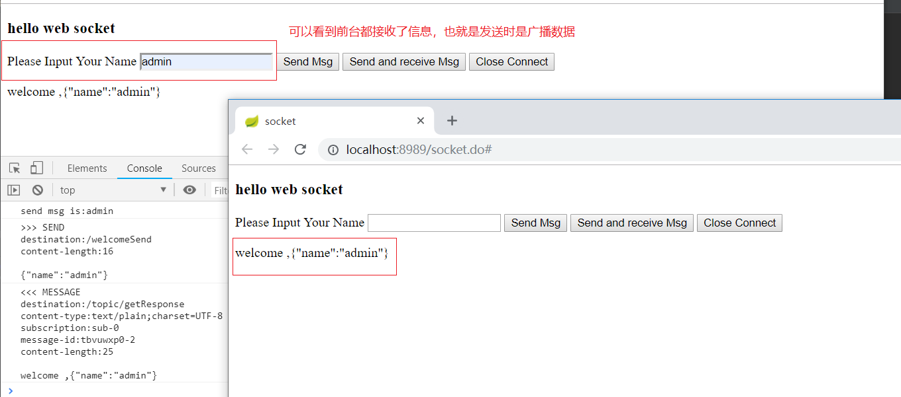
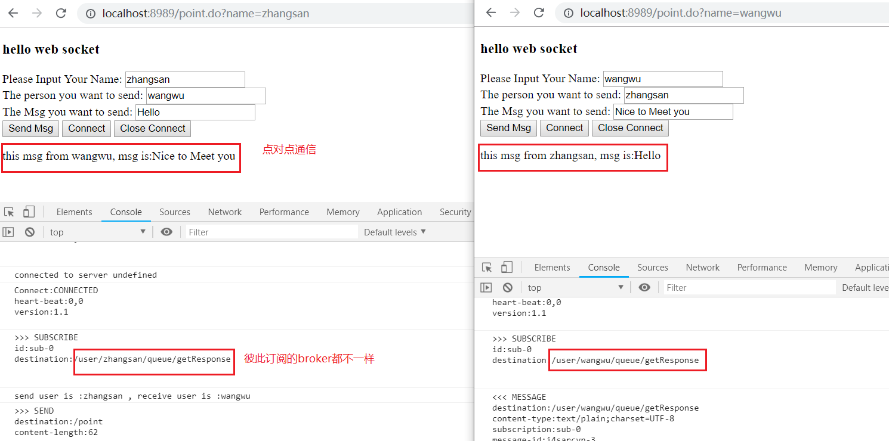
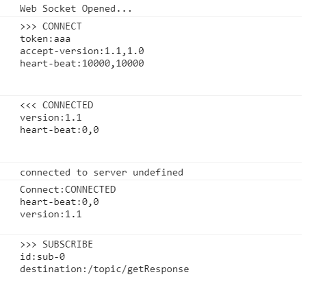

[TOC]

# websocket的使用

## 1.简介

websocket是HTML5开始提供的一种在单个TCP连接上进行全双工通讯的协议。但是websocket发送的数据只是指定了text或binary类型的数据，但是并没有指定数据的格式是什么样子，故springboot在websocket之上有封装了STOMP协议，也就是定义了一种数据格式，方便解析。

## 2.stomp协议的处理流程


1. 数据发送到InputChannel
2. 根据订阅的地址不同，分发到不同的Handler
3. 处理完之后，会由broker分发到OutputChannel
4. 之后由OutChannel推送到前台

**这里注意：**outputChannel处理时是多线程处理，并不能保证顺序。

## 3.广播

配置：

```java
@Configuration
@EnableWebSocketMessageBroker
public class WebSocketConfig implements WebSocketMessageBrokerConfigurer{
    private static Logger log = LoggerFactory.getLogger(WebSocketConfig.class);
    @Bean
    public ServerEndpointExporter serverEndpointExporter(){
        return new ServerEndpointExporter();
    }

    // "/endpointStomp"就是暴露的broker,前台与此地址进行握手连接
    @Override
    public void registerStompEndpoints(StompEndpointRegistry registry) {
        // server端的连接点
        registry.addEndpoint("/endpointStomp")
            .setAllowedOrigins("*")  // 允许所有的连接
            .withSockJS();          // 使用sockJS
    }
    // 配置消息代理
    @Override
    public void configureMessageBroker(MessageBrokerRegistry registry) {
        // 设置代理broker
        registry.enableSimpleBroker("/topic","/user");
        //registry.setUserDestinationPrefix("/user"); // 设置用户的前缀
// 为所有的server端的目的地添加前缀,如 这里的@MessageMapping("/welcome"),访问时使用 /app/welcome
        //registry.setApplicationDestinationPrefixes("/app");
    }
}
```

后台处理:

```java
@Controller
public class WebSocketController {
    private static Logger log = LoggerFactory.getLogger(WebSocketController.class);
    @Autowired
    private SimpMessagingTemplate messagingTemplate;

    @RequestMapping("send.do")
    @ResponseBody
    public String sendTopicMessage(){
        messagingTemplate.convertAndSend("/topic/getResponse","aa,bb,cc");
        return "send ok...";
    }

    @MessageMapping("/welcome")
    public String receiveMsg(String name, @Headers Map<String ,Object> headers){
        log.info("headers is:"+headers.toString());
        log.info("receive msg is:"+name);
        return "receive ok";
    }
    @MessageMapping("/welcomeSend")
    //SendTo 此操作是: 有数据发送到welcomeSend时,数据会被发送到/topic/getResponse此目的
    @SendTo("/topic/getResponse")
    public String revAndSend(String name){
        log.info("receive msg is:"+name);

        return "welcome ,"+name;
    }
}
```


前台:

```java
<!DOCTYPE html>
<html lang="en" xmlns:th="http://www.thymeleaf.org">
<head>
    <meta charset="UTF-8">
    <title>socket</title>
</head>
<body>
    <h3>hello web socket</h3>
    <div>
        <label>Please Input Your Name</label>
        <input type="text" id="name">
        <button id="send" onclick="sendMsg();">Send Msg</button>
        <button id="send2" onclick="sendMsg2();">Send and receive Msg</button>
        <button id="close" onclick="disconnect();">Close Connect</button>
    </div>
    <div id="response"></div>
<script th:src="@{/js/jquery.min.js}"></script>
<script th:src="@{/plugins/sockjs.min.js}"></script>
<script th:src="@{/plugins/stomp.js}"></script>
<script th:src="@{/function/socketfunction.js}"></script>
</body>
</html>
```

```javascript
var stompClient = null;

// 页面加载时，就进行了解
$(function () {
    connect();
})

// 页面关闭,断开连接
window.onunload = function () {
    disconnect();
}

function connect() {
    // 使用sokjs进行连接
    var socket = new SockJS('http://127.0.0.1:8989/endpointStomp')
    // 发送的header头
    var headers = {token:"aaa"};
    // 创建stompClient客户端
    stompClient = Stomp.over(socket);
    // 连接操作
    stompClient.connect(headers,function (frame) {
        console.log("Connect:"+frame);
        // 订阅主题
        stompClient.subscribe("/topic/getResponse",function (response) {
            showResponse(response.body);
        })
    });
}
function showResponse(msg) {
    var response = $("#response");
    response.append("<p>" +msg+ "</p>");
}
function disconnect() {
    if (stompClient != null){
        stompClient.disconnect();
    }
    console.log("Disconnected")
}

// 发送消息
function sendMsg(){
    var name = $("#name").val();
    console.log("send msg is:"+name);
    stompClient.send("/welcome",{},JSON.stringify({'name': name}));
}
// 
function sendMsg2(){
    var name = $("#name").val();
    console.log("send msg is:"+name);
    // 第一个参数为处理的handler(@MassageMapping),第二个参数为header
    // 第三个参数为 数据
    stompClient.send("/welcomeSend",{},JSON.stringify({'name': name}));
}
```

效果:



## 3.1 可以在InChannel或OutChannel添加拦截器

```java
@Configuration
@EnableWebSocketMessageBroker
public class WebSocketConfig implements WebSocketMessageBrokerConfigurer{
    private static Logger log = LoggerFactory.getLogger(WebSocketConfig.class);

    /**
     *  拦截器的添加
     *  stomp发送数据时，分为：命令段, header 段, data 段
     *  此处的操作就是当命令时connect时,对header中的token进行了过滤
     * @param registration
     */
    @Override
    public void configureClientInboundChannel(ChannelRegistration registration) {
        registration.interceptors(new ImmutableMessageChannelInterceptor(){
            @Override
            public Message<?> preSend(Message<?> message, MessageChannel channel) {
                StompHeaderAccessor accessor = MessageHeaderAccessor.getAccessor(message, StompHeaderAccessor.class);

                if (StompCommand.CONNECT.equals(accessor.getCommand())){
                    String token = accessor.getNativeHeader("token").get(0);
                    if (token.equalsIgnoreCase("aaa")){
                        log.info("token is valid");
                        return message;
                    }else{
                        log.info("token is invalid");
                        return null;
                    }
                }
                return message;
            }
        });
    }
	// 输出拦截器
    @Override
    public void configureClientOutboundChannel(ChannelRegistration registration) {
        registration.interceptors(new ImmutableMessageChannelInterceptor(){
            @Override
            public void postSend(Message<?> message, MessageChannel channel, boolean sent) {
                String headers = message.getHeaders().toString();
                Object payload = message.getPayload();
                log.info("payload:{},headers: {}",payload.toString(),headers);
            }
        });
    }
}

```


## 4.单点传输


后台:

```java
@Controller
public class WebSocketPoint {
    private static Logger log = LoggerFactory.getLogger(WebSocketPoint.class);
    @Autowired
    private SimpMessagingTemplate messagingTemplate;

    private Map<String,Integer> userMap = new HashMap<>();

    @RequestMapping("pointsend.do")
    @ResponseBody
    public String sendTopicMessage(String name){
        log.info("send to user :"+name);
        messagingTemplate.convertAndSendToUser(name,"/queue/getResponse","point to point");
        return "send ok...";
    }


    @MessageMapping("/point")
    public void receiveMsg(@RequestBody String name, @Headers Map<String ,Object> headers){
        log.info("headers is:"+headers.toString());
        log.info("receive msg is:"+name);
        String name1 = JSON.parseObject(name).getString("name");
        String msg = JSON.parseObject(name).getString("msg");
        messagingTemplate.convertAndSendToUser(name1,"/queue/getResponse",msg);
    }
    /**
     *  Message     把stomp传输的消息封装到 message中
     *  MessageHeaders  获取stomp请求头
     *  MessageHeaderAccessor   :access to the headers through typed accessor methods.
     * @param headers
     */
    @MessageMapping("/point2")
    public void receiveMsg2(Message message,  @Headers Map<String ,Object> headers){
        log.info("headers is:"+message.getHeaders().toString());
        log.info("receive msg is:"+message.getPayload());
        String content = message.getPayload().toString();
        String name1 = JSON.parseObject(content).getString("name");
        String msg = JSON.parseObject(content).getString("msg");
        messagingTemplate.convertAndSendToUser(name1,"/queue/getResponse",msg);
    }
}
```

前台:

```java
<!DOCTYPE html>
<html lang="en" xmlns:th="http://www.thymeleaf.org">
<head>
    <meta charset="UTF-8">
    <title>socket</title>
</head>
<body>
<h3>hello web socket</h3>
<div>
    <label>Please Input Your Name:</label>
    <input type="text" id="name" readonly="readonly" th:value="${name}"><br/>
    <label for="toUser">The person you want to send:</label>
    <input type="text" id="toUser"/><br/>
    <label for="message">The Msg you want to send:</label>
    <input type="text" id="message"><br/>
    <button id="send" onclick="sendMsg();">Send Msg</button>
    <button id="connect" onclick="connect();">Connect</button>
    <button id="close" onclick="disconnect();">Close Connect</button>
</div>
<div id="response"></div>

<script th:src="@{/js/jquery.min.js}"></script>
<script th:src="@{/plugins/sockjs.min.js}"></script>
<script th:src="@{/plugins/stomp.js}"></script>
<script th:src="@{/function/socketfunction-point.js}"></script>
</body>
</html>
```

```javascript
var stompClient = null;

// 页面加载时
$(function () {
})

// 页面关闭,断开连接
window.onunload = function () {
    disconnect();
}

function connect() {
    var socket = new SockJS('http://127.0.0.1:8989/endpointStomp')
    var headers = {token:"aaa"};
    stompClient = Stomp.over(socket);
    var name = $("#name").val();
    // 连接操作
    stompClient.connect(headers,function (frame) {
        console.log("Connect:"+frame);
        // 订阅主题
        // 可见此处的name是一个变量,也就是不同的用户订阅不同的broker,以达到不同的point
        stompClient.subscribe("/user/" +name + "/queue/getResponse",function (response) {
            showResponse(response.body);
        })
    });
}

function showResponse(msg) {
    var response = $("#response");

    response.append("<p>" +msg+ "</p><br/>");
}
function disconnect() {
    if (stompClient != null){
        stompClient.disconnect();
    }

    console.log("Disconnected")
}

// 发送消息
function sendMsg(){
    var name = $("#name").val();
    var touser = $("#toUser").val();
    var msg = $("#message").val();
    console.log("send user is :"+name + " , receive user is :"+touser);

    stompClient.send("/point",{},JSON.stringify({'name': touser,"msg":"this msg from "+name+", msg is:"+msg}));
}
```



## 5.常用注解

| 注解                     | descriptor                                    |
| ------------------------ | --------------------------------------------- |
| @MessageMapping          | 在controller函数中定义，用于处理消息，Handler |
| @SendTo                  | 发送数据,广播                                 |
| @SendToUser              | 发送数据到指定的用户                          |
| @MessageExceptionHandler | 异常处理函数                                  |
| @SubscribeMapping        |                                               |

## 6.事件

| 事件                    | description                                                  |
| ----------------------- | ------------------------------------------------------------ |
| BrokerAvailabilityEvent | 当broker变的不可用或可用时分发此事件                         |
| SesionConnectEvent      | 当接收到一个STOMP CONNECT时，表示一个新的client session建立。则会分发此事件 |
| SessionConnectedEvent   | Published shortly after a `SessionConnectEvent` when the broker has sent a STOMP CONNECTED frame in response to the CONNECT. At this point, the STOMP session can be considered fully established |
| SessionSubscribeEvent   | 订阅事件                                                     |
| SessionUnsubscribeEvent | 取消订阅事件                                                 |
| SessionDisconnectEvent  | 断开连接                                                     |

## 7.STOMP消息格式

```shell
## header
{simpMessageType=MESSAGE, stompCommand=SEND, nativeHeaders={destination=[/point], content-length=[51]}, simpSessionAttributes={}, simpHeartbeat=[J@3b49363f, lookupDestination=/point, simpSessionId=m2zdpwm5, simpDestination=/point}
```

```shell
>>> SEND				## 命令
destination:/point		## header
content-length:51

{"name":"","msg":"this msg from zhangsan, msg is:"}  ## 消息体
```

握手信息：

