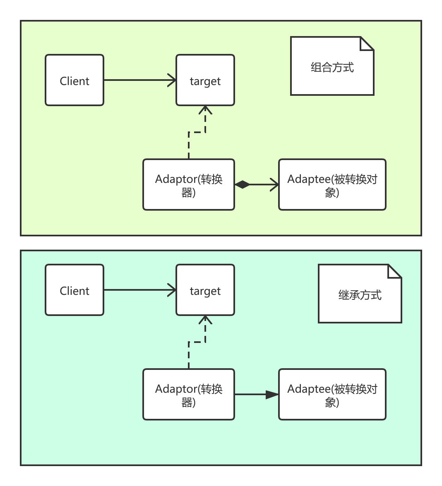
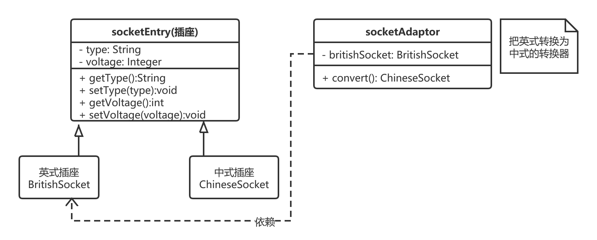

# 适配器模式

## 什么是适配器模式

> Convert  the  interface  of  a  class into  another  interface clients  expect.  Adapter  lets  classes   work  together that couldn't  otherwise  because of  incompatible  interface.
>
> 将一个类的接口变成客户端所期望的另一个接口, 从而使原本因接口不匹配而无法一起工作的两个类能够在一起工作.

适配器的作用:

1. 接口转换, 将原来的接口(或方法)转换为另一个接口
2. 用新的接口包装一个已有的类
3. 匹配一个老的组件到一个新的接口

适配器模式又叫`变压器`模式, 也叫`包装`模式, 它的`核心思想是`: 将一个对象经过包装或转换后使它符合指定的接口, 使得调用方法可以像使用接口的一般对象一样使用它.

适配模式的实现有两种方式: `一种是组合方式,另一种是继承方式`.





> 实现

```java
public class SocketEntry {
    // 插座类型
    private String type;
    // 插座电压
    private Integer voltage;

    public void setType(String type) {
        this.type = type;
    }

    public void setVoltage(Integer voltage) {
        this.voltage = voltage;
    }

    public Integer getVoltage() {
        return voltage;
    }

    public String getType() {
        return type;
    }
}
```

```java
public class ChineseSocket extends SocketEntry{

    public ChineseSocket(){
        this.setType("chinese");
        this.setVoltage(220);
    }
}

public class BritishSocket extends SocketEntry {

    public BritishSocket(){
        this.setType("british");
        this.setVoltage(220);
    }
}

```

```java
// 把英式插座 转换为 中式插座
public class BritishToChineseAdaptor {
    private SocketEntry socketEntry;

    public BritishToChineseAdaptor(BritishSocket britishSocket){
        socketEntry = britishSocket;
    }

    public SocketEntry getSocket(){
        ChineseSocket socket1 = new ChineseSocket();
        socket1.setVoltage(socketEntry.getVoltage());
        socket1.setType("chinese");
        return socket1;
    }
}
```


## 优缺点

> 优点
>
> 1. 可以让两个没有关联的类一起运行, 起中间转换的作用
> 2. 提高了类的复用率
> 3. 灵活性好, 不会破坏原有系统

> 缺点
>
> 1. 如果原有系统没有设计好(如target不是抽象或接口), 而是一个实体类, 适配器模式将很难实现
> 2. 过多的使用适配器, 容器使代码结构混乱, 如明明看到调用的是A接口, 内部调用却是B接口的实现


