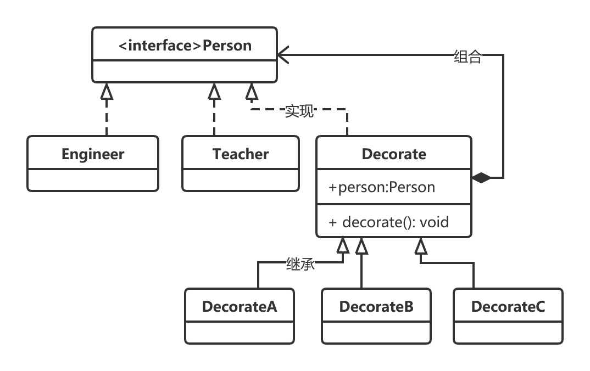

# 装饰模式

## 什么是装饰模式

> Attach  additional  responsibilities  to  an object  dynamically .  Decorators  provide  a  flexible  alternative  to  subclassing  for  extending  functionality.
>
> 动态的给一个对象添加额外的功能, 就扩展对象功能来说, 装饰模式比生成子类的方式更灵活.

在程序中,如果希望动态的给一个类增加额外的功能, 而不动原有的代码, 就可用装饰模式来进行扩展.



> 实现

```java
// 装饰器
public abstract class Decorator extends Person{
    private Person person;
    public Decorator(Person person){
        this.person = person;
    }

    @Override
    public void wear() {
        this.person.wear();
        this.decorate();
    }

    abstract void decorate();
}
```

```java
public class BeltDecorate extends Decorator {
    public BeltDecorate(Person person) {
        super(person);
    }

    @Override
    void decorate() {
        System.out.println("一条银色针扣头的腰带");
    }
}

public class LeatherDecorate extends Decorator {

    public LeatherDecorate(Person person) {
        super(person);
    }

    @Override
    void decorate() {
        System.out.println("一双休闲皮鞋");
    }
}
public class TShirtDecorate extends Decorator {
    public TShirtDecorate(Person person) {
        super(person);
    }

    @Override
    void decorate() {
        System.out.println("一件纯棉T shirt");
    }
}
```

```java
// 被装饰对象
public abstract class Person {
    public abstract void wear();
}

public class Engineer extends Person {
    @Override
    public void wear() {
        System.out.println("engineer wear clothes: ");
    }
}
```

```java
public class Main {
    public static void main(String[] args) {
        Engineer engineer = new Engineer();
        TShirtDecorate shirtDecorate = new TShirtDecorate(engineer);
        BeltDecorate beltDecorate = new BeltDecorate(shirtDecorate);
        LeatherDecorate leatherDecorate = new LeatherDecorate(beltDecorate);
        leatherDecorate.wear();
    }
}
```


## 优缺点

> 优点
>
> 1. 使用装饰模式来实现扩展比使用继承更灵活, 它可以在不创建更多子类的情况下, 将对象的功能加以扩展
> 2. 可以动态的给一个对象附加更多功能
> 3. 可以用不同的装饰器进行多重装饰, 装饰的顺序不同, 可能产生不同的效果
> 4. 装饰类和被装饰类可以独立发展, 不会相互耦合;  装饰模式相当于继承的一个替代模式

> 缺点
>
> 用装饰模式扩展功能容易出错, 排错也更困难, 对于多次装饰的对象, 调试寻找错误时可能需要逐级排查, 较为繁琐.