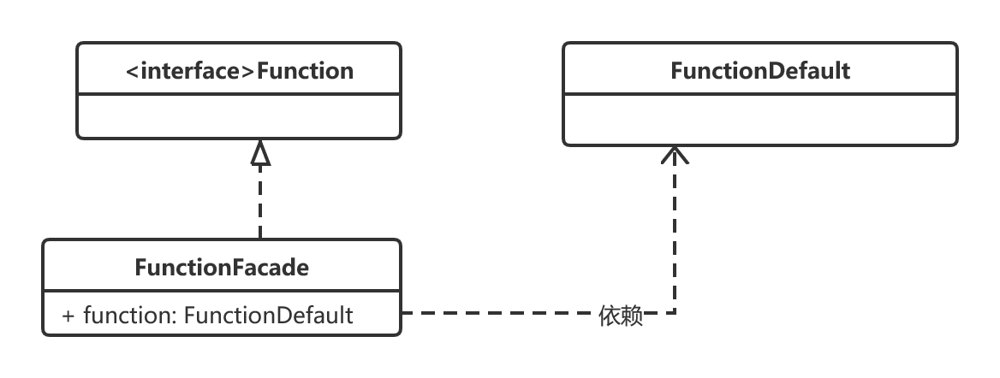
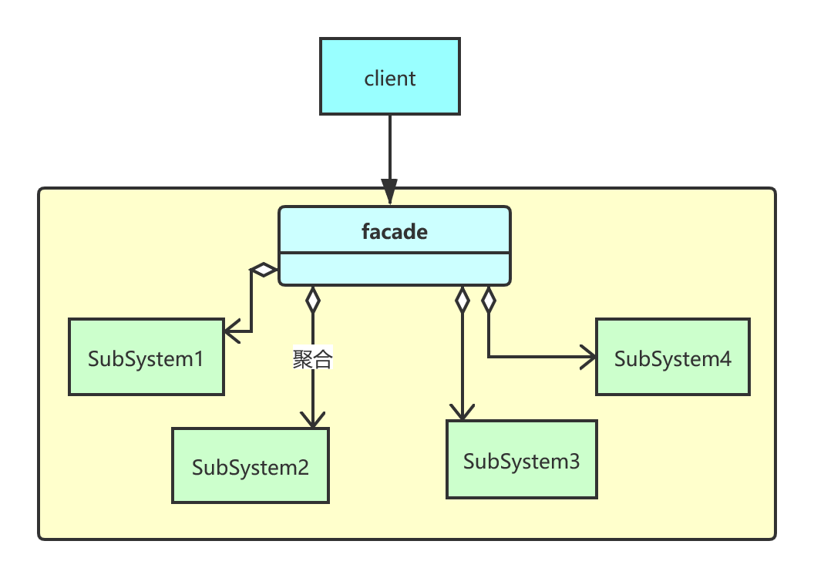

# 外观模式

## 什么是外观模式

> Provide  a  unified  interface  to  a  set of  interfaces  in  a   subsystem.   Facade defines  a  higher-level   interface  that  makes  the  subsystem  easier to user.
>
> 为子系统中的一组接口提供一个一致的界面成为外观模式. 外观模式定义了一个高层接口,  这个接口使得这一子系统更容易使用.

外观模式也叫`门面模式`.

外观模式的`核心`思想: `用一个简单的接口来疯转一个复杂的系统,  使这个系统更容易使用`.

## 优缺点

> 优点
>
> 1. 实现了子系统与客户端之间的松耦合关系, 这使得子系统的变化不会影响调用它的客户端
> 2. 简化了客户端对子系统的使用难度, 客户端(用户)无需关系子系统的具体实现, 而只需和外观进行交互即可
> 3. 为不同的用户提供了统一的调用接口, 方便了系统的管理和维护

> 缺点
>
> 因为统一了调用的接口, 降低了系统功能的灵活性