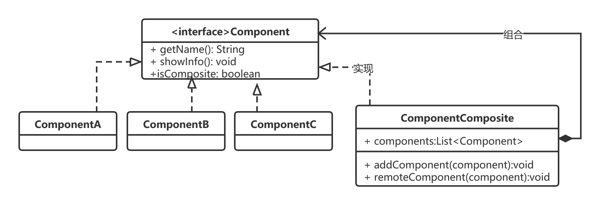

# 组合模式

## 什么是组合模式

> Compose  objects  into  tree  structures   to  represent  whole-part  hierarchies.  Composite  lets   clients  treat  individual  objects  and  compositions  of  objects  uniformly.
>
> 将对象组合成树型结构以表示"整体-部分"的层次结构关系.  组合使得用户对单个对象和组合对象的使用具有一致性.

像电脑一样, 把对象组合成树形结构, 以表示`"整体-部分"`的层次结构的程序设计模式就叫组合模式.

## 优缺点

> 优点
>
> 1. 调用简单, 组合对象可以像一般对象一样使用
> 2. 组合对象可以自由的增加, 删除组件, 可灵活的组合不同的对象

> 缺点
>
> 在一些层次结构太深的场景中, 组合结构会变的复杂

> 应用场景
>
> 1. 对象之间具有明显的"整体-部分"的关系时, 或者具有层次关系时
> 2. 组合对象与单个对象具有相同或类似行为(方法), 用户希望统一的使用组合结构中的所有对象.