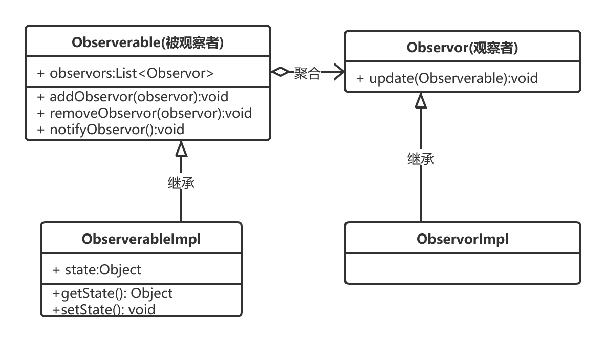

# 观察者模式

## 什么是观察者模式

> Define  a  one-to-many   dependency  between  objects  so  that  when  one  object   changes  state,  all   its  dependents  are  notified  and  updated  automatically . 
>
> 在对象间定义一种一对多的依赖关系, 当这个对象状态发生改变时,  所有依赖它的对象都会被通知并自动更新.

监听模式是一种一对多的关系,  可以有任意个(一个或多个)观察者对象同时监听某一个对象.  监听的对象叫观察者(即 监听者), 被监听者叫被观察者(observable, 也就主题, subject). 被观察者对象在状态或内容发生变化时, 会通知所有观察者对象,  使它们能够做出相应的变化.

`观察者模式又叫监听模式`. 如: 你在烧开水时看着它开没开, 你就是观察者, 水是被观察者;  你在带小孩, 你关注他是不是饿了, 那么你就是观察者, 小孩就是被观察者.

观察者模式的`核心思想: 就是在被观察者和观察者之间建立一种自动触发的关系`.

## 推模型和拉模型

> 推模型
>
> 被观察者像观察者推送主题的详细信息, 不管观察者是否需要, 推送的信息通常是主题对象的全部或部分数据. 一般在这种模型实现中, 会把被观察者对象中全部或部分信息通过update参数传递给观察者 `update(Object obj)`, 通过obj参数传递.
>
> 如: App在凌晨1点进行维护, 这里就需要向所有app用户推送完成的通知消息, 不管用户想不想知道, 也不管用户会不会在这期间访问app. 这既是典型的 推模型

> 拉模型
>
> 被观察者在通知观察者的时候, 只传递少量的信息. 如果观察者需要更具体的信息,  由观察者主动到被观察者对象中获取, 相当于观察者从被观察者对象中拉数据.   一般这种模型实现中, 会把被观察者对象自身通过update方法传递给观察者`update(Observable observable)`, 通过observable参数传递, 这样在观察者需要获取参数时, 就可以通过这个引用来获取数据了.

## 优缺点

> 优点

> 缺点

> 应用场景
>
> 1. 对一个对象状态或数据的更新需要其他对象同步更新, 或者一个对象的更新依赖另一个对象的更新
> 2. 对象仅需要将自己的更新通知给其他对象而不需要知道其他对象的细节, 如消息推送.