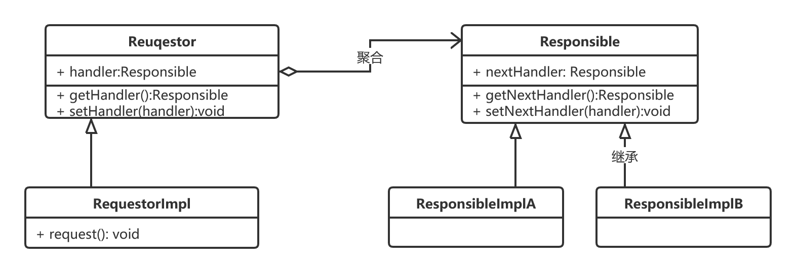

# 责任链模式

## 什么是责任链模式

> Avoid  coupling  the  sender  of  a  request  to  its  receiver  by  giving   more  than  one  object  a chance  to handle  the  request.  Chain the  receiving  objects  and pass the  request  along the  chain  until an  object  handles it.
>
> 为变量请求请求发送者和接收者耦合在一起,  让多个对象都有可能接收请求.   将这些接收对象链接成一条链, 并且沿着这条链传递请求,  直到有对象处理它为止.

`责任链模式也称为 职责模式`, 它将请求的发送者和接收者解耦了.  客户端不需要知道请求处理者的明确信息和处理的具体逻辑,  甚至不需要知道链的结构, 他只需要将请求进行发送即可.

## 优缺点

> 优点
>
> 1. 降低耦合度. 将请求的发送者和接收者解耦
> 2. 简化了对象, 他使得对象不需要知道链的结构
> 3. 增强给对象指派职责的灵活性.  可改变链内的成员或者调用它们的次序, 允许动态的新增或者删除责任人
> 4. 增加新的处理类很方便

> 缺点
>
> 1. 不能保证请求一定被接收
> 2. 系统性能将收到一定影响, 而且在进行代码调试时不太方便, 可能会造成循环调用

> 应用场景