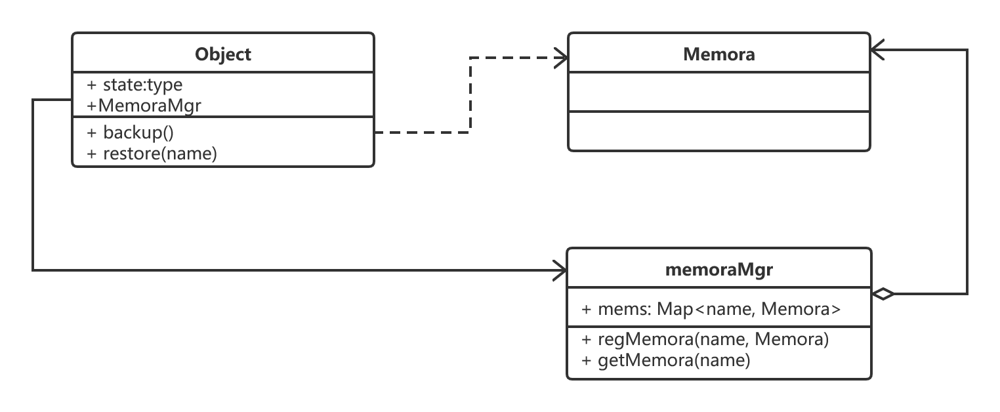

# 备忘录模式

## 什么是备忘录模式

> Capture   the  object's  internal  state without  exposing  its   internal  structure  , so  that  the  object  can  be  returned  to this state later.
>
> 在不破坏内部结构的前提下捕获一个对象的内部状态, 这样便可以以后将该对象恢复到原先保存的状态.

## 优缺点

> 优点
>
> 1. 提供了一种可以恢复状态的机制, 使得用户能够比较方便的回到某个历史状态
> 2. 实现了信息的封装, 用户不需要关心状态的保存细节

> 缺点
>
> 如果类的成员变量过多, 势必会占用比较多的资源, 而且每一此保存都会消耗一定的内存. 此时可以限制保存的次数.

> 应用场景
>
> 1. 需要保存/恢复对象的状态或数据时, 如游戏的存档, 虚拟机的快照
> 2. 需要实现撤销, 恢复功能的场景, 如work中的 ctrl+z,  ctrl+y的功能;  dos命令或linux终端的命令记忆功能
> 3. 提供一个回滚机制, 如数据库的事务管理

