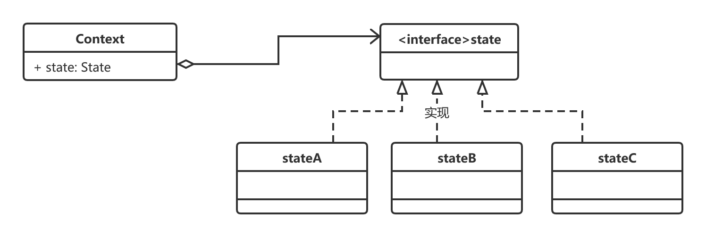

# 状态模式

## 什么是状态模式

> Allow  an  object   to  alter   its  behavior  when  its   internal  state   changes.   The  object   will  appear   to  change  its   class.
>
> 允许一个对象在其内部状态发生改变时改变其行为, 使这个对象看上去就像改变了它的类型一样

状态模式的核心思想: `就是一个事务(对象)有多种状态, 在不同的状态下表现出来的行为和属性不一样.`

## 优缺点

> 优点
>
> 1. 封装了状态的转换规则,  在状态模式中可以将状态的转换代码封装在环境类中, 对状态转换代码进行集中管理, 而不是分散在一个个业务逻辑中
> 2. 将所有与某个状态有关的行为放到一个类中(称为状态类),使得开发人员关注于该状态下的逻辑开发
> 3. 允许状态转换逻辑与状态对象合为一体, 使用时只需要注入一个不同的状态对象即可使环境对象拥有不同的行为

> 缺点
>
> 1. 会增加系统类和对象的个数
> 2. 状态模式的结构与实现都较为复杂, 如果使用不当容易导致程序结构和代码的混乱

> 应用场景
>
> 1. 一个对象的行为取决于他的状态, 并且它在运行时可能经常改变他的状态, 从而改变他的行为
> 2. 一个操作中含有庞大的分支条件语句, 这些语句依赖于对象的状态, 且每一个分支的业务逻辑都分成复杂时,  我们可以使用状态模式来拆分不同的分支逻辑, 使程序有更好的可读性和可维护性.

