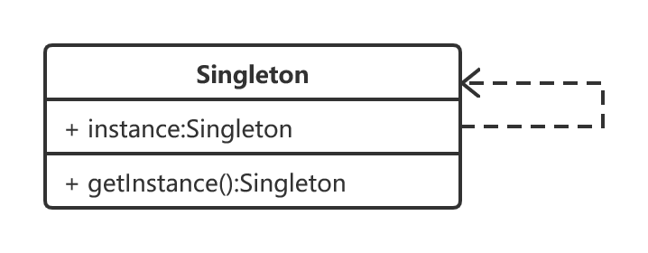

# 单例模式

## 什么是单例模式

> Ensure a  class has only one instance,  and provide a global point of access to it.
>
> 就是确保一个类只有一个实例,并且提供一个访问它的全局方法

单例模式就是保证一个类有且只有一个对象(实例)的机制.



下面来看几种java实现单例的方式.

> 饿汉式

```java
// 饿汉式单例
public class RedCar{
    private static final RedCar car = new RedCar();
    private RedCar(){}
    public static RedCar getCar(){
        return car;
    }
}
/*
优点:
	1. 简单且线程安全
缺点:
	不能延迟加载
*/
```

> 懒汉式

```java
 // 懒汉式
public class RedCar2{
    private static RedCar2 car = null;
    private RedCar2(){}
    public static RedCar2 getCar(){
        if (car == null){
            car = new RedCar2();
        }
        return car;
    }
}
/*
优点:
	达到了延迟加载
缺点:
	线程不安全
*/
```

> 改进的懒汉式, 双重判定锁

```java
public class RedCar3{
    private static volatile RedCar3 car = null;
    private RedCar3(){}
    public static RedCar3 getCar(){
        if (car == null){
            synchronized (RedCar3.class){
                if (car == null) {
                    car = new RedCar3();
                }
            }
        }
        return car;
    }
}
/*
优点:
	延迟加载
缺点:
	实现复杂

*/
```

> 静态内部类

```java
public class Singleton{
    // 静态内部类 懒加载初始化,线程安全
    private static class SingletonHolder {
        private static final Singleton INSTANCE = new Singleton();
    }
    // 私有化 构造器
    private Singleton(){}
    public static final Singleton getInstance(){
        return SingletonHolder.INSTANCE;
    }
}
```

> 枚举实现

```java
public enum SingletonEnum {
    SINGLETON;

    private User user;

    private SingletonEnum(){
        user = new User();
    }

    public User getUser(){
        return user;
    }
}

// 使用
System.out.println(SingletonEnum.SINGLETON.getUser());
System.out.println(SingletonEnum.SINGLETON.getUser());
```


