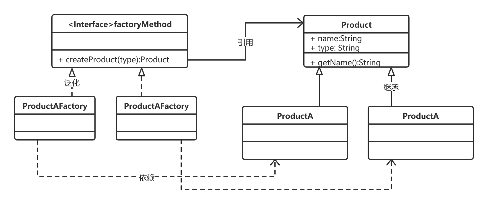

# 工厂方法模式

工厂方法模式是简单工厂的一个升级, 为解决工厂模式不符合"开放-封闭"原则的问题.  对simpleFactory进行了一个拆分, 抽象出要给父类factory, 并增加多个子类来创建不同的具体产品.

> 定义
>
> Define  an  interface for creating an object, but let subclasses decide which  class  to instantiate .  Factory method lets  a class defer instantiation to subclasses.
>
> 定义一个创建对象(实例化对象)的接口, 让子类来决定创建哪个类的实例. 工厂方法使一个类的实例化延迟到其子类.



```java
// 被创建的对象
public class BuleCar {
}

public class RedCar {
}
```

```java
// 工厂方法
public interface ObjectFactory<T> {
    /*
       定义工厂方法的接口类, 针对不同的对象,创建不同的工厂实现类
       通过对不同的对象定义不同的工厂类, 当需要创建的对象比较多时,容易造成类爆炸
       这也导致了后面出现抽象工厂模式,针对某一类对象来提取出 一个公共的 抽象工厂
     */
    T createObject();
}


public class BuleCarFactory implements ObjectFactory<BuleCar> {
    @Override
    public BuleCar createObject() {
        return new BuleCar();
    }
}


public class RedCarFactory implements ObjectFactory<RedCar> {
    @Override
    public RedCar createObject() {
        return new RedCar();
    }
}
```


## 优缺点

> 优点
>
> 1. 解决了简单工厂模式不符合“开放-封闭”原则的问题, 使程序更容易拓展
> 2. 实现简单


> 缺点
>
> 1. 对于有多种分类的产品, 或具有二级分类的产品, 工厂方法并不适用.
>
> 多种分类
>
> ​	如有一个电子白板程序,可以绘制各种图形, 那么画笔的绘制功能可以理解为一个工厂, 而图形可以理解为一种产品; 图形可以根据形状分为直线,曲线等, 也可以根据颜色分为红色图形,绿色图形等.
>
> 二级分类
>
> ​	如一个家电工厂, 可同时是生产冰箱, 空调和洗衣机. 那么冰箱, 空调,洗衣机属于一级分类; 而洗衣机又可分为节能型和高效型, 高效和节能就属于二级分类

> 应用场景
>
> 1. 客户端不知道它所需要的对象的类
> 2. 工厂类希望通过子类来决定创建哪个具体类的对象


