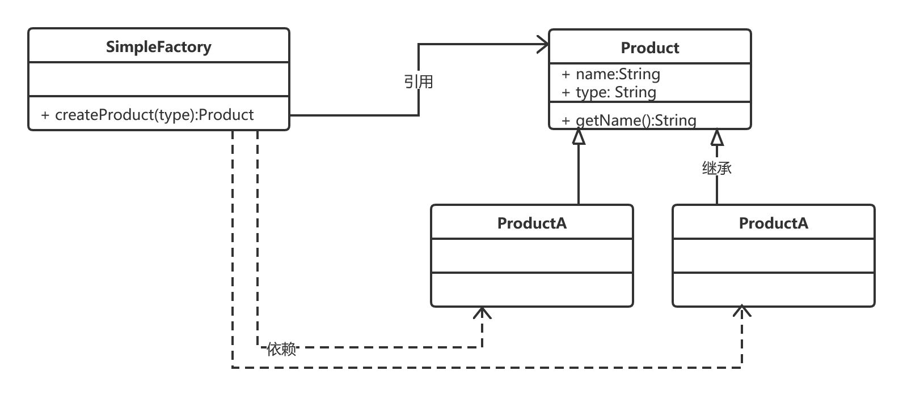

# 简单工厂模式

## 什么是简单工程模式?

专门定义一个类来负责创建其他类的实例, 根据参数的不同创建不同的实例, 被创建的实例通常具有共同的父类, 这个模式叫**简单工厂模式(Simple factory pattern).**

> Define an interface for creating an object,  it througn the argument to decide which class to instantiate.
>
> 定义一个创建对象(实例化对象)的接口, 通过参数类决定创建那个类的实例.

类图:



> java实现

```java
public class RedCar {
}

public class SimpleFactory {
    // 简单工厂类, 用于创建 redCar
    public RedCar buildCar(){
        return new RedCar();
    }
}
```


## 优缺点

> 优点
>
> 1. 实现简单,结构清晰
> 2. 抽象出一个专门的类来负责某类的创建, 分割出创建的职责, 不用直接创建具体的对象, 只需传入适当的参数即可
> 3. 使用者可以不关注具体对象的类名称, 只需知道参数和创建类的对应就可以.


> 缺点
>
> 1. 不易扩展, 一旦添加新的产品类型, 就不得不修改工厂的创建逻辑. 不符合"开放封闭"原则, 如果要增加或删除一个产品类型, 就需要修改switch..case (或 if..else.) 的判断逻辑
> 2. 当产品类型较多时, 工厂的创建逻辑可能过于负复杂, switch..case(或if ... else..) 判断就会变得非常多.  一旦出错可能造成所有产品创建失败, 不利于系统的维护


> 应用场景
>
> 1. 产品有明显的继承关系, 且产品的种类不太多
> 2. 所有的产品具有相同的方法和类似的属性, 使用者不关心具体的类型, 只希望传入合适的参数返回合适的对象


