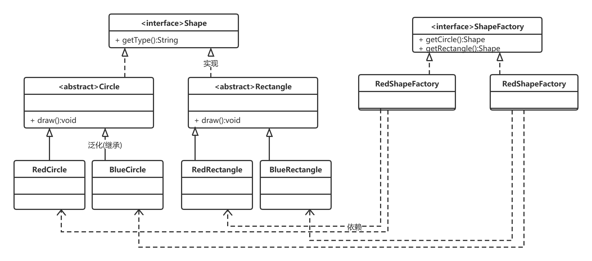

# 抽象工厂模式

抽象工厂模式是工厂方法模式的升级, 工厂方法不能解决具有二级分类的产品创建问题, 抽象工厂模式就是用来解决这一问题的.

> Provide an interface for creating families of related or dependent objects without  specifying their concrete classes.
>
> 提供一个创建一系列相关或相互依赖的对象的接口, 而无需指定它们的具体类



> java 实现

```java
// 要创建的 图形
public interface Shape {
    String getType();
}

public abstract class Rectangle implements Shape {
    @Override
    public String getType() {
        return "rectangle";
    }
    public abstract void draw();
}

public class RedRectangle extends Rectangle {
    @Override
    public void draw() {
        System.out.println("red rectangle");
    }
}
public class BlueRectangle extends Rectangle {
    @Override
    public void draw() {
        System.out.println("blue rectangle");
    }
}


public abstract class Circle implements Shape {
    @Override
    public String getType() {
        return "circle";
    }
    public abstract void draw();
}
public class RedCircle extends Circle {
    @Override
    public void draw() {
        System.out.println("红色 circle");
    }
}
public class BlueCircle extends Circle {
    @Override
    public void draw() {
        System.out.println("蓝色 circle");
    }
}

```

```java
public interface ShapeFactory {
    Shape getCircle();
    Shape getRectangle();
}

public class BlueShapeFactory implements ShapeFactory {
    @Override
    public Shape getCircle() {
        System.out.println("Get blue circle");
        return new BlueCircle();
    }

    @Override
    public Shape getRectangle() {
        System.out.println("get blue rectangle");
        return new BlueRectangle();
    }
}

public class RedShapeFactory implements ShapeFactory{
    @Override
    public Shape getCircle() {
        System.out.println("get red circle");
        return new RedCircle();
    }

    @Override
    public Shape getRectangle() {
        System.out.println("get red rectangle");
        return new RedRectangle();
    }
}
```


## 优缺点

> 优点
>
> 解决了具有二级分类的产品的创建

> 缺点
>
> 1. 如果产品的分类超过三级, 如三级或者更多, 抽象工厂模式就会变的非常臃肿
> 2. 不能解决产品有多种分类,多种组合问题

> 应用场景
>
> 1. 系统中有多于一个的产品簇, 而每次只使用其中的某一个产品簇
> 2. 产品等级结构稳定, 设计完成之后, 不会像系统中增加新的产品等级结构或者删除已有的产品等级结构.


