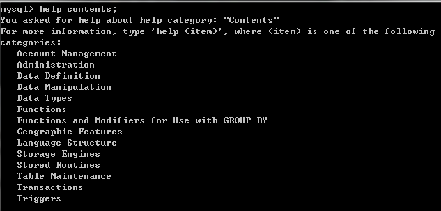
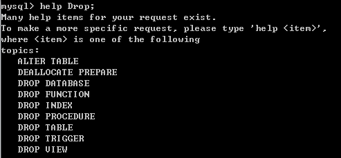
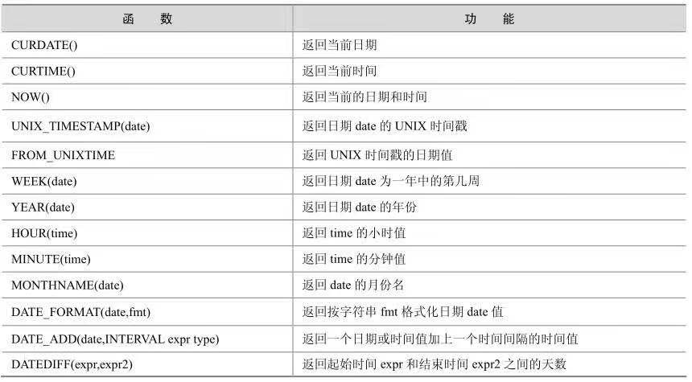
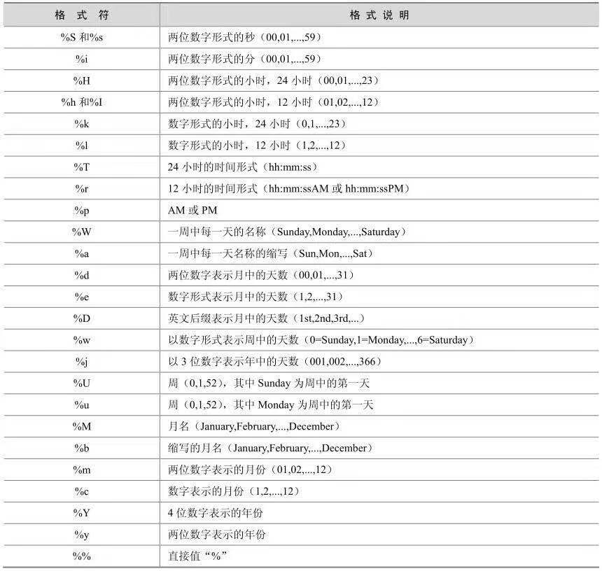
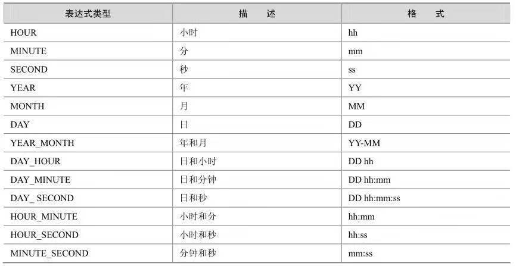
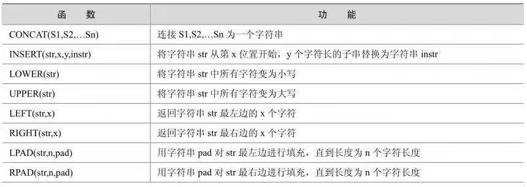

[TOC]

# mysql常用命令
SQL命令通常分为三种：DDL、DML、DCL。下面就以这三种为基础进行说明。
## DDL(Data definition language)
数据定义语言，一般用于创建数据库，表，以及修改表字段信息。
查看都有哪些动作属于DDL:
```shell
help Data Definition;
```
常用命令如下：


可以看到常用的create，drop，alter，rename等操作数据库、表的动作都属于DDL。
语法:
### 1. 创建
#### 1.1 创建数据库
```shell
Syntax:
    create {DATABASE | Schema} [IF NOT EXISTS] dbName 
    [DEFAULT] CHARACTER SET charset_name 
    [DEFAULT] COLLATE collation_name;
```

#### 1.2 创建表
```shell
Syntax:
	Create [TEMPORARY] TABLE [IF NOT EXISTS] tbName <create_definition> [table_option ...]
or
	Create [Temporary] TABLE [IF NOT EXISTS] TbName [<create_definition>] [table_option] select_statement;
or
	Create [Temporary] Table [IF NOT EXISTS] TbName <LIKE old_table_name }

create_definition:
column_definition    # 列定义
    [CONSTRAINT [symbol]] PRIMARY KEY [index_type] (index_col_name,...)  # 约束以及主键 索引的定义
    {INDEX|KEY} [index_name] [index_type] (index_col_name,...)
    [CONSTRAINT [symbol]] UNIQUE [INDEX|KEY]
    [index_name] [index_type] (index_col_name,...)
    {FULLTEXT|SPATIAL} [INDEX|KEY] [index_name] (index_col_name,...)
    [CONSTRAINT [symbol]] FOREIGN KEY
    [index_name] (index_col_name,...) [reference_definition]    # 外键定义
    CHECK (expr)

index_type:
	USING {BTREE | HASH}   # hash 格式 或 btree格式

index_col_name:
	col_name [(length)] [ASC | DESC]   # 索引名字，长度

reference_definition:       # 外部引用
    REFERENCES tbl_name [(index_col_name,...)]
    [MATCH FULL | MATCH PARTIAL | MATCH SIMPLE]
    [ON DELETE reference_option]
    [ON UPDATE reference_option]

reference_option：
	RESTRICT | CASCADE | SET NULL | NO ACTION   
# RESTRICT  严格模式，子表有父表的引用，那父表的记录不可删除
# CASCADE    父表删除，子表也删除，级联删除
# SET NULL       父表删除，子表设置为null
# NO ACTION   父表删除，子表无动作

column_definition:
    col_name data_type [NOT NULL | NULL] [DEFAULT default_value]  # 列定义：列名  列类型  列属性
    [AUTO_INCREMENT] [UNIQUE [KEY] | [PRIMARY] KEY]
    [COMMENT 'string'] [reference_definition]

table_option:
    {ENGINE|TYPE} [=] engine_name              # 引擎类型
    AUTO_INCREMENT [=] value                   # 自增值
    AVG_ROW_LENGTH [=] value
    [DEFAULT] CHARACTER SET charset_name    # 默认字符集
    CHECKSUM [=] {0 | 1}
    COLLATE collation_name                          # 字符集校验
    COMMENT [=] 'string'                            # 注释
    CONNECTION [=] 'connect_string'
    DATA DIRECTORY [=] 'absolute path to directory' # 数据路径
    DELAY_KEY_WRITE [=] {0 | 1}
    INDEX DIRECTORY [=] 'absolute path to directory'    # 索引存储路径
    INSERT_METHOD [=] { NO | FIRST | LAST }         # 插入类型，第一条插入，最后插入
    MAX_ROWS [=] value
    MIN_ROWS [=] value
    PACK_KEYS [=] {0 | 1 | DEFAULT}
    PASSWORD [=] 'string'                                      # 密码
    ROW_FORMAT [=] {DEFAULT|DYNAMIC|FIXED|COMPRESSED|REDUNDANT|COMPACT} # 列格式。默认格式，压缩格式等
    UNION [=] (tbl_name[,tbl_name]...)

select_statement:
	[IGNORE | REPLACE] [AS] SELECT ...   (Some legal select statement)   # 从另一个选择来创建新表


Example：
create table [IF NOT EXISTS] user (
id int primary key auto_increment,
name Varchar(25)
) ENGINE = innodb CHARACTER SET UTF-8 COLLATE UTF-8_ci COMMENT "用户表" ;

create table [IF NOT EXISTS] new_user1 as select * from user;

create table [IF NOT EXISTS] new_user like user;
```
#### 1.3 创建索引

```shell
Syntax:
	CREATE [UNIQE | FULLTEXT | SPATIAL] INDEX index_name 
		[index_type]
		ON tbl_name {index_column_name}
	
	index_column_name:
		col_name [(length)] [ASC | DESC]
	index_type:
		{BTREE | HASH}
```


#### 1.4 创建视图

```shell
Syntax:
Create VIEW v AS Select * from t where t.id = f(t.name)
f() 可以是一个函数:
IF name IS NULL then
CALL p1();
ELSE
CALL p2();
END IF;
```

### 2. 修改

#### 2.1 修改数据库

```shell
Syntax:
Alter {Database | schema} Dbname Character Set charset_name Collate collection_name;
```
#### 2.2 修改表


```shell
Syntax:
Alter [Ignore] TABLE TbName alter_specification [,alter_specification]...

alter_specification:
	table_option:
    ADD [COLUMN] column_definition [FIRST | AFTER col_name ]   # 在某一列前 或 后添加一列
    ADD [COLUMN] (column_definition,...)					# 直接添加列
    ADD {INDEX|KEY} [index_name] [index_type] (index_col_name,...) # 添加索引
    # 添加主键
    ADD [CONSTRAINT [symbol]] PRIMARY KEY [index_type] (index_col_name,...)	
    # 添加约束 | unique 属性| 索引
    ADD [CONSTRAINT [symbol]]　UNIQUE [INDEX|KEY] [index_name] [index_type] (index_col_name,...)
    # 全文索引
    ADD [FULLTEXT|SPATIAL] [INDEX|KEY] [index_name] (index_col_name,...)
    # 添加外键
    ADD [CONSTRAINT [symbol]] FOREIGN KEY [index_name] (index_col_name,...) [reference_definition]
    # 给列添加 或 删除默认值
    ALTER [COLUMN] col_name {SET DEFAULT literal | DROP DEFAULT}
    # 修改列的定义
    CHANGE [COLUMN] old_col_name column_definition [FIRST|AFTER col_name]
    # 修改列的定义
    MODIFY [COLUMN] column_definition [FIRST | AFTER col_name]
    # 删除某一列
    DROP [COLUMN] col_name
    # 删除主键
    DROP PRIMARY KEY
    # 删除索引
    DROP {INDEX|KEY} index_name
    # 删除外键
    DROP FOREIGN KEY fk_symbol
    # 关闭 | 打开 keys
    DISABLE KEYS
    ENABLE KEYS
    # 重命名table名字
    RENAME [TO] new_tbl_name
    ORDER BY col_name [, col_name] ...
    CONVERT TO CHARACTER SET charset_name [COLLATE collation_name]
    # 默认字符集 以及 字符校验集
    [DEFAULT] CHARACTER SET charset_name [COLLATE collation_name]
    DISCARD TABLESPACE
    IMPORT TABLESPACE
	
	index_col_name:  # 创建索引时使用的具体的列的长度
		 col_name [(length)] [ASC | DESC] 
	index_type: # 索引类型
		 USING {BTREE | HASH}
```

#### 2.3 修改视图

```shell
Syntax:
	ALTER
    [ALGORITHM = {UNDEFINED | MERGE | TEMPTABLE}]
    [DEFINER = { user | CURRENT_USER }]
    [SQL SECURITY { DEFINER | INVOKER }]
    VIEW view_name [(column_list)]
    AS select_statement
    [WITH [CASCADED | LOCAL] CHECK OPTION]
```


### 3. 删除

#### 3.1 删除数据库

```shell
Syntax:
	drop {Database | schema} [IF EXISTS] dbName;
```

#### 3.2 删除表

```shell
Syntax:
	Drop [Temporary] TABLE [IF EXISTS] tbName [,tbName]... [RESTRICT | CASCADE]
```


#### 3.3 删除视图

```shell
Syntax:
	drop VIEW [IF EXISTS] view_name [,view_name]...  [RESTRICT | CA]
```


### 4.重命名

#### 4.1 表重命名

```shell
Syntax:
	RENAME	TABLE tbName TO new_tb_Name [,tb1Name to new_tb1_name2]
```


下面给出一些示例：
### Example
#### 1. 创建动作

**注意**mysql中临时表只在当前连接中存在，当连接断开，临时表会被清理掉；这就导致不同连接可以创建同名的临时表。

```shell
# 创建数据库
mysql> create database if not exists sqlcom \
    -> default character set utf8;
Query OK, 1 row affected (0.01 sec)
### 此出使用默认的字符集
mysql> create database if not exists sqlcom ;
Query OK, 1 row affected (0.01 sec)

# 选择数据库
mysql> use sqlcom;
Database changed
# 创建表
mysql> create table if not exists user1 ( \
    -> id int primary key auto_increment,
    -> age int,
    -> name varchar(50),
    -> address varchar(100)
    -> )ENGINE=InnoDB default character set utf8;
Query OK, 0 rows affected (0.02 sec)
## 第二种方式(此处是空表，只有表结构，没有表数据)
mysql> create table user2 like user1;
Query OK, 0 rows affected (0.01 sec)
### 查看第二种方式创建的表语句
mysql> show create table user2;
| Table | Create Table
| user2 | CREATE TABLE `user2` (
  `id` int(11) NOT NULL auto_increment,
  `age` int(11) default NULL,
  `name` varchar(50) default NULL,
  `address` varchar(100) default NULL,
  PRIMARY KEY  (`id`)
) ENGINE=InnoDB DEFAULT CHARSET=utf8 |

1 row in set (0.00 sec)

## 第三种创建表方式(此时表中是有数据的)
mysql> create table user3 as select * from user1;
Query OK, 2 rows affected (0.01 sec)
Records: 2  Duplicates: 0  Warnings: 0
### 第三种表语句
mysql> show create table user3;

| Table | Create Table
| user3 | CREATE TABLE `user3` (
  `id` int(11) NOT NULL default '0',
  `age` int(11) default NULL,
  `name` varchar(50) default NULL,
  `address` varchar(100) default NULL
) ENGINE=InnoDB DEFAULT CHARSET=utf8 |

1 row in set (0.00 sec)
# 插入两条数据
mysql> insert into user1(age,name,address) values(20,'zhangsan','bj'),(25,'lisi'
,'sh');
Query OK, 2 rows affected (0.00 sec)
Records: 2  Duplicates: 0  Warnings: 0

# 创建视图
mysql> create view people as select name,age,address from user1;
Query OK, 0 rows affected (0.01 sec)

mysql> select * from people;
+----------+------+---------+
| name     | age  | address |
+----------+------+---------+
| zhangsan |   20 | bj      |
| lisi     |   25 | sh      |
+----------+------+---------+
2 rows in set (0.00 sec)

# 给表添加索引(此命令都是在命令行运行测试的，所以列名都直接写，如果是其他第三方需要添加单引号)
mysql> ALTER TABLE user1 add INDEX idx_address_1  (address);
Query OK, 2 rows affected (0.01 sec)
Records: 2  Duplicates: 0  Warnings: 0

# 添加唯一键 (此命令都是在命令行运行测试的，所以列名都直接写，如果是其他第三方需要添加单引号)
mysql> alter table user1 add UNIQUE unq_name_1 (name);
Query OK, 2 rows affected (0.01 sec)
Records: 2  Duplicates: 0  Warnings: 0

# 添加主键 (此命令都是在命令行运行测试的，所以列名都直接写，如果是其他第三方需要添加单引号)
ALTER TABLE user1 ADD PRIMARY KEY (id)

# 添加全文检错
ALTER TABLE user1 ADD FULLTEXT(column)
#### 第三方图形界面 需要写这个
ALTER TABLE user1 ADD FULLTEXT('column')

# 添加多列索引
ALTER TABLE user1 ADD INDEX index_name ('column1','column2','column3'..)
```
#### 2. 修改动作
```shell
## 表结构:
user1 | CREATE TABLE `user1` (
  `id` int(11) NOT NULL auto_increment,
  `age` int(11) default NULL,
  `name` varchar(50) default NULL,
  `address` varchar(100) default NULL,
  PRIMARY KEY  (`id`)
) ENGINE=InnoDB DEFAULT CHARSET=utf8 |
# 修改上表结构
## 修改一个字段的属性（把字段salary从int修改为varchar类型，并修改列的位置）
mysql> alter table user1 modify COLUMN salary varchar(100) after name;
Query OK, 2 rows affected (0.04 sec)
Records: 2  Duplicates: 0  Warnings: 0

## 修改表字段，并修改表字段的名字,以及位置
mysql> alter table user1 change column salary salary1 int after name;
Query OK, 2 rows affected (0.04 sec)
Records: 2  Duplicates: 0  Warnings: 0

## 添加一个字段(在user1表的address后添加)
mysql> alter table user1 add COLUMN salary int after address;
Query OK, 2 rows affected (0.01 sec)
Records: 2  Duplicates: 0  Warnings: 0

## 删除一个字段
mysql> alter table user1 drop column salary1;
Query OK, 2 rows affected (0.04 sec)
Records: 2  Duplicates: 0  Warnings: 0

# 修改视图

# 表重命名
mysql> rename TABLE user1 TO user11;
Query OK, 0 rows affected (0.01 sec)
```

#### 3. 删除动作
```shell
# 删除索引
mysql> ALTER TABLE user1 DROP INDEX idx_address_1;
Query OK, 2 rows affected (0.01 sec)
Records: 2  Duplicates: 0  Warnings: 0
# 删除视图
drop view viewName
# 删除表
drop talbe tblName
# 删除数据库
mysql> drop database if exists sqlcom;
Query OK, 0 rows affected (0.01 sec)

# 删除存储过程
mysql> drop procedure if exists sp4;
Query OK, 0 rows affected (0.01 sec)

# 删除触发器
mysql> drop trigger t1;
Query OK, 0 rows affected (0.01 sec)
```

## DML(Data manipulation language)

### 1. 支持的动作

老规矩，看一下DML都有一些什么操作：

```shell
# 一下就是可用的DML操作
mysql> help Data Manipulation;
You asked for help about help category: "Data Manipulation"
For more information, type 'help <item>', where <item> is one of the following
topics:
   CACHE INDEX
   CHANGE MASTER TO
   DEALLOCATE PREPARE
   DELETE
   DO
   DUAL
   EXECUTE STATEMENT
   EXPLAIN
   FLUSH
   HANDLER
   INSERT
   INSERT DELAYED
   INSERT SELECT
   JOIN
   KILL
   LOAD DATA
   LOAD DATA FROM MASTER
   LOAD INDEX
   LOAD TABLE FROM MASTER
   PREPARE
   PURGE MASTER LOGS
   REPLACE INTO
   RESET
   RESET MASTER
   RESET SLAVE
   SELECT
   SET
   SET GLOBAL SQL_SLAVE_SKIP_COUNTER
   SET SQL_LOG_BIN
   SHOW
   SHOW BINARY LOGS
   SHOW BINLOG EVENTS
   SHOW CHARACTER SET		# 显示字符集
   SHOW COLLATION			# 显示字符校验集
   SHOW COLUMNS				# 显示列
   SHOW CREATE DATABASE		# 显示创建数据库的语句
   SHOW CREATE PROCEDURE	# 显示创建 存储过程的 语句
   SHOW CREATE TABLE		# 显示创建表的语句
   SHOW CREATE VIEW			# 显示创建view的语句
   SHOW DATABASES			# 显示有哪些数据库
   SHOW ENGINE				# 显示存储引擎的log | status
   SHOW ENGINES				# 显示支持的存储引用
   SHOW ERRORS
   SHOW GRANTS
   SHOW INDEX
   SHOW INNODB STATUS
   SHOW LOGS
   SHOW MASTER STATUS
   SHOW MUTEX STATUS
   SHOW OPEN TABLES
   SHOW PRIVILEGES
   SHOW PROCEDURE CODE
   SHOW PROCEDURE STATUS
   SHOW PROCESSLIST
   SHOW PROFILES
   SHOW SLAVE HOSTS
   SHOW SLAVE STATUS
   SHOW STATUS
   SHOW TABLE STATUS
   SHOW TABLES
   SHOW TRIGGERS
   SHOW VARIABLES
   SHOW WARNINGS
   START SLAVE
   STOP SLAVE
   TRUNCATE TABLE
   UNION
   UPDATE
```

#### 1.1.show使用

先看一下show的用法，平时查询信息用的要多些:

```shell
mysql> help show;
Name: 'SHOW'
Description:
SHOW has many forms that provide information about databases, tables,
columns, or status information about the server. This section describes
those following:
# show有很多用法，提供了查询数据库，表，列以及server的状态等信息.

# 显示表中的列信息
SHOW [FULL] COLUMNS FROM tbl_name [FROM db_name] [LIKE 'pattern']
# 显示数据库的创建信息
SHOW CREATE DATABASE db_name
SHOW CREATE FUNCTION funcname
SHOW CREATE PROCEDURE procname
SHOW CREATE TABLE tbl_name
# 过滤显示数据库
SHOW DATABASES [LIKE 'pattern']
# 显示存储引擎的日志或状态
SHOW ENGINE engine_name {LOGS | STATUS }
# 显示支持的存储引擎
SHOW [STORAGE] ENGINES
# 显示错误
SHOW ERRORS [LIMIT [offset,] row_count]
SHOW FUNCTION CODE sp_name
SHOW FUNCTION STATUS [LIKE 'pattern']
# 显示用户的权限
SHOW GRANTS FOR user
# 显示表的索引信息
SHOW INDEX FROM tbl_name [FROM db_name]
# 显示innodb状态
SHOW INNODB STATUS
# 显示存储过程的code
SHOW PROCEDURE CODE sp_name
# 显示存储过程的状态
SHOW PROCEDURE STATUS [LIKE 'pattern']
SHOW [BDB] LOGS
SHOW MUTEX STATUS
SHOW PRIVILEGES
SHOW [FULL] PROCESSLIST
SHOW PROFILE [types] [FOR QUERY n] [OFFSET n] [LIMIT n]
SHOW PROFILES
SHOW [GLOBAL | SESSION] STATUS [LIKE 'pattern']
SHOW TABLE STATUS [FROM db_name] [LIKE 'pattern']
SHOW [OPEN] TABLES [FROM db_name] [LIKE 'pattern']
# 显示触发器
SHOW TRIGGERS
SHOW [GLOBAL | SESSION] VARIABLES [LIKE 'pattern']
# 显示警告
SHOW WARNINGS [LIMIT [offset,] row_count]

The SHOW statement also has forms that provide information about
replication master and slave servers and are described in [HELP PURGE MASTER LOGS]:
# show也可以显示集群模式下的master和slave的信息

SHOW BINARY LOGS
SHOW BINLOG EVENTS
# 显示master状态
SHOW MASTER STATUS
# 有哪些slave
SHOW SLAVE HOSTS
# slave状态
SHOW SLAVE STATUS
```

Example:

```shell
# 显示创建数据库信息
mysql> show create database sqlcom;
+----------+-----------------------------------------------------------------+
| Database | Create Database                                                 |
+----------+-----------------------------------------------------------------+
| sqlcom   | CREATE DATABASE `sqlcom` /*!40100 DEFAULT CHARACTER SET utf8 */ |
+----------+-----------------------------------------------------------------+
1 row in set (0.00 sec)

# 显示创建表信息
mysql> show create table user1;
+-------+-----------------------------------------------------------------------
--------------------------------------------------------------------------------
----------------------------------------------------------------------------+
| Table | Create Table

                                                                            |
+-------+-----------------------------------------------------------------------
--------------------------------------------------------------------------------
----------------------------------------------------------------------------+
| user1 | CREATE TABLE `user1` (
  `id` int(11) NOT NULL auto_increment,
  `age` int(11) default NULL,
  `name` varchar(50) default NULL,
  `address` varchar(100) default NULL,
  PRIMARY KEY  (`id`)
) ENGINE=InnoDB DEFAULT CHARSET=utf8 |
+-------+-----------------------------------------------------------------------
--------------------------------------------------------------------------------
----------------------------------------------------------------------------+
1 row in set (0.00 sec)

# 显示视图创建
mysql> show create view people;
+--------+----------------------------------------------------------------------
--------------------------------------------------------------------------------
------------------------------------------+
| View   | Create View

                                          |
+--------+----------------------------------------------------------------------
--------------------------------------------------------------------------------
------------------------------------------+
| people | CREATE ALGORITHM=UNDEFINED DEFINER=`root`@`localhost` SQL SECURITY DE
FINER VIEW `people` AS select `user1`.`name` AS `name`,`user1`.`age` AS `age`,`u
ser1`.`address` AS `address` from `user1` |
+--------+----------------------------------------------------------------------
--------------------------------------------------------------------------------
------------------------------------------+
1 row in set (0.00 sec)

```


## DCL(data control language)

看一下DCL支持的动作:

```shell
mysql> help account Management;
You asked for help about help category: "Account Management"
For more information, type 'help <item>', where <item> is one of the following
topics:
   CREATE USER
   DROP USER
   GRANT
   RENAME USER
   REVOKE
   SET PASSWORD

mysql> help Administration;
You asked for help about help category: "Administration"
For more information, type 'help <item>', where <item> is one of the following
topics:
   DESCRIBE
   FLUSH QUERY CACHE
   HELP COMMAND
   HELP STATEMENT
```

### 用户管理

#### 1 创建用户

```shell
Syntax:
create USER user [IDENTIFIED BY [PASSWORD] 'password'] [,user [IDENTIFIED BY [PASSWORD] 'password']]
```

#### 2. 删除用户

```shell
Syntax:
Drop USER user [,user]...
```

#### 3. 重命名用户

```shell
Syntax:
Rename USER old_user TO new_user [,old_user TO new_user]...
```


### 权限管理

#### 1.授权

```shell
Syntax:
GRANT priv_type [{column_list}] [,priv_type [{column_list}]] ...
ON [object_type] {tbl_name | * | *.* | db_name.*} 
TO user [IDENTIFIED BY [PASSWORD] 'password']
	[,user [IDENTIFIED BY [PASSWORD] 'password']]...
[REQUIRE
	NONE |
	[{SSL | X509}]
	[CIPHER 'cipher' [AND]]
	[ISSUER 'issuser' [AND]]
	[SUBJECT 'subject']... ]
[WITH with_option [with_option]...]

object_type:
	TABLE | FUNCTION | PROCEDURE

with_option:
	GRANT OPTION
	MAX_QUERIES_PER_HOUR count
	MAX_UPDATES_PER_HOUR count
	MAX_CONNECTIONS_PER_HOUR count
	MAX_USER_CONNECTIONS count
priv_type:
	权限的类型
Privileges levels:
	Global level:
		GRANT ALL ON *.*     | REVOKE ALL ON *.*
	Database level:
		GRANT ALL ON db_name.*  | REVOKE ALL ON db_name.*	
	Table level:
		GRANT ALL ON db_name.tbl_name  | REVOKE ALL ON db_name.tbl_name
	Column level:
		对行列的权限存储在mysql.colums_priv 表中，修改对表进行修改
	Routine level:
		这些权限存储在mysql.procs_priv表中
		
		
Example:
# 赋予root用户所有权限
GRANT ALL ON *.* TO root IDENTIFIED BY PASSWORD('admin');
```

MySql权限的类型：(show privileges)

| Privilege(权限)         | Context(作用范围)                     | comment(注释)                                                |
| ----------------------- | ------------------------------------- | ------------------------------------------------------------ |
| Alter                   | Tables                                | 修改表                                                       |
| Alter routine           | Functions,Procedures                  | 修改和和删除 functions/procedures                            |
| Create                  | Databases,Tables,Indexes              | 创建新的数据库和表                                           |
| Create routine          | Functions,Procedures                  | 创建 functions/procedures                                    |
| Create temporary tables | Databases                             | 创建临时表                                                   |
| Create view             | Tables                                | 创建视图                                                     |
| Create user             | Server admin                          | 创建新的用户                                                 |
| Delete                  | Tables                                | 删除存在的列                                                 |
| Drop                    | Databases,tables                      | 删除数据库，表，视图                                         |
| Execute                 | Functions,Procedures                  | 执行存储过程                                                 |
| File                    | File access on server                 | 读写在server上的文件                                         |
| Grant option            | Databases,Tables,Functions,Procedures | 能够赋予他人权限，但是只能赋予自己拥有的权限                 |
| Index                   | Tables                                | 创建和删除索引                                               |
| Insert                  | Tables                                | 插入数据到表中                                               |
| Lock Tables             | Databases                             | 使用LOCAKTABLES权限                                          |
| Process                 | Server Admin                          | 查看当前执行查询的脚本(view theplain text of currently executing queries) |
| References              | Databases,Tables                      | 查看数据库和表                                               |
| Reload                  | Server Admin                          | To reload or refresh tables, logs and privileges             |
| Replication client      | Server Admin                          | To ask where the slave or master servers are                 |
| Replication slave       | Server Admin                          | To read binary log events from the master                    |
| Select                  | Tables                                | 查询表中内容                                                 |
| Show databases          | Server Admin                          | 可以查看有哪些数据库                                         |
| show view               | Tables                                | To see views with SHOW CREATE VIEW                           |
| shutdown                | Server Admin                          | 关闭服务                                                     |
| super                   | Server Admin                          | To use KILLthread, SET GLOBAL, CHANGE MASTER, etc.           |
| update                  | Tables                                | To update existing rows                                      |
| usage                   | Server Admin                          | No privileges - allow connect only                           |

#### 2.去除授权

```shell
Syntax:
REVOKE priv_type [{column_list}] [,priv_type [{column_list}]]...
ON [object_type] {tbl_name | * | *.* | db_name.*}
FROM user [,user]......

Example:
# 去除root用户的所有权限
REVOKE Execute ON *.* FROM root;
```


#### 3. 查看授权

```shell
SHOW GRANTS FOR user;
```


## 帮助
```shell
# 查看有哪几种帮助
help contents;

# 查看具体item的帮助
help item； 如：help drop;
```
查看有那些帮助分类：


查看一个具体的分类：


查看一个具体命令的帮助信息:



## 常用函数
### 日期函数
常用的日期函数:


日期格式化格式;



### 时间函数
常用时间函数：


### 数字函数
常用数字计算函数：


### 字符串函数
字符串函数：



### 语句函数
