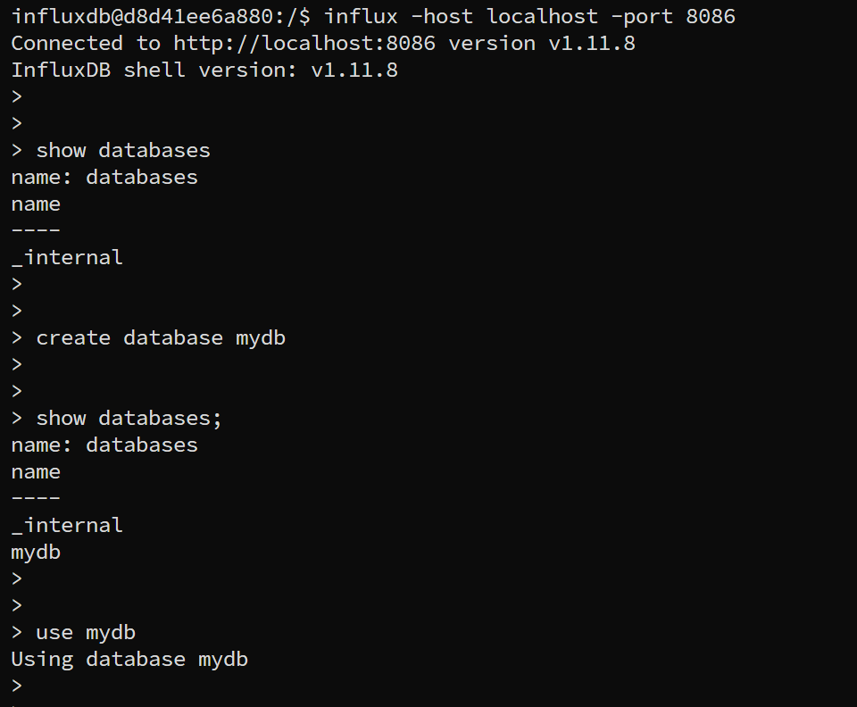

---
tags:
  - influxDb
  - install
---
搭建一个简单的influxdb环境，当然可以使用官网建议的方式安装([Linux install](https://docs.influxdata.com/influxdb/v1/introduction/install/?t=Red+Hat+%26amp%3B+CentOS))，不过同样可以使用docker镜像的方式快速搭建环境。


```shell

sudo docker pull influxdb:1.11.8

## start
sudo docker run --rm -d -p 8086:8086 -v /var/lib/influxdb:/tmp/lib/influxdb influxdb:1.11.8

## jump into container and interaction with influxdb
sudo docker exec -it d8d41ee6a880 bash

influx -host localhost -port 8086

```




> reference

[docker influx](https://hub.docker.com/_/influxdb)
[docker influxdb dockerfile](https://github.com/influxdata/influxdata-docker/blob/37d6b9bc4a1aa67689f68a362b7948ec312672c7/influxdb/1.11/Dockerfile)


