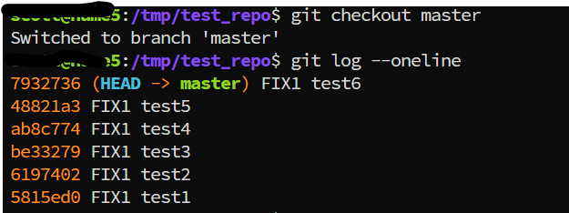
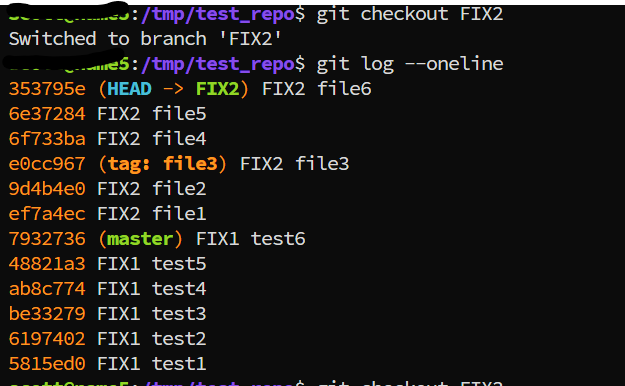
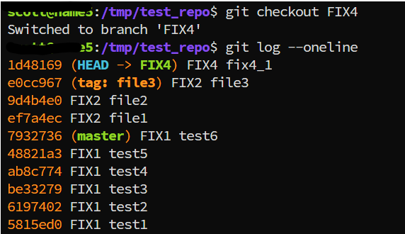
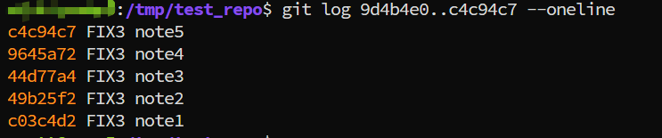

---
tags:
  - git
  - git-log
  - git-diff
---
In our daily work, we usually use `git log` and `git diff` to check the change difference and change history commit.  And we usually use `git log commitA..commitB` or `git log commitA...commitB`, similar for `git diff`, and what the difference for `..` and `...`?

### build git repository like below
```shell
git init
# master branch
for i in `seq 1 5`; do touch test$i; git add test$i; git commit -m"FIX1 test$i";  done

# FIX2 branch
git checkout -b FIX2
for i in `seq 1 5`; do touch file$i; git add file$i; git commit -m"FIX2 file$i"; done

# FIX3 branch
git checkout master
git checkout -b FIX4
for i in `seq 1 5`; do touch note$i; git add note$i; git commit -m"FIX3 note$i"; done

# FIX4 branch
FIX4 checkout from 'tag of FIX2 file3'
touch fix4_1;  git add fix4_1; git commit -m"FIX4 fix4_1";

```






### A..B (two dots)

`git log`:  means commits reachable from `B`, but not from `A`.
```shell
# 9d4b4e0 FIX2 file2
# c4c94c7 FIX3 note5
git log 9d4b4e0..c4c94c7  --oneline
```


```shell
git log c4c94c7..9d4b4e0  --oneline
```


`git diff`:  behavies like `git diff A B`,  the diff of the tree at A vs the tree at B.


### A...B(three dots)
`git log`:  symmetric difference(对称差)--commits reachable from either A ot B. but not from both . (useful to see what each branch has that the other doesn't).

```
git diff 9d4b4e0...c4c94c7  --oneline
```


```shell
git diff c4c94c7...9d4b4e0  --oneline
```


`git diff`: difference meaning -- it diffs $(git merge-base A B)->B;  shows what B changed since the branches diverged.  (useful to see what would be merged from B into A).


