---
tags:
  - git
  - git-rebase
  - history-commit
---
当提交完功能代码后, 整理一下commit history可以大大方便review的工作量, 同事对于以后review起到一个很好的提示作用.

初始的提交记录如下:
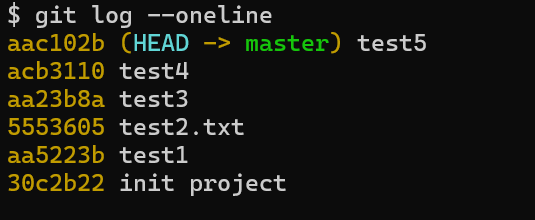

#### git rebase 操作
> 修改提交的message

```shell
# 把  test2.txt 提交记录修改为  test2

### step1 
git rebase -i 5553605~

### step2 之后进入下面的 交互编辑界面, 直接修改message 就可以

### step3 修改 `pick` 为 `reword`

### step4 修改message,并保存


```

进入rebase 交互式编辑:
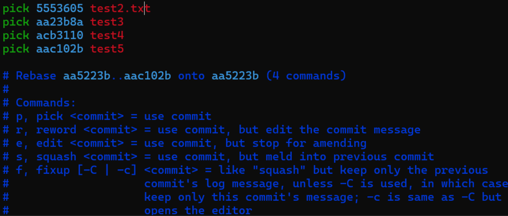

把对应的 `pick`修改为`reword`, 然后保存.

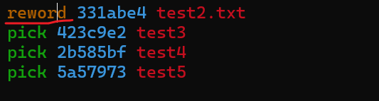

之后可以修改message, 保存就好.
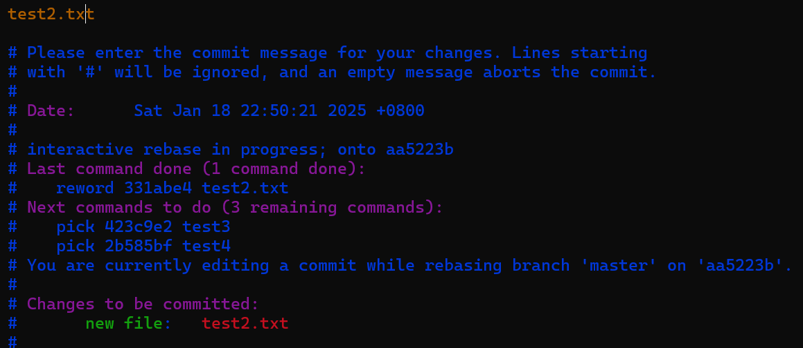


应用成功, 查询最新的记录
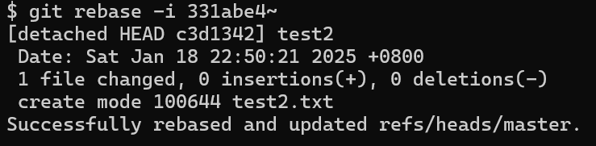

查看最新记录
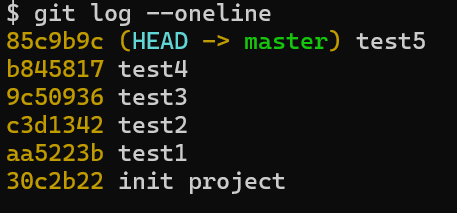


> 合并多一个commit 为一个

```shell
# 把 test3/4/5  合并为一个 commit

### step1 进入rebase 编辑
### step2 修改 test5/4 pick to fixup

```

step1
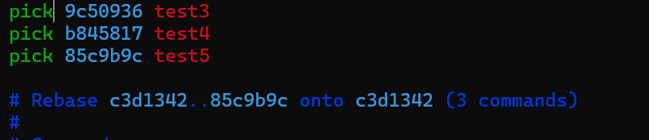

step2

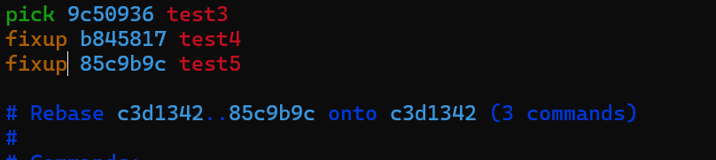
step3
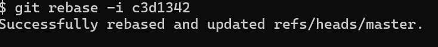

最新记录如下, 可以看到 test4/5 合并到了test3中.

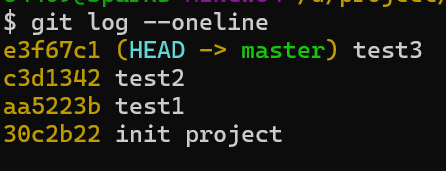


> 删除commit

```shell
# 删除 test2 commit

### step1 进入rebase 交互界面
### step2 编辑并保存
### step3 查看记录


```

step1
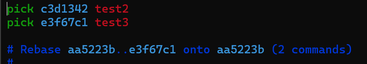


step2
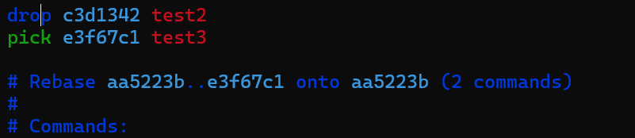

step3


可以看到对应的test2 已经被删除了, 同事查看 `test2.txt` 文件也没有了.

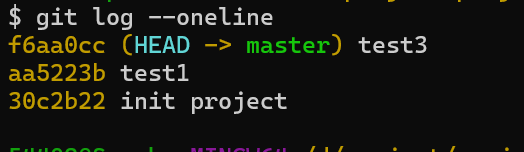


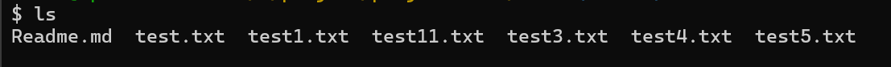


> 拆分一个commit为多个

```shell
# 将 test1 commit 分拆为多个

### step1 进入rebase 交互界面
### step2 编辑 pick 为 edit,并保存
### step3 此时进入到了test1提交后的环境.
### step4 reset HEAD, 之后通过git add, git commit 进行提交
### step5 执行 git rebase --continue
### step6 查看最新记录

```

step1
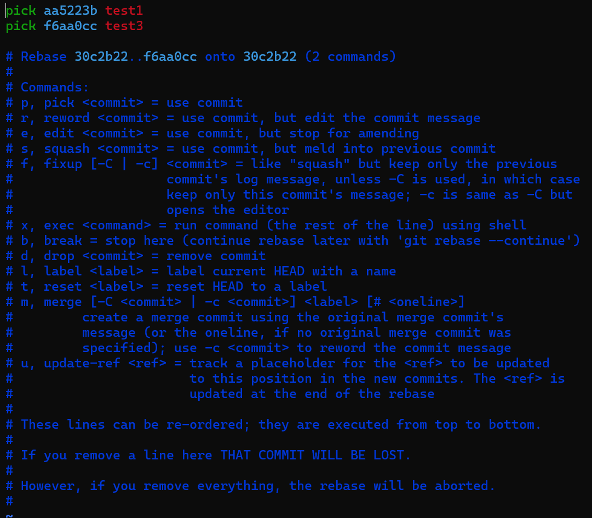

step2

step3
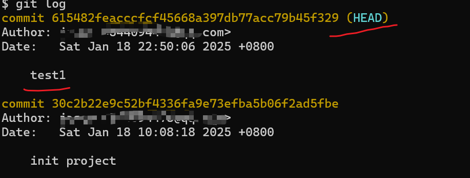

step4
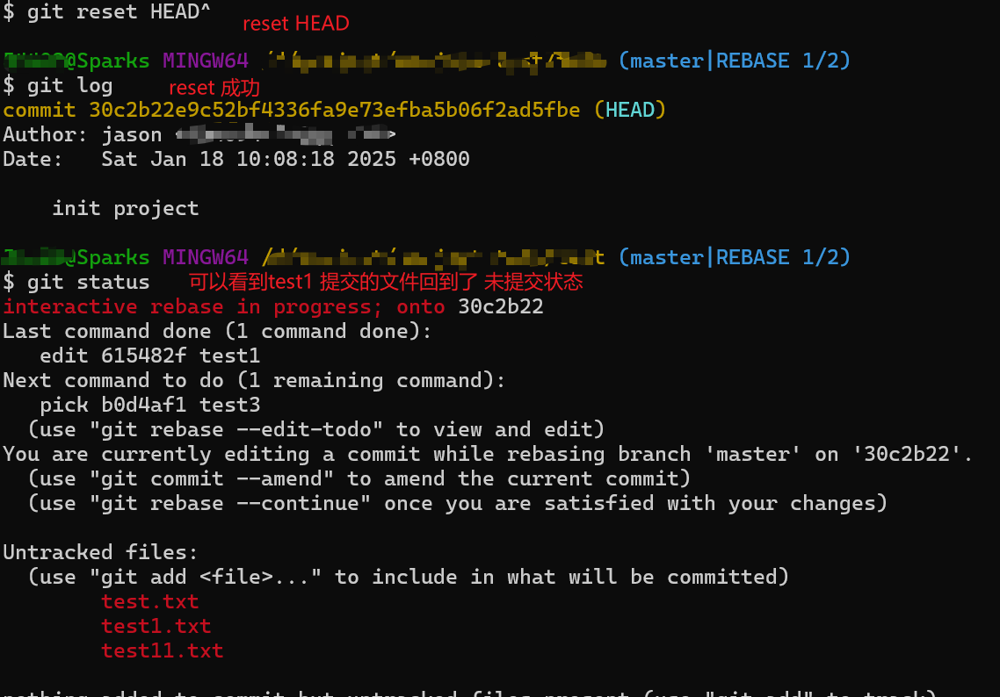

进行文件的编辑, 提交
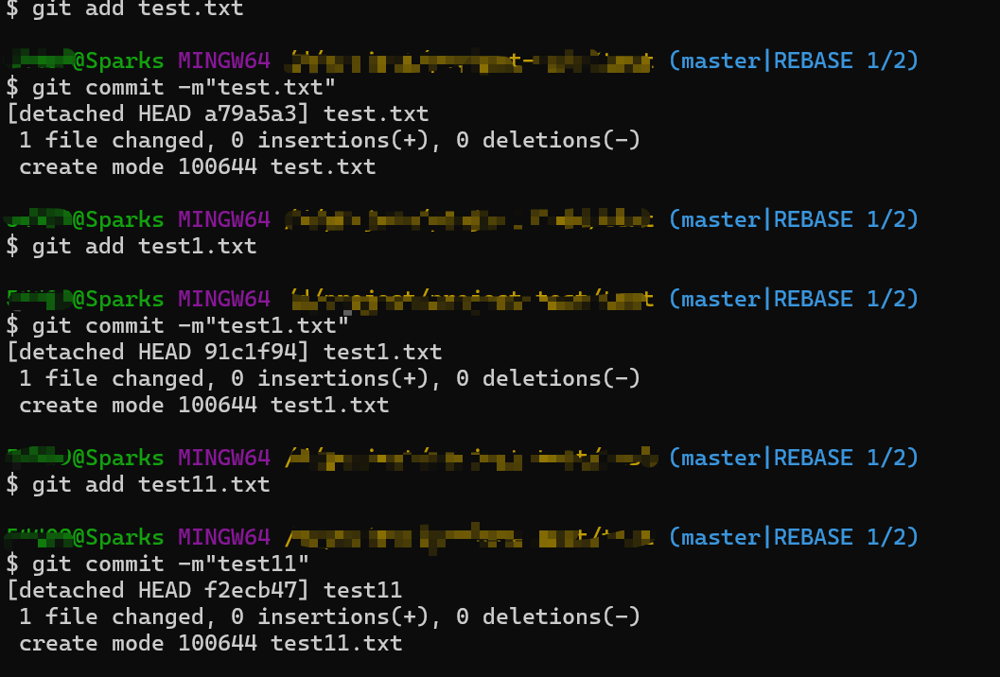

step5
可以看到 test1 分为了  test.txt test1.txt  test11.txt
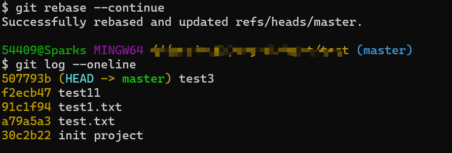


>针对提交的代码, 进行patch拆分

```shell
# 通过 git add -p 选择哪些代码进行提交.  不提交的代码从patch删除就可以


```

#### 针对全部的history执行命令

> 修改整个history的 email

```shell
git filter-branch --env-filter ' 
OLD_EMAIL="旧的 email" 
NEW_NAME="新的名字" 
NEW_EMAIL="新的 email"  
if [ "$GIT_COMMITTER_EMAIL" = "$OLD_EMAIL" ]; then     
export GIT_COMMITTER_NAME="$NEW_NAME"     
export GIT_COMMITTER_EMAIL="$NEW_EMAIL" fi 
if [ "$GIT_AUTHOR_EMAIL" = "$OLD_EMAIL" ]; then     
export GIT_AUTHOR_NAME="$NEW_NAME"     
export GIT_AUTHOR_EMAIL="$NEW_EMAIL"  fi' --tag-name-filter cat -- --branches --tags
```

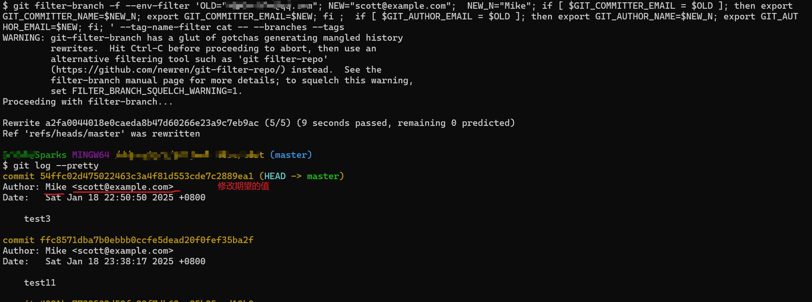


> 从全部history中删除文件

```shell
git filter-branch --tree-filter "rm -f test.txt"  HEAD

```

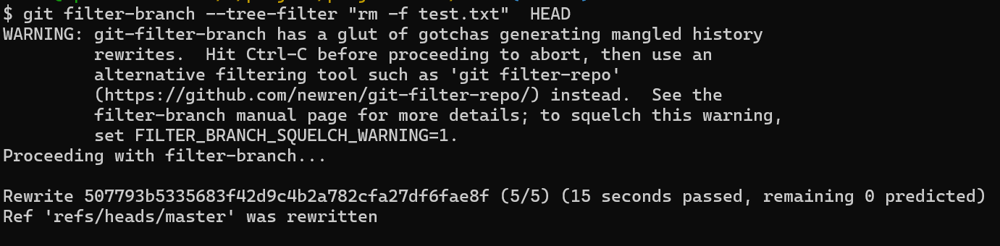


可以看到 test.txt 文件确实被删除了.
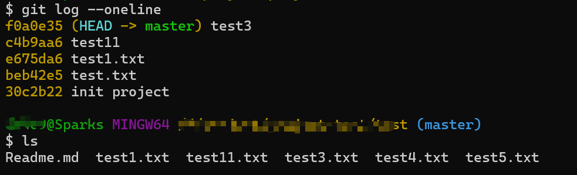


