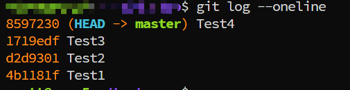
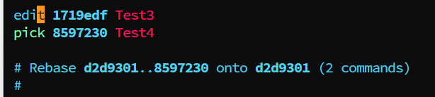

---
tags:
  - git
  - commit-date
---
In git,  is there any method that you can use to update the commmit date? 
Yes, it has.

If you want to update the commit date for specific commitId, please follow below steps:
```shell
# f.g:  update 1719edf
## 1. rebase the commit
git rebase -i 1719edf^

## 2. change pick to edit

## 3. re-commit the change and set the commit date
GIT_COMMITTER_DATE="2025-11-10 00:00:00" git commit --amend --no-edit --date="2025-11-10 00:00:00"

git rebase --continue

git push origin HEAD --force


### 修改Author date
git commit --amend --no-edit --date="2025-11-10 00:00:00"

```







