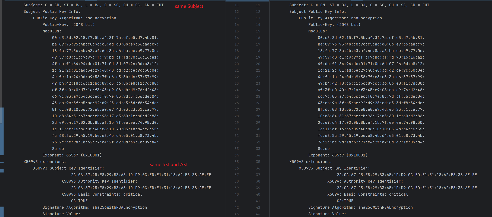
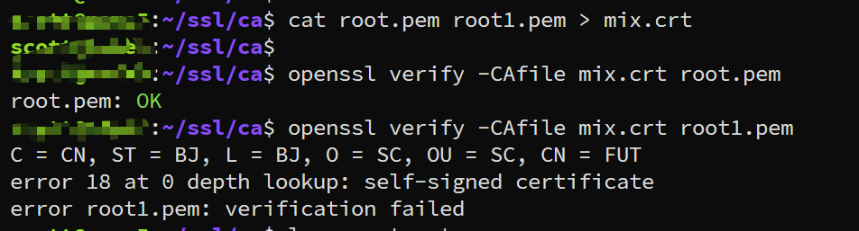
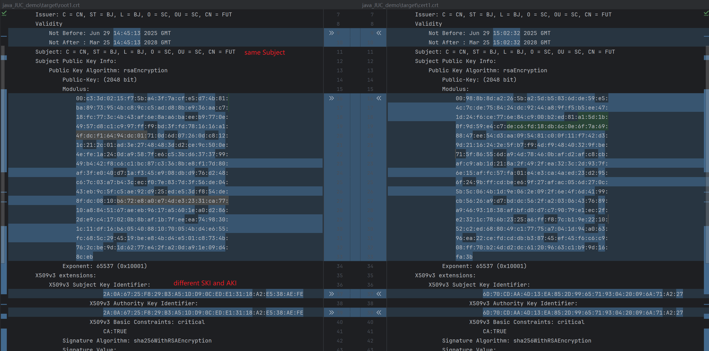
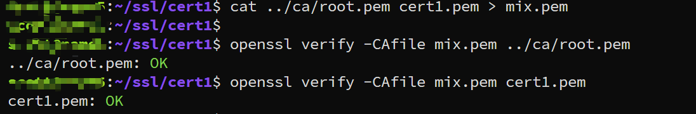
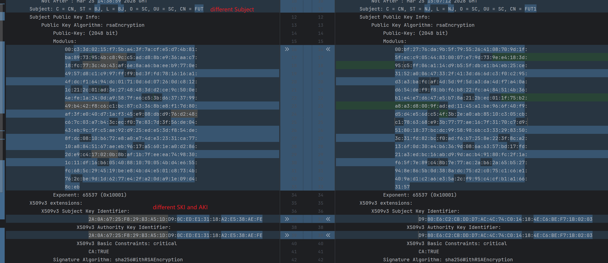
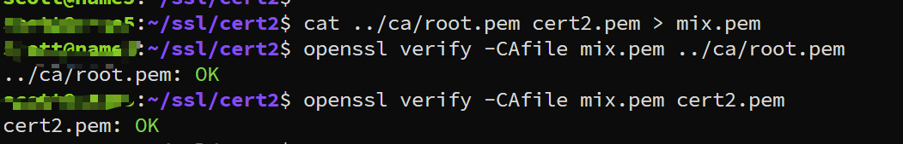

---
tags:
  - openssl
  - ssl-verify
  - certificate
---
openssl 在不同情况下对certificate的verify: 

> case 1: 
> 1. same Subject
> 2. same Subject Key Identifier (SKI)
> 3. same Authority Key Identifier (AKI)
> 

```shell
# generate certificate
openssl genrsa  -out ca.key 2048
openssl req -new -key ca.key -out root.csr -subj "/C=CN/ST=BJ/L=BJ/O=SC/OU=SC/CN=FUT"
openssl req -x509 -days 1000 -key ca.key -in root.csr -out root.pem

openssl req -x509 -days 1000 -key ca.key -in root.csr -out root1.pem

```



verify result: 


可以看到只有一个certificate verify成功.


> case 2:
> 1. same Subject
> 2. different SKI and AKI

```shell
# generate certificate
openssl genrsa -out cert1.key 2048
openssl req -new -key cert1.key -out cert1.csr -subj "/C=CN/ST=BJ/L=BJ/O=SC/OU=SC/CN=FUT"
openssl req -x509 -days 1000 -key cert1.key -in cert1.csr -out cert1.pem

```



verify result:



> case 3:
> 1. different Subject
> 2. same SKI and AKI

```shell
# generate certificate
openssl genrsa -out cert2.key 2048
openssl req -new -key cert2.key -out cert2.csr -subj "/C=CN/ST=NJ/L=NJ/O=SC/OU=SC/CN=FUT1"
openssl req -x509 -days 1000 -key cert2.key -in cert2.csr -out cert2.pem

```






| condition                                                                                     | result                                |
| --------------------------------------------------------------------------------------------- | ------------------------------------- |
| GIVEN: <br>1, same Subject and Same SKI and AKI<br>WHTN:<br>verify the certificate            | one of the certificate verify success |
| GIVEN: <br>1, same Subject<br>2, different SKIAKI<br>WHTN:<br>verify the certificate          | both certificate verify success       |
| GIVEN: <br>1, different Subject<br>2.different SKI and AKI<br>WHTN:<br>verify the certificate | both verify success                   |


