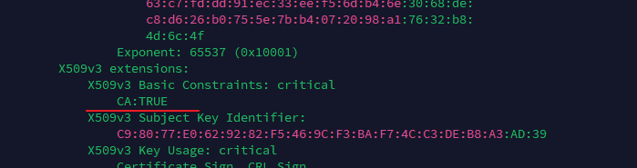
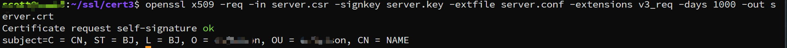
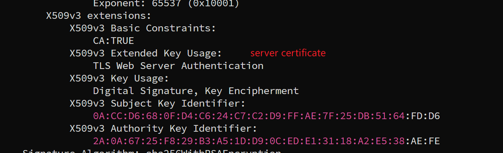
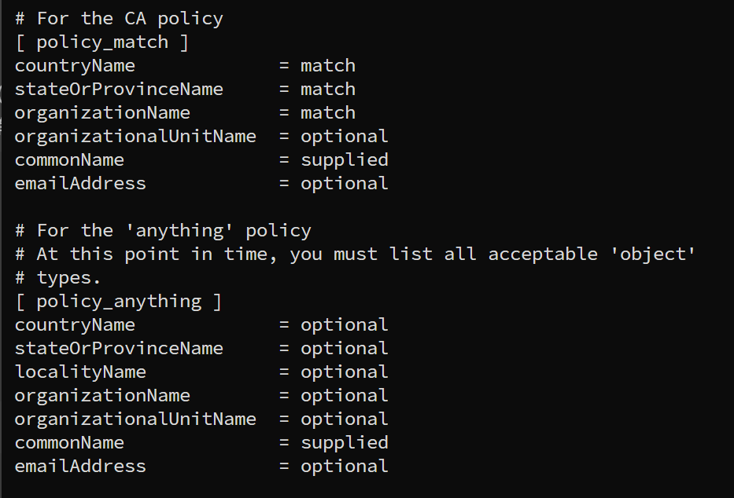

---
tags:
  - certificate
  - openssl-verify
  - openssl
  - extentation
---
场景:
线上环境, 在和外部client通信时, 需要使用ssl/tls加密. 不过经常会遇见一些ssl/tls 握手失败的情况, 下面是一些异常情况总结.

> CA certificate missed  CA:True.



当使用没有 `CA:TRUE`的证书去校验时, 会报错:
```shell
# verify
openssl verify -CAfile root.pem server.pem

error 20 at 0 depth lookup: unable to get local issuer certificate
server.pem: verification failed
```


> 缺少: extendedKeyUsage = serverAuth /clientAuth

```shell
# 校验是否可做“服务器”用途
openssl verify -CAfile ca.crt -purpose sslserver server.crt

server.crt: CN = your.server.name
error 27 at 0 depth lookup: certificate not certified for SSL server

# 校验是否可做“客户端”用途
openssl verify -CAfile ca.crt -purpose sslclient server.crt

server.crt: CN = your.server.name
error 27 at 0 depth lookup: certificate not certified for SSL client
```

生成server Auth的配置文件 以及 cmd:
```ini
[ req ]
# 用于"openssl req"生成 CSR 时，默认选哪个 section 来加扩展
req_extensions = v3_req

[ v3_req ]
basicConstraints = CA:TRUE
# 服务器认证
extendedKeyUsage = serverAuth/clientAuth
# 数字签名 + 密钥协商
keyUsage = digitalSignature,keyEncipherment
```

```shell
openssl genrsa -out server.key 2048
# generate CSR
openssl req -new -config server.conf -key server.key -out server.csr -subj "/C=CN/ST=BJ/L=BJ/O=ericsson/OU=ericsson/CN=NAME"

# verify CSR
openssl req -in server.csr -noout -text

# self sign key
# 自签模式
openssl x509 -req -in server.csr -signkey server.key -extfile server.conf -extensions v3_req -days 1000 -out server.crt

## ca 生成需要生成一些前提目录
mkdir -p demoCA/{certs,newcerts,private}
touch demoCA/{crl,index,txt,serial}
echo 1000 > demoCA/serial
cp ../ca/root.key demoCA/private/cakey.pem
cp ../ca/ca.pem demoCA/cacert.pem
openssl ca -config /etc/ssl/openssl.cnf -in server.csr -out server1.crt -extfile server.conf -extensions v3_req

```






> 签名证书时, 报错:
> The organizationName field is different between CA certificate (SC) and the request (csson)

```shell
# sign command
openssl ca -config /etc/ssl/openssl.cnf -in server.csr -out server1.crt -extfile server.conf -extensions v3_req

output: 
The organizationName field is different between CA certificate (SC) and the request (csson)
```

这是因为CA 配置文件中启用了一个`严格匹配策略(policy)`, 它要求CSR 里的某些字段必须和CA 自身证书里面一模一样. 默认策略:
```shell
[ policy_match ]
countryName             = match
stateOrProvinceName     = match
organizationName        = match    #这里要求 CSR 的 O 必须和 CA 的 O 相同
organizationalUnitName  = optional
commonName              = supplied
```



解决方法一: 

修改openssl.conf, 增加一个policy:
```shell
# 配置：
[ policy_loose ]
countryName             = optional
stateOrProvinceName     = optional
organizationName        = optional
organizationalUnitName  = optional
commonName              = supplied

# generate
openssl ca -config openssl.conf -policy policy_loose -in request.csr -out certificate.crt


```

解决方法二:
```shell
# 修改match
[ policy_match ]
countryName             = match
stateOrProvinceName     = match
- organizationName      = match
+ organizationName      = optional
organizationalUnitName  = optional
commonName              = supplied


# 之后命令不变, 重新生成
openssl ca -config /etc/ssl/openssl.cnf -in server.csr -out server1.crt -extfile server.conf -extensions v3_req
```


解决方法三:

```shell
# 使用一个更宽松的policy
openssl ca -config openssl.conf -policy policy_anything -in request.csr -out cert.pem
```
