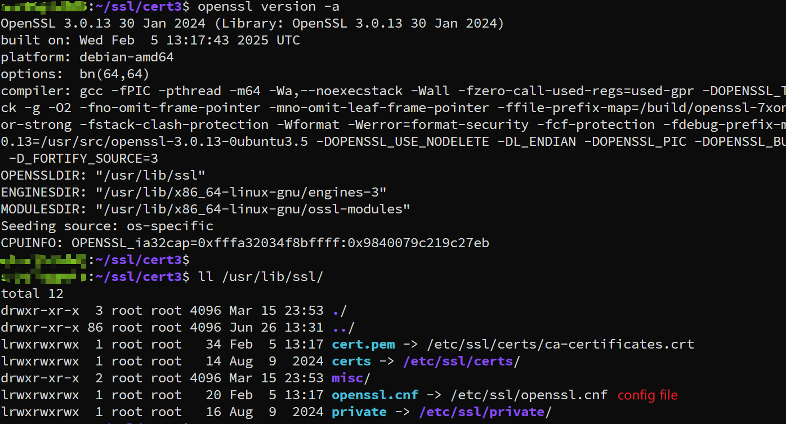

---
tags:
  - openssl
  - config
  - openssl-conf
---
在使用openssl 生成certificate时, 一定需要定义一个配置文件. 不过此配置文件可以参考openssl自带的配置, 那么如何找到openssl 自带的配置文件呢? 

>  default config for openssl

1,  通过 `openssl version` 找到 openssl 目录
```shell
openssl version -a
OpenSSL 3.0.13 30 Jan 2024 (Library: OpenSSL 3.0.13 30 Jan 2024)
built on: Wed Feb  5 13:17:43 2025 UTC
platform: debian-amd64
options:  bn(64,64)
compiler: gcc -fPIC -pthread -m64 -Wa,--noexecstack -Wall -fzero-call-used-regs=used-gpr -DOPENSSL_TLS_SECURITY_LEVEL=2 -Wa,--noexecstack -g -O2 -fno-omit-frame-pointer -mno-omit-leaf-frame-pointer -ffile-prefix-map=/build/openssl-7xongr/openssl-3.0.13=. -fstack-protector-strong -fstack-clash-protection -Wformat -Werror=format-security -fcf-protection -fdebug-prefix-map=/build/openssl-7xongr/openssl-3.0.13=/usr/src/openssl-3.0.13-0ubuntu3.5 -DOPENSSL_USE_NODELETE -DL_ENDIAN -DOPENSSL_PIC -DOPENSSL_BUILDING_OPENSSL -DNDEBUG -Wdate-time -D_FORTIFY_SOURCE=3
OPENSSLDIR: "/usr/lib/ssl"
ENGINESDIR: "/usr/lib/x86_64-linux-gnu/engines-3"
MODULESDIR: "/usr/lib/x86_64-linux-gnu/ossl-modules"
Seeding source: os-specific
CPUINFO: OPENSSL_ia32cap=0xfffa32034f8bffff:0x9840079c219c27eb
```
配置文件就在: `OPENSSLDIR`中.



