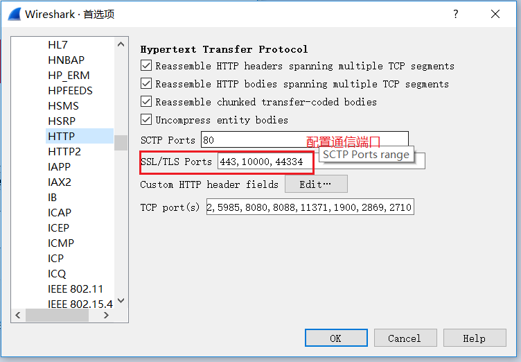
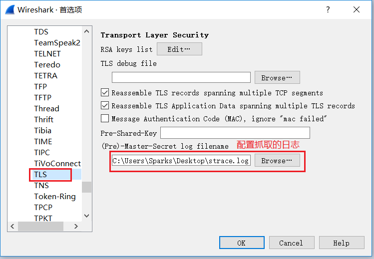

# https报文解密

本篇说一下借助wireshark工具来解密https报文，用于https通讯调试。

使用到的工具: wireshark

实现的语言: java

环境: centos-6.5

第三方jar包: jSSLKeyLog.jar

参考工程: 

```shell
https://github.com/emperwang/JavaBase/tree/master/JavaSSL
```

## 步骤1:

首先搭建一个https的客户端和服务端，并能够进行通信。

## 步骤2: 

在https服务端的虚拟机启动参数添加如下参数，并重启:

```shell
-javaagent:jSSLKeyLog.jar=/path/strace.log
```


## 步骤3: 

抓取https通信报文，命令如下:

```shell
tcpdump -i eth0 -w https.pcap
```

## 步骤4: 

 配置wireshark，如图:

1.编辑--> 首选项-->RSA Keys

在此处配置密钥(keyStore)，不是证书也不是trustKeyStore.


2.根据工程使用的http端口，配置http的端口

编辑--> 首选项 --> protocol --> HTTP



3.把java工程中抓取的日志放入到wireshark中

编辑 --> 首选项 --> protocol --> TLS



## 步骤5:  右键加密的报文，追踪流


## 步骤6: 查看解密后的数据

