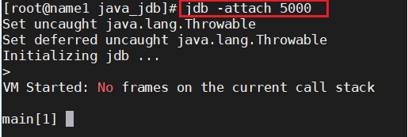
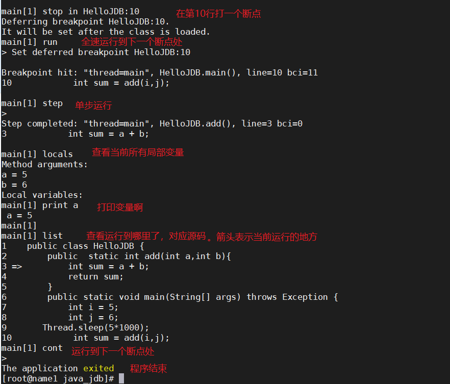

# 记录一次JDB命令行调试java程序

参考的官网文档:

```shell
https://docs.oracle.com/javase/8/docs/technotes/tools/windows/jdb.html
```

## 调试方式

```shell
# 直接使用JDB 执行编译好的class文件
## 此种方式相当于是 启动一个新的JVM 运行程序，故可以在命令行给程序传递参数
jdb mainClassName

# 使用远程方式调试
## 此种格式是使用原来的JVM，故只可以调试
java -agentlib:jdwp=transport=dt_socket,server=y,suspend=n MyClass
jdb -attach 8000

```

调试程序:

```java
public class HelloJDB {
    public  static int add(int a,int b){
        int sum = a + b;
        return sum;
    }
    public static void main(String[] args) {
        int i = 5;
        int j = 6;

        int sum = add(i,j);

        System.out.println("the result is :"+sum);

        sum = 0;
        for (int i1 = 0;i1 < 100; i1++){
            sum += i1;
        }

        System.out.println("result2 is :"+sum);
    }
}
```

### 方式一

```shell
# 编译
## -g 添加上调试参数
javac  -g  HelloJDB
```

1.编译程序

```shell
javac -g HelloJDB
```

2.进入调试


3.看一下支持的命令

```shell
> help
** command list **
connectors                -- list available connectors and transports in this VM

run [class [args]]        -- start execution of application's main class

threads [threadgroup]     -- list threads
thread <thread id>        -- set default thread
suspend [thread id(s)]    -- suspend threads (default: all)
resume [thread id(s)]     -- resume threads (default: all)
where [<thread id> | all] -- dump a thread's stack
wherei [<thread id> | all]-- dump a thread's stack, with pc info
up [n frames]             -- move up a thread's stack
down [n frames]           -- move down a thread's stack
kill <thread id> <expr>   -- kill a thread with the given exception object
interrupt <thread id>     -- interrupt a thread

print <expr>              -- print value of expression
dump <expr>               -- print all object information
eval <expr>               -- evaluate expression (same as print)
set <lvalue> = <expr>     -- assign new value to field/variable/array element
locals                    -- print all local variables in current stack frame

classes                   -- list currently known classes
class <class id>          -- show details of named class
methods <class id>        -- list a class's methods
fields <class id>         -- list a class's fields

threadgroups              -- list threadgroups
threadgroup <name>        -- set current threadgroup

stop in <class id>.<method>[(argument_type,...)]
                          -- set a breakpoint in a method
stop at <class id>:<line> -- set a breakpoint at a line
clear <class id>.<method>[(argument_type,...)]
                          -- clear a breakpoint in a method
clear <class id>:<line>   -- clear a breakpoint at a line
clear                     -- list breakpoints
catch [uncaught|caught|all] <class id>|<class pattern>
                          -- break when specified exception occurs
ignore [uncaught|caught|all] <class id>|<class pattern>
                          -- cancel 'catch' for the specified exception
watch [access|all] <class id>.<field name>
                          -- watch access/modifications to a field
unwatch [access|all] <class id>.<field name>
                          -- discontinue watching access/modifications to a field
trace [go] methods [thread]
                          -- trace method entries and exits.
                          -- All threads are suspended unless 'go' is specified
trace [go] method exit | exits [thread]
                          -- trace the current method's exit, or all methods' exits
                          -- All threads are suspended unless 'go' is specified
untrace [methods]         -- stop tracing method entrys and/or exits
step                      -- execute current line
step up                   -- execute until the current method returns to its caller
stepi                     -- execute current instruction
next                      -- step one line (step OVER calls)
cont                      -- continue execution from breakpoint

list [line number|method] -- print source code
use (or sourcepath) [source file path]
                          -- display or change the source path
exclude [<class pattern>, ... | "none"]
                          -- do not report step or method events for specified classes
classpath                 -- print classpath info from target VM

monitor <command>         -- execute command each time the program stops
monitor                   -- list monitors
unmonitor <monitor#>      -- delete a monitor
read <filename>           -- read and execute a command file

lock <expr>               -- print lock info for an object
threadlocks [thread id]   -- print lock info for a thread

pop                       -- pop the stack through and including the current frame
reenter                   -- same as pop, but current frame is reentered
redefine <class id> <class file name>
                          -- redefine the code for a class

disablegc <expr>          -- prevent garbage collection of an object
enablegc <expr>           -- permit garbage collection of an object

!!                        -- repeat last command
<n> <command>             -- repeat command n times
# <command>               -- discard (no-op)
help (or ?)               -- list commands
version                   -- print version information
exit (or quit)            -- exit debugger

<class id>: a full class name with package qualifiers
<class pattern>: a class name with a leading or trailing wildcard ('*')
<thread id>: thread number as reported in the 'threads' command
<expr>: a Java(TM) Programming Language expression.
Most common syntax is supported.

Startup commands can be placed in either "jdb.ini" or ".jdbrc"
in user.home or user.dir
```

4.打个断点


5.执行一步


6.查看变量


7.查看执行到哪里


8.执行到结束


### 方式二(远程调试)

启动脚本:

```shell
#!/bin/bash

echo "starting"
JAVA_ARG="-Xdebug -Xrunjdwp:transport=dt_socket,server=y,suspend=y,address=5000"

javac -g HelloJDB.java

java ${JAVA_ARG} HelloJDB

echo "started"
```

查看程序启动时的日志:


连接到运行中的程序，此时端口要和脚本中的端口号一致。



运行示例:

