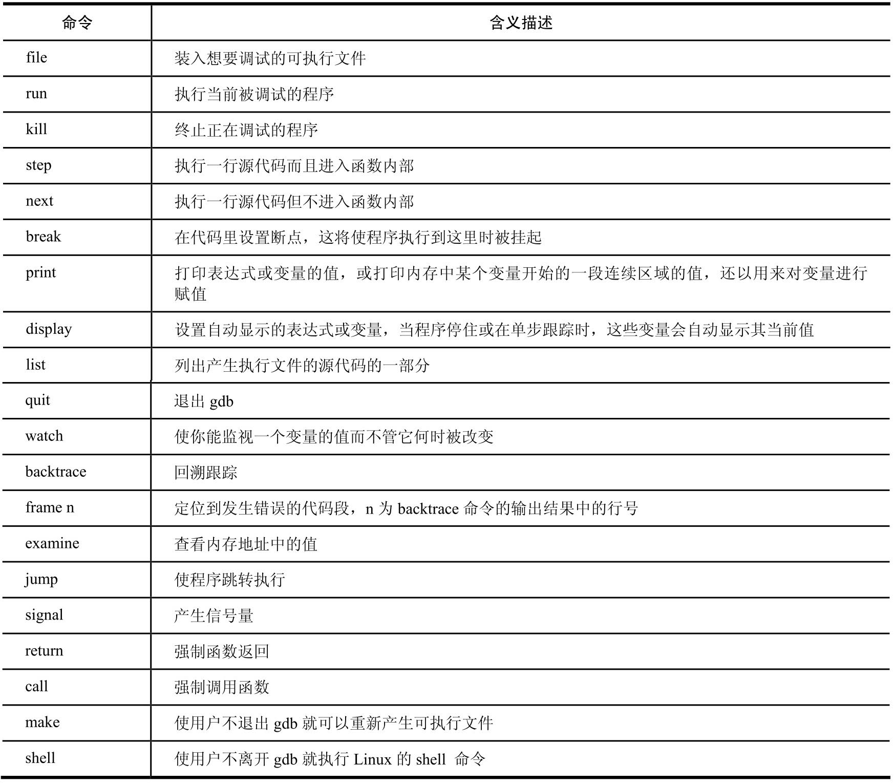

# GDB

Gdb是一款强大的调试工具，在这里小结一下其常用的用法.

## 1.常用的命令

调试期间常用的命令:



## 2.break(断点)

打断点:


其中list，print命令等也有一些常用的参数:


## 3.显示

### 3.1 print

```shell
print <expr>
print /<fmt> <expr>   # 使用指定格式打印值
# 设置变量的值为8
print x=8   
```

print打印数值时可以指定格式:


### 3.2 display(自动显示)

```shell
display <expr>    # 显示表达式的值
display /<fmt>  <expr>  # 显示格式时使用指定的格式
display /<fmt>  <addr>  # 使用指定的格式显示
display /i  $pc   # $pc 是环境变量,表示制定的地址,/i表示输出格式为机器的指令码
```

其他display常用命令:


### 3.3 examine (查看内存)

```shell
examine /<n/f/u>  <addr>
n,f,u: 是可选参数,可以独立使用,也可以联合使用
n: n是一个正整数,表示显示内存的长度,也就是从当前地址向后显示几个地址的内容
f: f表示显示的格式.
u: 表示从当前地址往后请求的字节数,如果不指定,gdb默认是4个bytes.
<addr>: 表示一个内存地址
```

### 3.4 gdb环境变量

```shell
## 使用环境鼻哪里时,gdb会在第一次使用时创建这个变量,而在以后的使用中,则直接对其赋值.环境变量没有类型,可以给环境变量定义任意的类型,包括结构体和数组.
# 设置环境变量
set $foo=*object_ptr

# 查看所有环境变量
show convenience   

# 查看某个环境变量
print $i
```

### 3.5 查看寄存器

```shell
# 打印某个寄存器, $+寄存器名
print  $ip
```


### 3.6 查看源代码


### 3.7 查看源代码内存

```shell
### 使用info line 查看源代码在内存中的地址.
# 查看某行的内存地址
info  line lineNum(行号)
# 查看某函数的内存地址
info line funcName(函数名)
# 查看某文件某行的内存地址
info line 文件名:行号
# 查看某文件的某函数的内存地址
info line 文件名:函数名
```


## 4 乱序执行

### 4.1 跳转执行

```shell
# <linespec>可以是文件的行号,也可以是 file:line格式,可以是 +num 这种偏移量格式，表示下一条运行语句在哪
jump  <linespec>
# 跳转到某个地址开始运行
jump  <address>
# 设置pc值也可以达到跳转效果
set  $pc = ox456
```

### 4.2 发送信号量

```shell
# linux的系统信号量通常为1~15,故<singal>也在此范围
singal  <singal>
```


### 4.3 强制函数返回

```shell
# 取消当前函数的执行
return 
# 使用<expression> 作为函数的返回值
return <expression>
```


### 4.4 强制调用函数

```shell
# <expr> 可以是函数,达到强制调用函数的目的,显示函数的返回值,如果返回值为void,那么久不显示
call <expr>
```


## 5.语言环境


