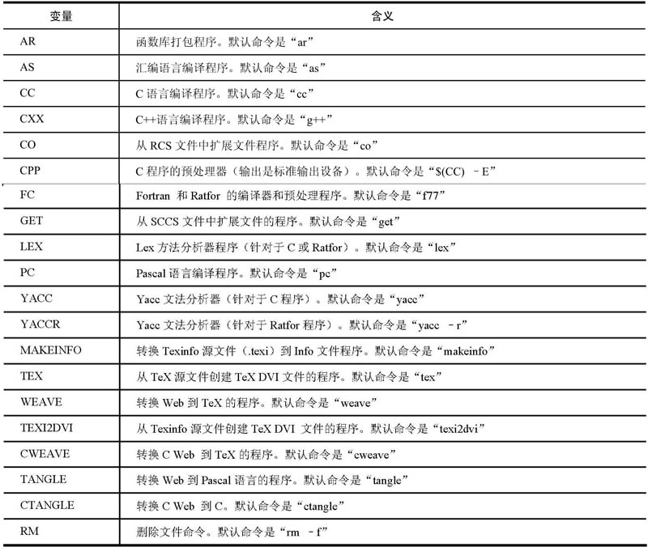
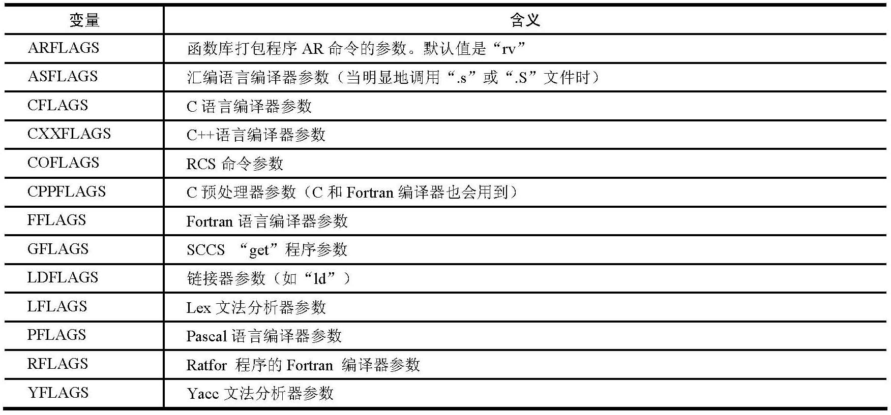
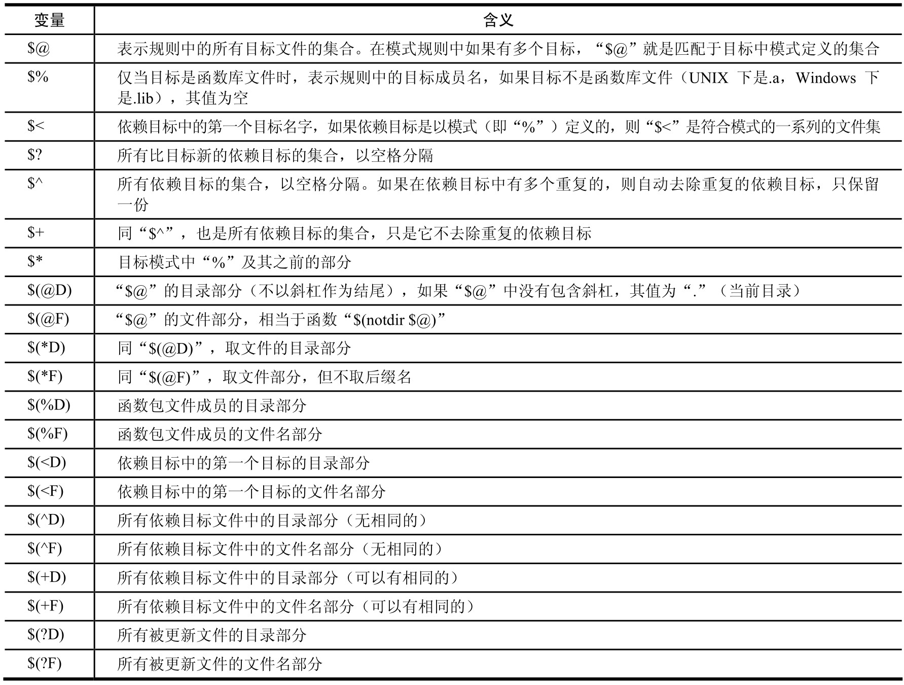

# Makefile

## 1.书写规则

Makefile里面主要包含了5方面的内容：显式规则，隐式规则，变量定义，文件指示(文件包含)和注释。

* 显式规则。显示规则说明了如何生成一个或多个目标。这需要由Makefile的书写者显示指出要生成的文件，文件的依赖文件及生成的命令
* 隐式规则。由于make有自动推导的功能，会选择一套默认的方法进行make，所以隐式的规则可以让开发者比较简略的书写Makefile，这是由make支持的。
* 变量定义。在Makefile中需要定义一系列的变量，一般都是字符串，它类似C语言中的宏，当Makefile被执行时，其中的变量都会被扩展到相应的应用位置上。
* 文件指示。包括三个部分，第一部分是在一个Makefile中引用另一个Makefile，就像C语言中incldue一样包含进来；第二部分是指根据某些情况指定Makefile中的有效部分，就像C语言中的预编译宏#ifdef一样； 第三部分就是定义一个多行的命令。
* 注释。注释使用 # 符号。

**注意：Makefile文件中的命令必须要以"Tab"键开始。**

```shell
Syntax:
targets:prerequisties
commnad
...
或者:
targets:prerequisties;command command
...

targets:是目标文件，多个文件以空格分开，可以使用通配符。一般来说，Makefile的目标是一个文件，但也有可能是多个文件
prerequisties:是目标所依赖的文件(或依赖目标)。
command: 是命令行。如果没有和 "targets:prerequisties"在一行，那就必须要以tab键开头.
```

### 1.1 通配符

```shell
make支持三种通配符:
* 
? 
[...]
# 和unix的bshell是一样的。
# 特殊符号:
~ :如: ~/test 表示当前用户的 $HOME目录下的test目录
```


### 1.2 伪目标

伪目标一般没有依赖，但是可以为伪目标指定所依赖的文件。

伪目标同样可以作为默认目标，只要把它放在Makefile第一行就可以。

```shell
# 此处理的clean就是伪目标
.PHONY: clean
clean:
rm *.o
```

```shell
# 伪目标作为默认目标
all:prog1,prog,prog3
.PHONY:all
prog1:prog1.o util.o
cc -o prog prog1.o util.o
prog2:prog2.o
cc -o prog2 prog2.o
prog3:prog3.o sort.o util.o
cc -o prog prog3.o sort.o util.o

```

```shell
# 为伪目标指定依赖文件
.PHONY: cleanall cleanobj cleandiff
cleanall: cleanobk cleandiff
rm program
cleanobj:
rm *.o
cleandiff:
rm *.diff
```

## 2.Makefile的命令

### 2.1 上条的命令结果应用在下一条命令

如果要把Makefile中上条的命令结果应用在下一条命令下，则应该把命令写在一行。

```shell
# 示例一
exec:
	cd /home/zhangsan/zs   
	pwd					# 此命令结果返回Makefile文件的路径

# 示例二
exec:
	cd /home/zhangsan/zs; pwd      #此命令结果返回 /home/zhangsan/zs
```

### 2.2 忽略命令出错

每当命令执行完毕后，make会自动检测他们的返回码，如果命令返回成功，那么make会继续执行下一条命令，直到规则中的所有命令都成功返回。如果某个命令出错(命令退出码非零)，那么make就会终止执行当前规则，这将有可能终止所有规则的执行。

1.方式一:

可以在Makefile的命令行前加一个减号 "-"，标记为不管命令是否出错都认为成功

```shell
exec:
	- cd /home/zhangsan/zs; pwd   # 此处的 "-" 表示不管命令是否出错都认为成功
```

2.方式二

make 使用参数 "-i" 或 "--ignore-errors"参数

3.方式三

make 使用参数 "-k" 或 "--keep-going"，此参数是 如果某个规则中的命令出错了，那么就终止该规则的执行，但继续执行其他规则。

### 2.3  @符号

make通常会把要执行的命令行在执行前输出到屏幕上。 当用 "@" 字符在命令前，这个命令将不被make显示出来:

```shell
## 没有@字符
echo "compiling"
执行时输出:
echo "compiling"
"compiling"

## 添加 @ 字符
@echo "compiling"
执行时输出:
"compiling"
```

```shell
make 参数:
-n | --just-print:此参数是只显示命令，不执行命令，这个功能有助于调试Makefile

-s | --slient: 全面禁止命令的显示
```


## 3. Makefile的变量


## 4. Makefile的函数


## 5. Makefile的隐式规则

在隐式规则的命令中，基本上都是使用了一些预先设置的变量。可以在Makefile中改变这些变量的值，或是在make的命令行中传入这些值，或是在环境变量中设置这些值，无论怎么样，只要设置了这些特定的变量，那么它们就会对隐式规则启作用。当然，可以利用make的 "-R" 或 "--no-buildin-variables"参数类取消所定义的变量对隐式规则的作用。

看一下内置的变量:



预先定义的一些flag:



自动化变量:

