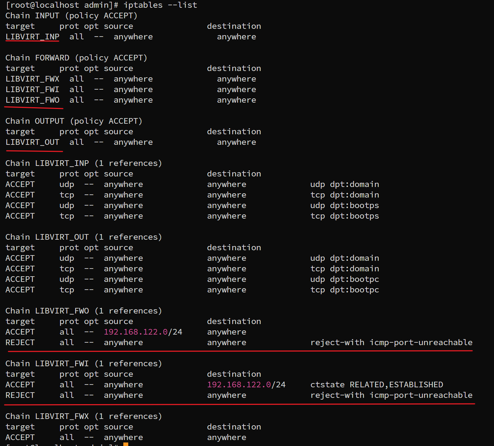

---
tags:
  - kvm
  - iptables
---
> kvm default kvm

```shell
# 其中有几个 reject所有流量的.
sudo iptables -A LIBVIRT_FWI -p all -j REJECT --reject-with icmp-port-unreachable
sudo iptables -A LIBVIRT_FWO -p all -j REJECT --reject-with icmp-port-unreachable
```




