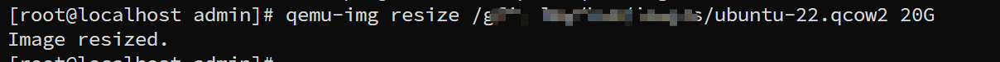
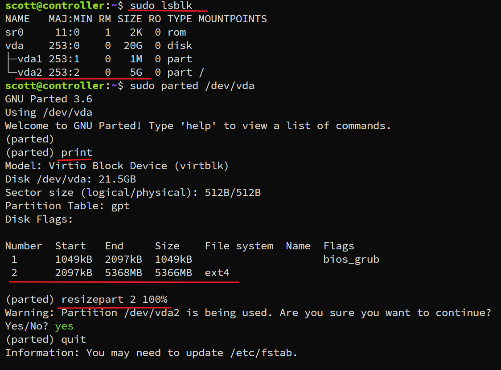
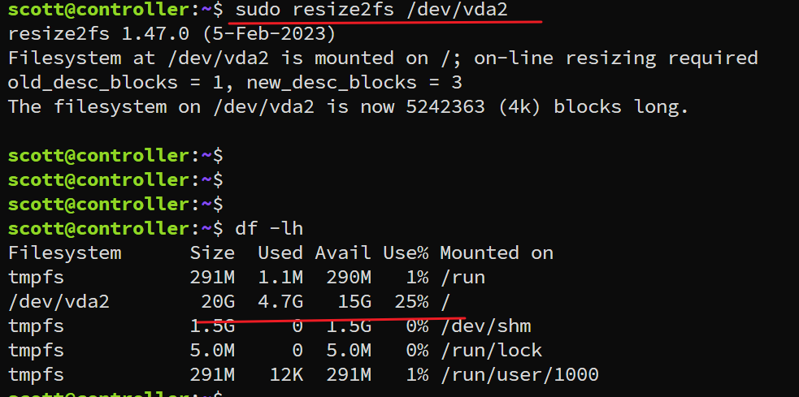

---
tags:
  - kvm
  - image
  - increment
---

```shell
# step 1: shutdown vm
virsh stop vm

# step 2: increce disk size
qemu-img resize /path/disk 20G

# step 3: start vm and login.  increce vm disk partition size
### check 
sudo lsblk

### increce partition
resizepart 2 100%


# step 4: resize filesystem
sudo resize2fs /dev/vda2

```


step 2: 


step 3:

step 4:
