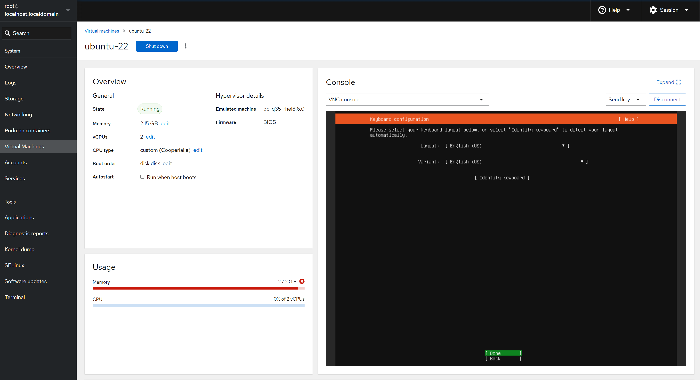

---
tags:
  - kvm
---
> create kvm instance from iso image

```shell
## 使用此工具从 浏览器通过 vnc 连接到 正在安装的 kvm, 进行安装时的配置
dnf install cockpit cockpit-machines

## url:
http://ip:9090
```




```shell
# create image
qemu-img create -f qcow2 ubuntu-22.qcow2 10G

# install system
virt-install --name=ubuntu-22 --description="ubuntu server" --os-variant=ubuntu22.04 --os-type linux  --vcpus=2 --ram=2048 --hvm  --disk path=/gfix_log/kvm/images/ubuntu-22.qcow2,format=qcow2 --cdrom /gfix_log/ubuntu-24.04.1-live-server-amd64.iso  --network bridge=virbr0,model=virtio --graphics vnc --console pty,target_type=serial --boot menu=on

--name 虚拟机名字
--description:
--os-type & --os-variant : 操作系统类别和版本
--network： 网络配置。 bridge=virbr0 默认使用桥接
--graphics vnc: 使用VNC 进行图形化安装
--console pty,target_type=serial: 启动控制台控制
--boot menu=on: 启动时显示引导菜单
-hvm: The guest VM is fully virtualized

## install from inernet
sudo virt-install \
  --name ubuntu-instance \
  --ram 2048 \
  --vcpus 2 \
  --disk size=20,path=/var/lib/libvirt/images/ubuntu-instance.qcow2,format=qcow2 \
  --os-type linux \
  --os-variant ubuntu20.04 \
  --graphics none \
  --console pty,target_type=serial \
  --network network=default \
  --location http://archive.ubuntu.com/ubuntu/dists/focal/main/installer-amd64/ \
  --extra-args "console=ttyS0,115200n8 serial"


# 在安装过程中 创建了账户,故可以使用创建的账户登录
## 查看 kvm ip
virsh net-dhcp-leases default 
ssh user@ip

```