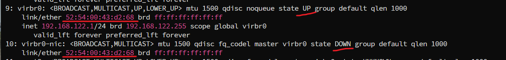
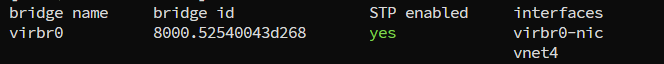

---
tags:
  - kvm
  - kvm-network
---
`bridge`的使用, 可以使用Linux自带的bridge, 也可以使用openvswitch sofrware 来进行.

本篇主要是使用自带的 bridge.

```shell
# bridge install
dnf install bridge-utils

# confirm bridge module installed.
lsmod | grep bridge

# delete existing bridge. and create a new one which same as before.
## 1. shutdown bridge
ifconfig virbr0 down

## 2. delete bridge
brctl delbr virbr0
brctl show

## 3.create new bridge
brctl addbr virbr0

## 4. bring up bridge
ifconfig virbr0 up

## 5. set ip
ip addr add 192.168.122.1 dev virbr0

## 6. enable STP
brctl stp virbr0 on

## 7. add kvm interface to bridge
brctl addif virbr0 vnet0

## 8. delete ingerface from bridge
brctl delif virbr0 vnet1

## 9. show bridge info
brctl show virbr0
brctl showmacs  virbr0
brctl showstp virbr0

### 在上面重建 virbr0后, 会导致guest vm 不能访问网络.需要重启一下 libvirtd
systemctl restart libvirtd

```


```shell
# 如果上面的操作失败了可以重新创建默认的 bridge
virsh net-define /usr/share/libvirt/networks/default.xml
virsh net-start default
virsh net-autostart default
```


> Note:
> 正常情况下, 一个virbr0 会对应要给 virbr0-nic的设备. nic作用是与物理网卡的连接.
> 其物理地址相同.






