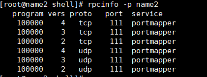
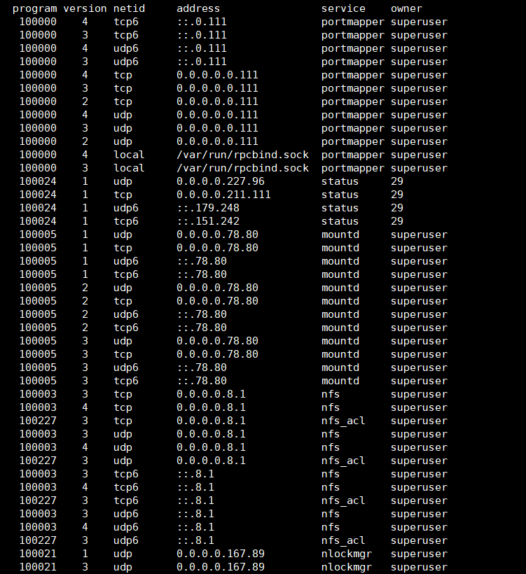

[TOC]

# NFS Install

## 1. 依赖的服务

本次实验环境:

| 主机IP        | 版本       | 角色   |
| ------------- | ---------- | ------ |
| 192.168.72.35 | centos-7.6 | 服务端 |
| 192.168.72.18 | centos-6.4 | 客户端 |

软件安装:

```shell
$ yum install nfs-utils rpcbind
```

查看软件的安装:

```shell
## centos-7.6
[root@name2 ~]# rpm -qa | grep nfs
libnfsidmap-0.25-19.el7.x86_64
nfs-utils-1.3.0-0.61.el7.x86_64

[root@name2 ~]# rpm -qa | grep rpc
rpcbind-0.2.0-47.el7.x86_64
xmlrpc-c-client-1.32.5-1905.svn2451.el7.x86_64
xmlrpc-c-1.32.5-1905.svn2451.el7.x86_64
libtirpc-0.2.4-0.15.el7.x86_64

## centos-6.4
[root@name1 ~]# rpm -qa | grep nfs
nfs-utils-lib-1.1.5-6.el6.x86_64
nfs4-acl-tools-0.3.3-6.el6.x86_64
nfs-utils-1.2.3-36.el6.x86_64

[root@name1 ~]# rpm -qa | grep rpc
xmlrpc-c-1.16.24-1209.1840.el6.x86_64
rpcbind-0.2.0-11.el6.x86_64
xmlrpc-c-client-1.16.24-1209.1840.el6.x86_64
libtirpc-0.2.1-5.el6.x86_64

```

并先关闭防火墙.

## 2. 服务的配置

这里把服务器的 /root/shell  目录共享出去。

### 2-1 服务端的配置

```shell
# 配置 /etc/exports 文件,添加内容
/root/shell *(rw,sync,no_root_squash)

### 参数解释
*:  任何人
rw:读写权限
sync: 资料会先暂存于内存中,而非直接写入硬盘
no_root_squash:当登录NFS主机使用共享目录的使用者是root时,其权限将被转换成为匿名使用者,通常它的UID与GID都会变成nobody身份.
```

| 参数             | 说明                                                         |
| ---------------- | ------------------------------------------------------------ |
| ro               | 只读方式                                                     |
| rw               | 读写访问                                                     |
| sync             | 所有数据再请求时写入共享                                     |
| async            | nfs在写入数据前可以响应请求                                  |
| secure           | nfs通过1024以下的安全TCP/IP端口发送                          |
| insecure         | nfs通过1024以上的端口发送                                    |
| wdelay           | 如果多个用户要写入nfs目录,则归组写入(默认)                   |
| no_wdelay        | 如果多个用户要写入nfs目录,则立即写入, 当使用async时,无需此设置 |
| hide             | 在nfs共享目录中不共享子目录                                  |
| no_hide          | 共享nfs目录的子目录                                          |
| subtree_check    | 如果共享/usr/bin之类的子目录时, 强制nfs检查父目录的权限(默认) |
| no_subtree_check | 不检查父目录权限                                             |
| all_squash       | 共享文件的UID和GID映射匿名用户anonynous,适合公用目录         |
| no_all_squash    | 保留共享文件的UID和GID(默认)                                 |
| root_squash      | root用户的所有请求映射成如anonymous用户一样的权限(默认)      |
| no_root_squash   | root用户具有根目录的完全管理访问权限                         |
| anonuid=xxx      | 指定nfs服务器/etc/passwd 文件中匿名用户的UID                 |
| anongid=xxx      | 指定nfs服务器e/etc/passwd文件中的匿名用户的GID               |


```shell
## 启动服务
#### 这里一定要注意,服务一定要先驱动rpcbind
systemctl start rpcbind
systemctl start nfs

## 查看一下服务状态
systemctl status rpcbind
systemctl status nfs

## 查看服务状态,可以看到 portmap，nfs，mounted 进程的启动状态
rpcinfo -p 192.168.72.18

##　查看nfs的设置
showmount -e  localhost(ip也可以)   # 查看 /etc/exports 文件
showmount -a localhost(ip)  # 查看nfs与主机连接情况

## 查看服务端可挂载目录
showmount -e 192.168.72.35
```

刚启动rpc时的输出信息, 还没有nfs相关的注册



nfs启动注册后的rpc注册信息



查看nfs-server上有哪些export的目录


### 2-2 客户端的配置

```shell
# 创建一个挂载目录
mkdir  /opt/shell

# 修改目录属主
chown root:root /opt/shell

# 修改目录权限
chmod 777 /opt/shell
```

```shell
## 查看服务端可挂载的目录
showmount -e 192.168.72.35

## 挂载目录到本地
mount -t nfs 192.168.72.35:/root/shell  /opt/shell 
# nfs默认使用UDP连接,可以指定使用tcp
mount -t nfs 192.168.72.35:/root/shell /opt/shell -o proto=tcp -o nolock
# 卸载nfs
umount /opt/shell

## 查看 portmap nfs  mountd 进程端口等信息
rpcinfo -p localhost

## 查看那nfs设置
showmount -e 192.168.72.35	# 查看主机可用的挂载

## 查看本机挂载
mount | grep nfs

```


## 3. 服务 start | stop | status 

```shell
$ systemctl status | start | stop | restart rpcbind
 
$ systemctl status | start | stop | restart nfs

# 开机启动
$ systemctl enable rpcbind
$ systemctl enable nfs
```


## 4. nfs共享挂载 及 查看

```shell
## 挂载服务端目录到本地
mount -t nfs 192.168.72.35:/root/shell  /opt/shell


## 也可以把命令添加到 /etc/fatab
192.168.72.35:/root/shell  /opt/shell   nfs  defaults,_rnetdev  1 1
注: 第一个1表示备份文件系统,第二个1表示从/分区的顺序开始fsck磁盘检测,0表示不检测.
_rnetdev: 表示主机无法挂载直接跳过,避免无法挂载主机无法启动
```


```shell
# 卸载
umount dir
```


## 5. 端口的开放

这里就需要把rpcinfo查看的服务的信息的端口，全部进行开放了。


## 相关command

### 1.showmount

```shell
NAME
showmount - show mount information for an NFS server

SYNOPSIS
showmount [ -adehv ] [ --all ] [ --directories ] [ --exports ] [ --help ] [ --version ] [ host ]


OPTIONS
-a or --all	# 显示所有的挂载信息(目前使用,没有生效,既没有显示)
List  both  the  client hostname or IP address and mounted directory in host:dir format. This info should not be considered reliable. See the notes on rmtab in rpc.mountd(8).

-d or --directories  # 显示挂载的目录。(目前使用发现不管用)
List only the directories mounted by some client.

-e or --exports	# 显示本机exports文件内容,也可以显示主机的exports文件内容,也就是显示主机
			# 的可挂载目录
Show the NFS server’s export list.

-h or --help   # 帮助信息
Provide a short help summary.

-v or --version		# 版本信息
Report the current version number of the program.

--no-headers	# 不显示header
Suppress the descriptive headings from the output.
```


### 2. rpcinfo

```shell
# 
-p host:  查询host主机上的注册信息
```


### 3. exportfs

```shell
# 用于操作/etc/exports中的内容
-a: 全部挂载或卸载/etc/exports中的内容
-r: 重新读取/etc/exports中的内容, 并同步更新/etc/exports   /var/lib/nfs/xtab
-u:卸载单一目录(和-a一起使用为卸载所有/etc/exports文件中的目录)
-v:输出详细的共享参数
```


