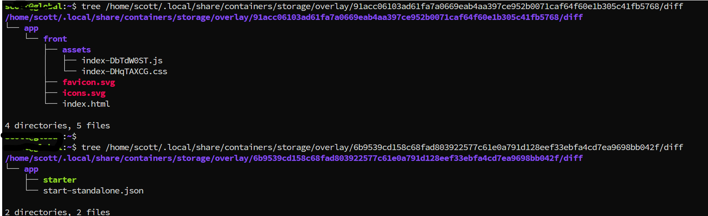

---
tags:
  - podman
  - images
  - image
  - scratch
  - inspect
---
Given a image build from `scratch`,  it do not have like `ls, bash,sh `etc.  so if something wrong, f.g:  the file path not correct.  How to check the image content to identify the issue?

With `podman image inspect` we can get the image information, like below:
`podman image inspect --format "image: {{ .GraphDriver}}" 931c93531d15`
```json
image: {overlaymap[
LowerDir:/home/scott/.local/share/containers/storage/overlay/6b9539cd158c68fad803922577c61e0a791d128eef33ebfa4cd7ea9698bb042f/diff UpperDir:/home/scott/.local/share/containers/storage/overlay/91acc06103ad61fa7a0669eab4aa397ce952b0071caf64f60e1b305c41fb5768/diff WorkDir:/home/scott/.local/share/containers/storage/overlay/91acc06103ad61fa7a0669eab4aa397ce952b0071caf64f60e1b305c41fb5768/work]
}
```

Through above path, we can know where the image persist, so check that folder directly:

