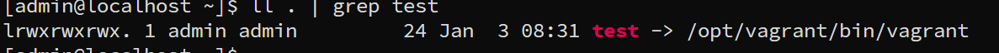
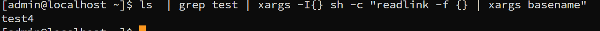

---
tags:
  - shell
  - xargs
---
> when need a complex statement in xargs, what to do ?

```shell
## print the symbolic link target
### as we use `sh`, then we can write any complex statement.
ls  | grep test | xargs -I{} sh -c "readlink -f {} | xargs basename"

```




