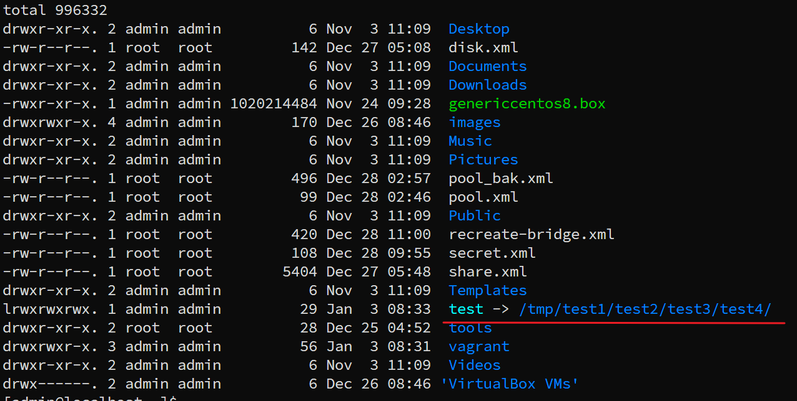
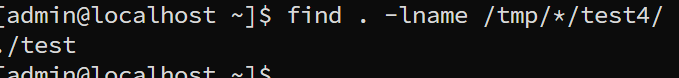

---
tags:
  - find
  - symbolic
---

>查询有没有针对某个文件或文件夹的 软链

创建一个example:


```shell
## 查找有没有 /tmp/**/test4 的连接文件

find . -lname *test4*

### 不区分大小写
find . -ilname *test4*

```
由此可见查询到一个 `test` 软链其连接到  test4.



