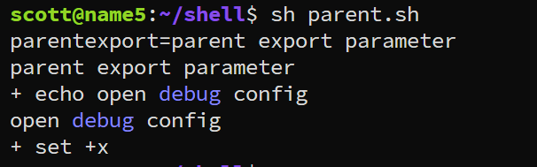

---
tags:
  - shell
  - set
---
shell中关于`set`的一些使用
```shell
# -a means open the feature

### export the veriable to environemnt, then the subprocess can use the variable
set -a/+a  


### debug option. print the cmd and output to stdout
set -x/+x

```

测试脚本
```shell
# parent
#!/usr/bin/bash
set -a
parentexport="parent export parameter"
set +a

# call subprocess
./sub.sh

set -x
echo "open debug config"
set +x


#--------------------------------------------
# sub
#!/usr/bin/env bash

# call parent parameter

echo $parentexport
```



