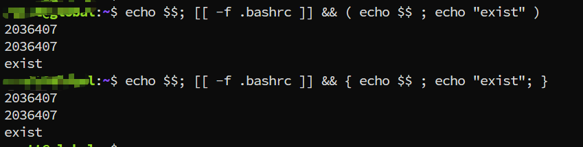
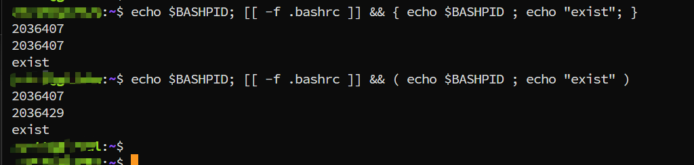

---
tags:
  - shell
  - linux
  - group-command
---

Usually, we will run multiple command as a group, f.g.:
```shell
[[ $? -eq 0 ]] && { echo "success"; exit 0; ) || echo "failed"
[[ $? -eq 0 ]] && { echo "success"; exit 0; } || echo "failed"

```

So, here is the question, what's the difference for `()` and `{}` in above command? 

> () will execute command in sub-shell, so when we set variable or assign value, the parent command can't use it. 
> {} will execute command in current shell.

``` shell
Note:  $$ in subshell will present parend shell PID
```



From above output, we can see `$$` is same in the current shell and sub-shell. So in sub-shell, `$$` will output the parent shell pid.




If we want to output the shell PID, please use `BASHPID` instead of `$$`.

