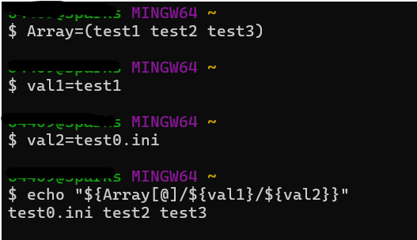

---
tags:
  - shell
  - shell-array
---
The basic shell Array operation.

> Arrary replace

```shell
#define 
Array=(test1 test2 test3)
# varable define
val1="test1"
val2="test0.ini"
# replace
echo "${Array[@]/${val1}/${val2}}"
```




