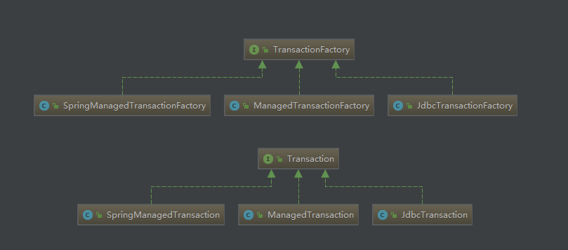
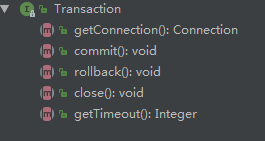
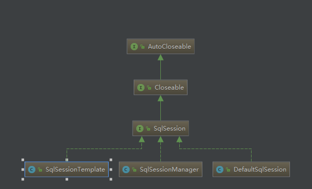

# Mybatis事务管理

前面分析了连接池，可以看出mybatis真的做了好多，数据库连接都帮忙管理了，那么关于数据库事务方面，mybatis有没有做什么呢？

今天咱们就来看看mybatis为方便事务管理做了哪些操作。上一个类图看一眼把：



事务接口功能：



事务工厂接口：


从上图可以看出，mybatis有三个事务管理的实现，并且为三个实现类创建了工厂方法.

先分别看一下三个事务实现类是如何管理事务的：

## JdbcTransaction

看一下属性：

```java
  protected Connection connection;
  protected DataSource dataSource;
	// 事务隔离级别
  protected TransactionIsolationLevel level;
  // MEMO: We are aware of the typo. See #941
  protected boolean autoCommmit;
```


具体的事务管理实现：

```java
  public Connection getConnection() throws SQLException {
    if (connection == null) {
      openConnection();
    }
    return connection;
  }

  public void commit() throws SQLException {
    if (connection != null && !connection.getAutoCommit()) {
      if (log.isDebugEnabled()) {
        log.debug("Committing JDBC Connection [" + connection + "]");
      }
      connection.commit();
    }
  }
	
  public void rollback() throws SQLException {
    if (connection != null && !connection.getAutoCommit()) {
      if (log.isDebugEnabled()) {
        log.debug("Rolling back JDBC Connection [" + connection + "]");
      }
      connection.rollback();
    }
  }
```

可以看到底层事务仍然是数据库连接.

## ManagedTransaction

看一下属性：
```java
  private DataSource dataSource;
  private TransactionIsolationLevel level;
  private Connection connection;
  private final boolean closeConnection;
```


具体的事务管理实现：
```java
 public Connection getConnection() throws SQLException {
    if (this.connection == null) {
      openConnection();
    }
    return this.connection;
  }

  public void commit() throws SQLException {
    // Does nothing
  }

  public void rollback() throws SQLException {
    // Does nothing
  }
```

事务管理没有实现，这是因为设置了自动提交。

## SpringManagedTransaction

看一下属性：
```java
  private final DataSource dataSource;

  private Connection connection;

  private boolean isConnectionTransactional;

  private boolean autoCommit;
```


具体的事务管理实现：
```java
  public Connection getConnection() throws SQLException {
    if (this.connection == null) {
      openConnection();
    }
    return this.connection;
  }

  private void openConnection() throws SQLException {
    this.connection = DataSourceUtils.getConnection(this.dataSource);
    this.autoCommit = this.connection.getAutoCommit();
    this.isConnectionTransactional = DataSourceUtils.isConnectionTransactional(this.connection, this.dataSource);
  }

 public void commit() throws SQLException {
    if (this.connection != null && !this.isConnectionTransactional && !this.autoCommit) {
      if (LOGGER.isDebugEnabled()) {
        LOGGER.debug("Committing JDBC Connection [" + this.connection + "]");
      }
      this.connection.commit();
    }
  }

  public void rollback() throws SQLException {
    if (this.connection != null && !this.isConnectionTransactional && !this.autoCommit) {
      if (LOGGER.isDebugEnabled()) {
        LOGGER.debug("Rolling back JDBC Connection [" + this.connection + "]");
      }
      this.connection.rollback();
    }
  }
```

可以看到，事务管理仍然是底层connect连接进行操作的。

这里就看一个工厂类分析，其他两个都差不多:

```java
// 可以看到  就是创建具体的实例对象
public class JdbcTransactionFactory implements TransactionFactory {

  @Override
  public void setProperties(Properties props) {
  }

  @Override
  public Transaction newTransaction(Connection conn) {
    return new JdbcTransaction(conn);
  }

  @Override
  public Transaction newTransaction(DataSource ds, TransactionIsolationLevel level, boolean autoCommit) {
    return new JdbcTransaction(ds, level, autoCommit);
  }
}
```

这是底层的事务管理，仍然是基于connect连接的；不过写mybatis查询时，也没有看见手动去调用回滚啊这些操作，那么mybatis是如何去调用这些的呢？

```java
try{
    ....
	sqlSession.commit();
} finally{
    sqlSession.close();
}
```

没有执行完，都要进行session的一个提交以及关闭操作，那session有没有做些事务相关的操作呢？进入看一下吧。这是SqlSession的类图:



可以看到这里有有是三个实现类，Template是跟spring相关的，这里先不进行分析，咱们就分析哪个DefaultSqlSession，至于那个SqlSessionManager回头再分析。

## DefaultSqlSession

还是先看一下属性：

```java
// 配置
private final Configuration configuration;
// 执行器
private final Executor executor;
// 是否自动提交
private final boolean autoCommit;
// 和数据库是否同步
private boolean dirty;
private List<Cursor<?>> cursorList;
```

再看一下有关事务的行为函数：

DefaultSqlSession

```java
public int update(String statement, Object parameter) {
    try {
        // 更新或者删除 , 会把dirty设置为true,表示需要提交操作
        dirty = true;
        MappedStatement ms = configuration.getMappedStatement(statement);
        return executor.update(ms, wrapCollection(parameter));
    } catch (Exception e) {
        throw ExceptionFactory.wrapException("Error updating database.  Cause: " + e, e);
    } finally {
        ErrorContext.instance().reset();
    }
}

// 提交
public void commit() {
    commit(false);
}
// 提交
public void commit(boolean force) {
    try {
        // 进行commit提交
        executor.commit(isCommitOrRollbackRequired(force));
        // 提交后 把dirty设置为false
        dirty = false;
    } catch (Exception e) {
        throw ExceptionFactory.wrapException("Error committing transaction.  Cause: " + e, e);
    } finally {
        ErrorContext.instance().reset();
    }
}

// autoCommit为false, 通过update delete 等操作后 dirty为true
// 所以force不会进行判断 直接返回true
private boolean isCommitOrRollbackRequired(boolean force) {
    return (!autoCommit && dirty) || force;
}

// 关闭操作
public void close() {
    try {
        // 如果提交成功,dirty变为false,那么就是executor.close(false)则不会进行回滚操作
        // 如果提交没有成功,那么dirty为true, 调用就是executor.close(true)
        executor.close(isCommitOrRollbackRequired(false));
        closeCursors();
        dirty = false;
    } finally {
        ErrorContext.instance().reset();
    }
}

// 事务回滚操作
public void rollback() {
    rollback(false);
}

// 事务回滚操作
public void rollback(boolean force) {
    try {
        executor.rollback(isCommitOrRollbackRequired(force));
        dirty = false;
    } catch (Exception e) {
        throw ExceptionFactory.wrapException("Error rolling back transaction.  Cause: " + e, e);
    } finally {
        ErrorContext.instance().reset();
    }
}
```

BaseExecutor:

```java
// executor的commit函数
public void commit(boolean required) throws SQLException {
    if (closed) {
        throw new ExecutorException("Cannot commit, transaction is already closed");
    }
    clearLocalCache();
    flushStatements();
    if (required) {
        transaction.commit();
    }
}


// 这是executor.close 调用的close函数
public void close(boolean forceRollback) {
    try {
        try {
            // 是否回滚
            rollback(forceRollback);
        } finally {
            if (transaction != null) {
                transaction.close();
            }
        }
    } catch (SQLException e) {
        // Ignore.  There's nothing that can be done at this point.
        log.warn("Unexpected exception on closing transaction.  Cause: " + e);
    } finally {
        transaction = null;
        deferredLoads = null;
        localCache = null;
        localOutputParameterCache = null;
        closed = true;
    }
}


public void rollback(boolean required) throws SQLException {
    if (!closed) {
        try {
            clearLocalCache();
            flushStatements(true);
        } finally {
            if (required) {// 参数为真  那么进行回滚
                transaction.rollback();
            }
        }
    }
}
```


稍微总结一下这个事务管理.isCommitOrRollbackRequired

1. sqlSession.commit()，执行此函数时，调用链为: sqlSession.commit() --> sqlSession.commit(false) --> executor.commit( false | true)
   1. 如果提交成功了，那么修改dirty变量值，并且进行关闭操作
   2.  如果没有成功，那么dirty变量没有修改，仍然为true
2. sqlSession.close() -->  executor.close( false | true)
   1. 如果提交成了，那么dirty为false，执行executor时传递进入的参数是false，那么就不会进行回滚
   2. 如果提交没有成功，那么dirty为true，执行executor的close时传递进入的就是true，那么就会进行回滚操作.