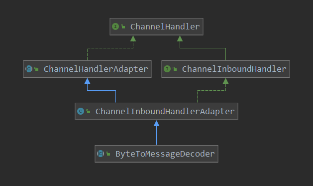

[TOC]

# 拆包粘包的处理

对于socket编程，拆包粘包的概念大家必然后有所了解，按照平时自己编写socket应用，对于拆包粘包的处理，一般也是下面几个步骤：

1. 持续读取数据
2. 判断读取数据是否符合
3. 如果符合，则进行相关的业务处理
4. 如果不符合则跳转到步骤1继续进行读取

那么使用netty后，大家只需要继承ByteToMessageDecoder来，复写其decode方法，就能解决这个问题，那netty是如何做到的呢？

本篇就来看一下netty对拆包粘包的处理。 此类的类图如下：



直接看一下此ByteToMessageDecoder的实现。

> io.netty.handler.codec.ByteToMessageDecoder#channelRead

```java
// 存储读取数据的 缓存
ByteBuf cumulation;
private Cumulator cumulator = MERGE_CUMULATOR;
// 记录是否是第一个此进行读取
// 如果 cumulation==null,则说明是第一次进行数的读取
private boolean first;

// 直接看进行读取的操作
@Override
public void channelRead(ChannelHandlerContext ctx, Object msg) throws Exception {
    if (msg instanceof ByteBuf) {
        // 可见此处的out是一个CodecOutputList[] elements数组,老保存读取的对象
        CodecOutputList out = CodecOutputList.newInstance();
        try {
            // 如果是第一次读取数据
            first = cumulation == null;
            // 1. 那么就给cumulator设置初始值为Unpooled.EMPTY_BUFFER
            // 2. 否则就使用原来,并把接收到的数据 msg写入到cumulator中
            // ctx.alloc() 获取此channel对应的内存分配器

            // *********重要********* 此处就是主要的读取操作,把msg读取到cumulation中
            cumulation = cumulator.cumulate(ctx.alloc(),
                          first ? Unpooled.EMPTY_BUFFER : cumulation, (ByteBuf) msg);
            // 调用解码器
            // 1. 解析器的作用,把读取的byte字节,解码到业务中的对象,并把对象添加到 out 这个list中
            // 解码
            callDecode(ctx, cumulation, out);
        } catch (DecoderException e) {
            throw e;
        } catch (Exception e) {
            throw new DecoderException(e);
        } finally {
            try {
                // 如果cumulation中还有数据,到这里后就会进行 释放,也就是把剩下的数据删除了
                if (cumulation != null && !cumulation.isReadable()) {
                    numReads = 0;
                    cumulation.release();
                    cumulation = null;
                    // 如果读取次数大于 discardAfterReads,也进行删除操作
                } else if (++numReads >= discardAfterReads) {
                    numReads = 0;
                    // 释放内存中的数据
                    discardSomeReadBytes();
                }
                // 获取读取到的对象数
                int size = out.size();
                firedChannelRead |= out.insertSinceRecycled();
                // 调用下面 handler 业务代码的处理
                fireChannelRead(ctx, out, size);
            } finally {
                out.recycle();
            }
        }
    } else {
        ctx.fireChannelRead(msg);
    }
}
```

```java
/**
     * 对于粘包拆包 平时处理也是持续从socket中读取数据,并判断是否是一个完整的包内容; 
     	1. 如果是完整包呢,就处理;  
     	2, 如果不是,继续读
     * netty处理方法类似,此处的MERGE_CUMULATOR 就是缓存器netty多次读取的数据,并传递到后面进行 完整包的判断
     *
     * 就是把in中的数据读取到 cumulation, 如果cumulation中的空间不够,则使用alloc分配器进行扩容
     */
public static final Cumulator MERGE_CUMULATOR = new Cumulator() {
    @Override
    public ByteBuf cumulate(ByteBufAllocator alloc, ByteBuf cumulation, ByteBuf in) {
        if (!cumulation.isReadable() && in.isContiguous()) {
            // If cumulation is empty and input buffer is contiguous, use it directly
            cumulation.release();
            return in;
        }
        try {
            final int required = in.readableBytes();
            if (required > cumulation.maxWritableBytes() ||
                (required > cumulation.maxFastWritableBytes() && cumulation.refCnt() > 1) ||
                cumulation.isReadOnly()) {
                // 扩容操作
                return expandCumulation(alloc, cumulation, in);
            }
            // 把in中的数据写入到 cumlation中
            cumulation.writeBytes(in, in.readerIndex(), required);
            in.readerIndex(in.writerIndex());
            return cumulation;
        } finally {
            in.release();
        }
    }
};
```

> io.netty.handler.codec.ByteToMessageDecoder#callDecode

```java
protected void callDecode(ChannelHandlerContext ctx, ByteBuf in, List<Object> out) {
    try {
        while (in.isReadable()) {
            // 获取out的大小
            int outSize = out.size();
            if (outSize > 0) {
                // 如果读取到了数据,则进行下面的handler读取操作
                fireChannelRead(ctx, out, outSize);
                out.clear();
                if (ctx.isRemoved()) {
                    break;
                }
                outSize = 0;
            }
            // 可读的数据长度
            int oldInputLength = in.readableBytes();
            // 调用decode,解码操作
            decodeRemovalReentryProtection(ctx, in, out);
            // 如果此handler被移除了,那么就不需要继续往下进行处理了
            if (ctx.isRemoved()) {
                break;
            }
            // 如果解码后, outsize没有变
            if (outSize == out.size()) {
                // 如果in中可读数据长度没有变,说明解码器没有解码; 那么有可能是这个包不是一个完整包
                // 那就退出继续从socket中读数据
                if (oldInputLength == in.readableBytes()) {
                    break;
                } else {
                    continue;
                }
            }
            // 如果outSize和out.size不相等, 说明解码器解码了一个对象,但是 in中数据没有别读取过,这处理逻辑正常
            // 抛错
            if (oldInputLength == in.readableBytes()) {
                throw new DecoderException(
                    StringUtil.simpleClassName(getClass()) +
                    ".decode() did not read anything but decoded a message.");
            }
            if (isSingleDecode()) {
                break;
            }
        }
    } catch (DecoderException e) {
        throw e;
    } catch (Exception cause) {
        throw new DecoderException(cause);
    }
}
```

> io.netty.handler.codec.ByteToMessageDecoder#decodeRemovalReentryProtection

```java
final void decodeRemovalReentryProtection(ChannelHandlerContext ctx, ByteBuf in, List<Object> out)
    throws Exception {
    decodeState = STATE_CALLING_CHILD_DECODE;
    try {
        // 调用解码器,进行解码操作, 把解码后的内容放入到out
        // 模板设计模式哦
        // 此decode由 具体子类来实现
        decode(ctx, in, out);
    } finally {
        boolean removePending = decodeState == STATE_HANDLER_REMOVED_PENDING;
        decodeState = STATE_INIT;
        if (removePending) {
            fireChannelRead(ctx, out, out.size());
            out.clear();
            handlerRemoved(ctx);
        }
    }
}
```

这里看一下我的一个decode的实现:

```java
public class CustomDecoder extends ByteToMessageDecoder {

    @Override
    protected void decode(ChannelHandlerContext ctx, ByteBuf in, List<Object> out) throws Exception {
        int length = in.readInt();
        if (in.readableBytes() >= length){
            byte[] bytes = new byte[length];
            in.readBytes(bytes);
            SocketPackage socketPackage = new SocketPackage();
            socketPackage.setLength(length);
            socketPackage.setBytes(bytes);
            out.add(socketPackage);
        }
    }
}
```

可以看到这里，就是对读取的数据按照业务逻辑进行解码操作，如果解码成功，则添加到out中，以备后续继续进行处理。

数据读取完成后，可以看到 channelRead的finally代码块有一个fireChannelRead来调用后面handler的业务代码处理，当前前面读取的操作中，也有执行此方法，对读取的消息进行业务处理。

> io.netty.handler.codec.ByteToMessageDecoder#fireChannelRead

```java
static void fireChannelRead(ChannelHandlerContext ctx, CodecOutputList msgs, int numElements) {
    // 调用后面的业务代码对msgs中读取的数据进行处理
    for (int i = 0; i < numElements; i ++) {
        // 遍历每一个msg,调用后面的解码
        ctx.fireChannelRead(msgs.getUnsafe(i));
    }
}
```

读取到的消息有很多个，存储在一个list的容器，在此方法中，遍历获取所有读取到的消息并调用后面的handler进行业务处理。


